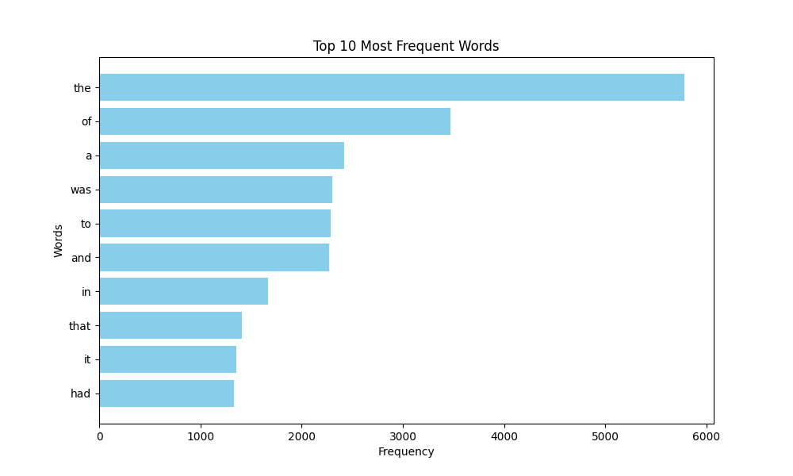

# Tier 2. Module 1: Computer Systems and Their Fundamentals

## Topic 10 - Introduction to parallel computing
## Homework

### Task

Write a Python script that loads text from a given URL, analyzes the frequency of word usage in the text using the MapReduce paradigm, and visualizes the top words with the highest frequency of usage in the text.

### Instructions

1. Import required modules (`matplotlib` and others).
2. Take the MapReduce implementation code from the outline.
3. Create a `visualize_top_words` function to visualize the results.
4. In the main code block, get the text from the URL, apply MapReduce, and visualize the results.

### Acceptance criteria

- The code successfully loads the text from the given URL.
- The code correctly performs word frequency analysis using MapReduce.
- Visualization displays top words by frequency of use.
- The code makes efficient use of multithreading.
- The code is readable and complies with PEP 8 standards.
