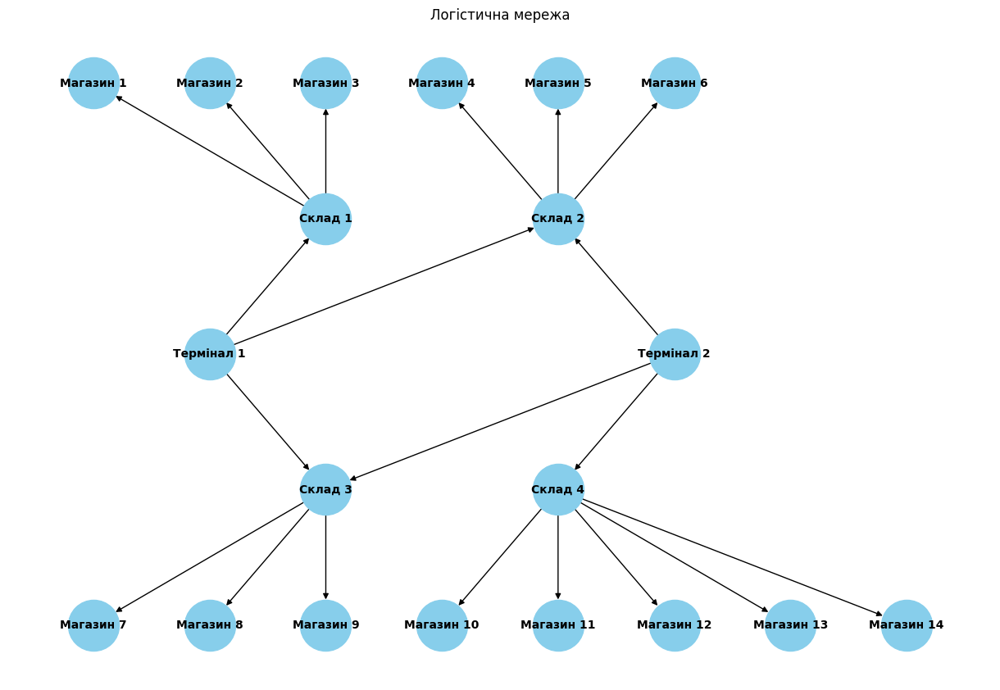

# Tier 2. Module 7 - Design and Analysis of Algorithms

## Lesson 03. Homework - Graphs and trees

### Task 1 - Application of the maximum flow algorithm for goods logistics

Develop a program to model a flow network for the logistics of goods from warehouses to stores using the maximum flow algorithm. Analyze the results and compare them with theoretical knowledge.

#### Task description

Make a graph model representing the flow network in the following image:



The connections and bandwidths in the graph have the following form:

| From        | To          | Throughput (units) |
| ----------- | ----------- | ------------------ |
| Terminal 1  | Warehouse 1 | 25                 |
| Terminal 1  | Warehouse 2 | 20                 |
| Terminal 1  | Warehouse 3 | 15                 |
| Terminal 2  | Warehouse 3 | 15                 |
| Terminal 2  | Warehouse 4 | 30                 |
| Terminal 2  | Warehouse 2 | 10                 |
| Warehouse 1 | Store 1     | 15                 |
| Warehouse 1 | Store 2     | 10                 |
| Warehouse 1 | Store 3     | 20                 |
| Warehouse 2 | Store 4     | 15                 |
| Warehouse 2 | Store 5     | 10                 |
| Warehouse 2 | Store 6     | 25                 |
| Warehouse 3 | Store 7     | 20                 |
| Warehouse 3 | Store 8     | 15                 |
| Warehouse 3 | Store 9     | 10                 |
| Warehouse 4 | Store 10    | 20                 |
| Warehouse 4 | Store 11    | 10                 |
| Warehouse 4 | Store 12    | 15                 |
| Warehouse 4 | Store 13    | 5                  |
| Warehouse 4 | Store 14    | 10                 |

Apply the maximum flow algorithm to solve the problem. Write a program that implements the Edmonds-Karp algorithm, or use an already implemented version to find the maximum flow in the constructed graph. Analyze the result. Has the optimal flow been achieved, and what does this mean for the network under consideration?

Prepare a report with calculations and explanations. Explain which vertices and edges were chosen, how they correspond to real elements of the logistics system. Show the step-by-step calculation of the maximum flow and explain the logic of each step.

#### Specifications

1. Use the Edmonds-Karp algorithm to implement maximum flow.
2. The graph construction should conform to the given structure with 20 vertices and given throughputs.

#### Acceptance criteria

1. The program correctly calculates the maximum flow and returns accurate results.
2. The data is correctly added to the graph and corresponds to the given structure of the logistics network.
3. The explanations and analysis are clear and clearly reflect the logic of the algorithm.
4. The report includes an analysis of the obtained results.

The report with calculations and explanations should include a table with the results of flows between terminals and stores of the following form:

| Terminal   | Store    | Actual Flow (units) |
| ---------- | -------- | ------------------- |
| Terminal 1 | Store 1  | X                   |
| Terminal 1 | Store 2  | Y                   |
| ...        | ...      | ...                 |
| Terminal 2 | Store 14 | Z                   |

The table shows the summary values ​​of flows between terminals and stores, calculated using the Edmonds-Karp algorithm. The data for each terminal and store reflects the volume of goods that were actually delivered.

After receiving the table, answer the following questions:

1. Which terminals provide the largest flow of goods to stores?
2. Which routes have the lowest throughput and how does this affect the overall flow?
3. Which stores received the least goods and can their supply be increased by increasing the throughput of certain routes?
4. Are there bottlenecks that can be eliminated to improve the efficiency of the logistics network?

### Task 2 - Comparison of `OOBTree` and Dictionary performance for range queries

Develop a program to store a large set of product data in two data structures — `OOBTree` and `dict` — and conduct a comparative analysis of their performance for performing range queries.

### Task description

1. Use the proposed `generated_items_data.csv` file to load product information. Each product includes a unique `ID` identifier, a `Name`, a `Category`, and a `Price`.
2. Implement two structures for storing products. The first is `OOBTree` from the `BTrees` library, where the key is the `ID`, and the value is a dictionary with product attributes. The second is `dict` (a standard dictionary), where the key is also the `ID`, and the value is a similar dictionary with product attributes.
3. Create functions for adding products to both structures: `add_item_to_tree` and `add_item_to_dict`.
4. Create functions to perform a range query where you need to find all items in a given price range: `range_query_tree` and `range_query_dict`.
5. Measure the total execution time of the range query for each structure using `timeit`.
6. For each structure, execute the range query 100 times to calculate the average execution time.
7. Output the total execution time of the range query for each structure, including how long it takes to execute 100 queries for `OOBTree` and `dict`.

### Specifications

1. Use only `OOBTree` and the standard `dict` dictionary for comparison.
2. Implement separate functions for adding an item to the structure: `add_item_to_tree`, `add_item_to_dict`.
3. Implement separate functions for the range query: `range_query_tree`, `range_query_dict`.
4. Use the `timeit` library to accurately measure the performance of each structure.
5. The time measurement should be done for 100 range queries for each structure.

### Acceptance criteria

1. The program correctly executes the range query and returns accurate results for both structures: `OOBTree` and `dict`.
2. Data is correctly added to each structure.
3. `OOBTree` uses the `items(min, max)` method for fast access to the range of values.
4. The `dict` dictionary implements the range query using linear search.
5. The comparative execution time results for `OOBTree` and `dict` are correctly output.
6. `OOBTree` is expected to show better results for range queries due to the sorted data structure.
7. The output of the results includes the total execution time of the range query for each structure with the format:

```
Total range_query time for OOBTree: X.XXXXXX seconds
Total range_query time for Dict: X.XXXXXX seconds
```
