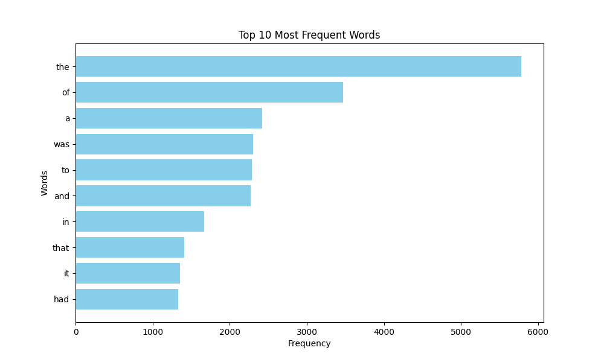
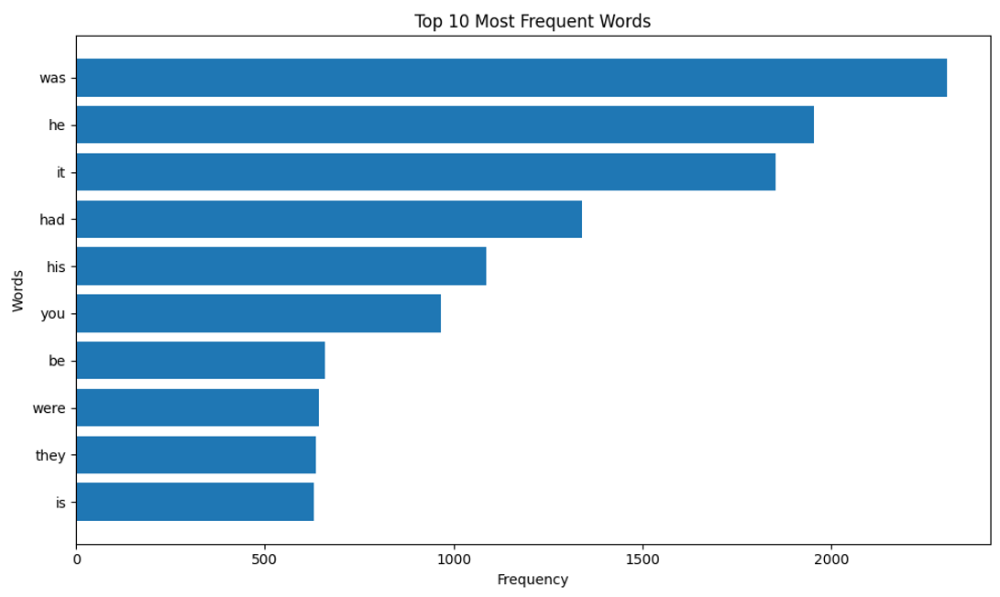

# Tier 2. Module 7 - Design and Analysis of Algorithms

## Lesson 06. Homework - Basics of parallel computing and the MapReduce model

### Technical task

Write a Python script that loads text from a given URL, analyzes the frequency of word usage in the text using the MapReduce paradigm, and visualizes the top words with the highest frequency of use in the text.

#### Step-by-step instructions

1. Import the necessary modules (`matplotlib` and others).
2. Take the MapReduce implementation code from the outline.
3. Create a `visualize_top_words` function to visualize the results.
4. In the main code block, get the text from the URL, apply MapReduce, and visualize the results.

For example, for the top 10 most frequently used words, the graph could look like this:

#### Acceptance Criteria

1. The code successfully loads text from the given URL.
2. The code correctly performs word frequency analysis using MapReduce.
3. The visualization displays the top words by frequency of use.
4. The code effectively uses multithreading.
5. The code is readable and complies with PEP 8 standards.

### Result

