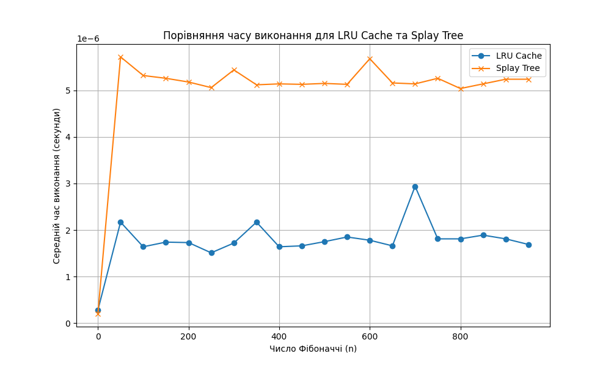
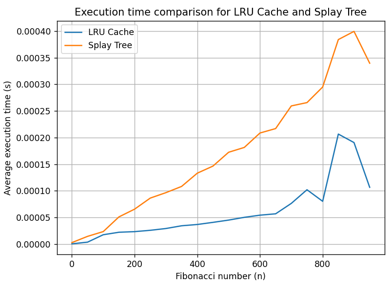

# Tier 2. Module 7 - Design and Analysis of Algorithms

## Lesson 07. Homework - Cache management algorithms

### Task 1 - Data access optimization using LRU cache

#### Task description

Implement a program to optimize the processing of queries to an array of numbers using the LRU cache.

#### Specifications

1. Given an array of size `N`, consisting of positive integers (`1 ≤ N ≤ 100_000`). It is necessary to process Q queries (`1 ≤ Q ≤ 50_000`) of the following type:

- `Range(L, R)` — find the sum of elements in the range from index `L` to `R` inclusive.
- `Update(index, value)` — replace the value of the element in the array at `index` with a new `value`.

2. Implement four functions for working with the array:

- `range_sum_no_cache(array, L, R)`

The function should calculate the sum of the elements of the array in the range from `L` to `R` inclusive **without using the cache**. For each query, the result should be calculated anew.

- `update_no_cache(array, index, value)`

The function should update the value of the array element at the specified index **without using the cache**.

- `range_sum_with_cache(array, L, R)`

The function should calculate the sum of the elements in the range from `L` to `R` inclusive, using the **LRU cache**. If the sum for this range has already been calculated before, it should be returned from the cache, otherwise the result is calculated and added to the cache.

- `update_with_cache(array, index, value)`

The function should update the value of the array element at the specified index and **remove all corresponding values ​​from the cache** that have become irrelevant due to a change in the array.

3. To test the program, create an array of `100_000` elements filled with random numbers and generate `50_000` `Range` and `Update` queries in random order.

Example query list: `[('Range', 46943, 91428), ('Range', 5528, 29889), ('Update', 77043, 78), ...]`

4. Use an LRU cache of size `K = 1000` to store pre-computed results of `Range` queries. The cache should automatically remove the least recently used elements if its maximum size is reached.

5. Compare the execution times of the queries:

- Without using the cache.
- With using the LRU cache.
- Print the results in terms of execution times for both approaches.

#### Acceptance criteria

1. All functions: `range_sum_no_cache`, `update_no_cache`, `range_sum_with_cache`, `update_with_cache` — are implemented and working.
2. The program measures the execution time of queries with and without cache and displays the results in a clear form.
3. The test results are presented in a convenient format for understanding, so that you can evaluate the effectiveness of using the LRU cache.
4. The code executes without errors and meets the technical requirements.

#### Example of output to the terminal of the program execution

```
Execution time without caching: 3.11 seconds
Execution time with LRU cache: 0.02 seconds
```

### Task 2 - Comparison of Fibonacci number calculation performance using LRU cache and Splay Tree

Implement a program to calculate Fibonacci numbers in two ways: using an LRU cache and using a Splay Tree to store previously calculated values. Compare their efficiency by measuring the average execution time for each approach.

#### Specifications

1. Implement two functions to calculate Fibonacci numbers:

- `fibonacci_lru(n)`

The function should use the `@lru_cache` decorator to cache the results of the calculation. This allows it to reuse previously calculated Fibonacci numbers.

- `fibonacci_splay(n, tree)`

The function uses the Splay Tree data structure to store the calculated values. If the Fibonacci number for a given n has already been calculated, the value should be returned from the tree, otherwise the value is calculated, stored in the Splay Tree, and returned.

2. Measure the execution time of the Fibonacci number calculation for each approach:

- Create a set of Fibonacci numbers from `0` to `950` in steps of `50`: `0, 50, 100, 150, ...`.
- Use the `timeit` module to measure the execution time of the calculations.
- For each value of `n`, calculate the average execution time of the Fibonacci number calculation using the `LRU cache` and the `Splay Tree`.

3. Construct a graph that compares the execution time for the two approaches:

- Use the `matplotlib` library to construct the graph.
- On the `x`-axis, display the value of `n` — the Fibonacci number.
- On the `y`-axis — the average execution time in seconds.
- Add a legend to the graph that indicates the two approaches: `LRU Cache` and `Splay Tree`.

4. Draw conclusions about the efficiency of both approaches based on the resulting graph.

5. In addition to plotting, output a text table containing the value of `n`, the average execution time for `LRU Cache` and `Splay Tree`. The table should be formatted for easy reading.

#### Acceptance Criteria

1. Implemented the `fibonacci_lru` and `fibonacci_splay` functions that calculate Fibonacci numbers using caching.
2. Measured the execution time for each approach at each value of `n` and plotted a graph showing the results.
3. The graph has axis labels, a title, and a legend explaining which method was used.
4. There is a formatted table of results in the terminal.
5. Analyzed the results based on the resulting graph to show which approach is more efficient for calculating Fibonacci numbers at large values ​​of `n`.
6. The code is executable and meets the specifications.

#### Example Output Table

```
n         LRU Cache Time (s)  Splay Tree Time (s)
--------------------------------------------------
0         0.00000028          0.00000020
50        0.00000217          0.00000572
100       0.00000164          0.00000532
150       0.00000174          0.00000526
```

#### Example Graph



#### Result

```
n         LRU Cache Time (s)    Splay Tree Time (s)
------------------------------------------------------
0         0.00000057            0.00000283
50        0.00000370            0.00001457
100       0.00001760            0.00002350
150       0.00002227            0.00005107
200       0.00002343            0.00006563
250       0.00002593            0.00008640
300       0.00002930            0.00009663
350       0.00003443            0.00010830
400       0.00003683            0.00013317
450       0.00004083            0.00014647
500       0.00004510            0.00017243
550       0.00005027            0.00018150
600       0.00005433            0.00020857
650       0.00005690            0.00021690
700       0.00007647            0.00025943
750       0.00010207            0.00026567
800       0.00008037            0.00029490
850       0.00020657            0.00038397
900       0.00019063            0.00039937
950       0.00010663            0.00033960
```


