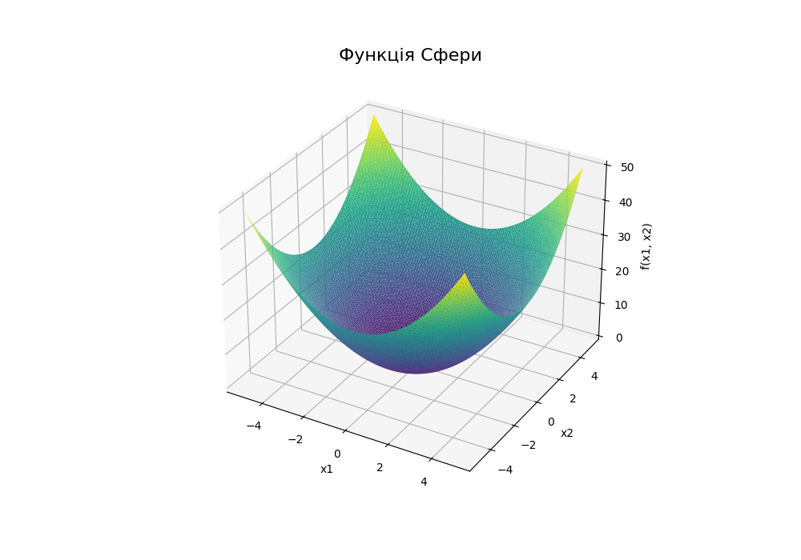

# Tier 2. Module 7 - Design and Analysis of Algorithms

## Lesson 09. Homework - Local search, heuristics, and simulated annealing

### Technical task

#### Task description

Implement a program to minimize the [Sphere function](https://uk.m.wikipedia.org/wiki/%D0%A2%D0%B5%D1%81%D1%82%D0%BE%D0%B2%D1%96_%D1%84%D1%83%D0%BD%D0%BA%D1%86%D1%96%D1%97_%D0%B4%D0%BB%D1%8F_%D0%BE%D0%BF%D1%82%D0%B8%D0%BC%D1%96%D0%B7%D0%B0%D1%86%D1%96%D1%97) $ f(x) = \sum^n_{i=1} x^2_i $, using three different approaches to local optimization:

- Hill Climbing Algorithm
- Random Local Search
- Simulated Annealing



#### Specifications

1. The function bounds are defined as $ x_i \in [−5,5] $ for each parameter $ x_i $.

2. Algorithms must return an optimal point (a list of x coordinates) and the function value at that point.
3. Implement three optimization methods:

- `hill_climbing` — hill climbing algorithm.
- `random_local_search` — random local search.
- `simulated_annealing` — simulated annealing.

4. Each algorithm must accept an `iterations` parameter that specifies the maximum number of iterations for the algorithm to execute.
5. Algorithms must terminate execution under one of the following conditions:

- The change in the value of the objective function or the position of a point in the solution space between two consecutive iterations becomes less than `epsilon`, where `epsilon` is an accuracy parameter and determines the sensitivity of the algorithm to minor improvements.
- The annealing algorithm takes temperature into account: if the temperature decreases to a value less than `epsilon`, the algorithm terminates, as this indicates that the algorithm's search capacity has been exhausted.

#### Acceptance Criteria

1. The algorithms work within the given range $ x_i \in [-5, 5] $.
2. The program finds an approximation to the global minimum of the function.
3. The results of all three algorithms are presented in text in a clear form.

#### Program template

```Python
import random
import math

# Defining the Sphere function
def sphere_function(x):
  return sum(xi ** 2 for xi in x)

# Hill Climbing
def hill_climbing(func, bounds, iterations=1000, epsilon=1e-6):
  pass

# Random Local Search
def random_local_search(func, bounds, iterations=1000, epsilon=1e-6):
  pass

# Simulated Annealing
def simulated_annealing(func, bounds, iterations=1000, temp=1000, cooling_rate=0.95, epsilon=1e-6):
  pass

if __name__ == "__main__":
  # Limits for a function
  bounds = [(-5, 5), (-5, 5)]

  # Execution of algorithms
  print("Hill Climbing:")
  hc_solution, hc_value = hill_climbing(sphere_function, bounds)
  print("Solution:", hc_solution, "Value:", hc_value)

  print("\nRandom Local Search:")
  rls_solution, rls_value = random_local_search(sphere_function, bounds)
  print("Solution:", rls_solution, "Value:", rls_value)

  print("\nSimulated Annealing:")
  sa_solution, sa_value = simulated_annealing(sphere_function, bounds)
  print("Solution:", sa_solution, "Value:", sa_value)
```

#### Example of execution

```
Hill Climbing:
Solution: [0.0005376968388007969, 0.0007843237077809137] Value: 9.042815690435702e-07

Random Local Search:
Solution: [0.030871215407484165, 0.10545563391334589] Value: 0.012073922664800917

Simulated Annealing:
Solution: [0.024585173708439823, -0.00484719941675793] Value: 0.0006279261084599791
```
