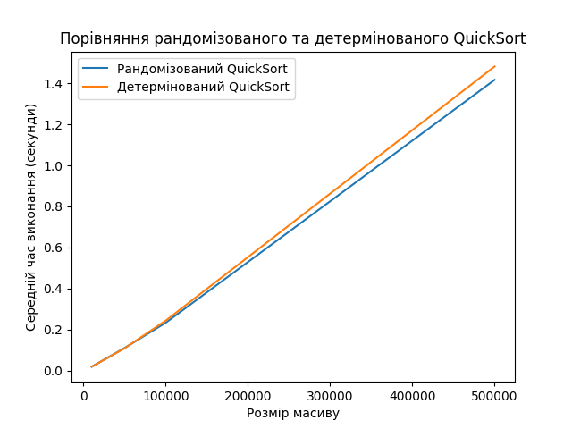
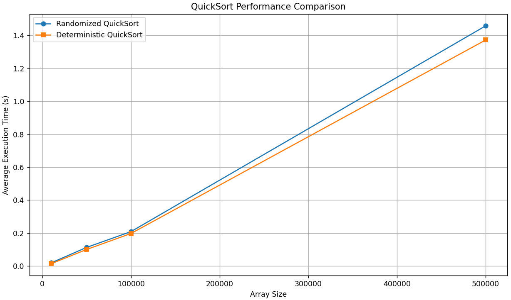

# Tier 2. Module 7 - Design and Analysis of Algorithms

## Lesson 10. Homework - Algorithmic complexity, approximate and randomized algorithms

### Task 1 - Comparison of randomized and deterministic QuickSort

#### Task description

Implement the randomized and deterministic QuickSort sorting algorithms. Compare their performance by measuring the average execution time on arrays of different sizes.

#### Specifications

1. To implement the randomized QuickSort algorithm, implement the function `randomized_quick_sort(arr)`, where the pivot element is chosen randomly.
2. To implement the deterministic QuickSort algorithm, implement the function `deterministic_quick_sort(arr)`, where the pivot element is chosen according to a fixed rule: the first, last, or middle element.
3. Create a set of test arrays of different sizes: `10_000`, `50_000`, `100_000`, and `500_000` elements. Fill the arrays with random integers.
4. Measure the execution time of both algorithms on each array. For a more accurate estimate, repeat the sorting of each array 5 times and calculate the average execution time.

#### Acceptance Criteria

1. The functions `randomized_quick_sort` and `deterministic_quick_sort` implement sorting algorithms and sort arrays.
2. The execution time of the algorithms is measured and presented in the form of a table and a graph.
3. Graphs are constructed, with axis labels and a legend.
4. The results are analyzed and conclusions are drawn regarding the effectiveness of randomized and deterministic QuickSort.
5. The code executes the use case and meets the expected results.

#### Example of plotting a graph by a program



#### Example of output to the terminal of program execution

```
Array size: 10000
    Randomized QuickSort: 0.0189 seconds
    Deterministic QuickSort: 0.0189 seconds

Array size: 50000
    Randomized QuickSort: 0.1104 seconds
    Deterministic QuickSort: 0.1090 seconds

Array size: 100000
    Randomized QuickSort: 0.2333 seconds
    Deterministic QuickSort: 0.2435 seconds

Array size: 500000
    Randomized QuickSort: 1.4166 seconds
    Deterministic QuickSort: 1.4815 seconds
```

#### Results



```
Array size: 10000
    Randomized QuickSort: 0.0191 seconds
    Deterministic QuickSort: 0.0140 seconds

Array size: 50000
    Randomized QuickSort: 0.1130 seconds
    Deterministic QuickSort: 0.1003 seconds

Array size: 100000
    Randomized QuickSort: 0.2088 seconds
    Deterministic QuickSort: 0.1975 seconds

Array size: 500000
    Randomized QuickSort: 1.4582 seconds
    Deterministic QuickSort: 1.3722 seconds
```

#### Conclusion:

According to the task conditions, the test arrays are filled completely with random numbers in random order, while randomized quicksort, compared to deterministic, performs best in the extreme cases when the array is already sorted in one way or another, because it allows to reduce the sorting of already sorted data.

In our case, deterministic quicksort was implemented, and the choice of the median reference point is a balanced approach for random data, because it is a good approximation of the median in uniformly random arrays. This leads to fairly balanced partitions - hence, to good performance.

This is why in this case, deterministic quicksort with the median reference point slightly outperforms randomized quicksort for random data. In addition, randomized quicksort includes a recursive call to randomly select a reference point. This action introduces a small overhead that accumulates with increasing array size.

### Task 2 - Class scheduling using a greedy algorithm

#### Task description

Implement a program to schedule classes at a university using a greedy algorithm for the set coverage problem. The goal is to assign teachers to subjects in such a way as to minimize the number of teachers and cover all subjects.

#### Specifications

Given a set of subjects: {'Mathematics', 'Physics', 'Chemistry', 'Informatics', 'Biology'}

List of teachers:

1. Olexandr Ivanenko, 45 years old, `o.ivanenko@example.com`, subjects: `{'Mathematics', 'Physics'}`
2. Maria Petrenko, 38 years old, `m.petrenko@example.com`, subjects: `{'Chemistry'}`
3. Sergiy Kovalenko, 50 years old, `s.kovalenko@example.com`, subjects: `{'Informatics', 'Mathematics'}`
4. Natalia Shevchenko, 29 years old, `n.shevchenko@example.com`, subjects: `{'Biology', 'Chemistry'}`
5. Dmytro Bondarenko, 35 years old, `d.bondarenko@example.com`, subjects: `{'Physics', 'Informatics'}`
6. Olena Grycenko, 42 years old, `o.grycenko@example.com`, subjects: `{'Biology'}`

#### Task description

- Implement a `Teacher` class with the following attributes:
- `first_name`
- `last_name`
- `age`
- `email`
- `can_teach_subjects` (set of subjects that can be taught)
- Implement a function `create_schedule(subjects, teachers)`, which uses a greedy algorithm to assign teachers to subjects. The function should return a list of teachers and the subjects that are assigned to them.
- When choosing a teacher at each stage, give preference to the one who can teach the largest number of subjects that are not yet covered. If there are several such candidates, choose the youngest by age.

#### Acceptance criteria

1. The program covers all subjects from the set of subjects.
2. If it is impossible to cover all subjects with the available teachers, the program should display a message about this.
3. All subjects must be covered by teachers, and all teachers must be assigned to their subjects.

#### Program Template

```Python
# Definition of the Teacher class
class Teacher:
    pass

def create_schedule(subjects, teachers):
   pass

if __name__ == '__main__':
    # Complete set of subjects
    subjects = {}
    # Creating a list of teachers
    teachers = []

    # Calling the schedule creation function
    schedule = create_schedule(subjects, teachers)

    # Schedule output
    if schedule:
        print("Class schedule:")
        for teacher in schedule:
            print(f"{teacher.first_name} {teacher.last_name}, {teacher.age} years, email: {teacher.email}")
            print(f"   Teaches subjects: {', '.join(teacher.assigned_subjects)}\\n")
    else:
        print("It is impossible to cover all subjects with the available teachers.")
```

#### Results:
```
Class schedule:
Natalia Shevchenko, 29 years, email: n.shevchenko@example.com
        Teaches subjects: Biology, Chemistry

Dmytro Bondarenko, 35 years, email: d.bondarenko@example.com
        Teaches subjects: Informatics, Physics

Olexandr Ivanenko, 45 years, email: o.ivanenko@example.com
        Teaches subjects: Mathematics
```
