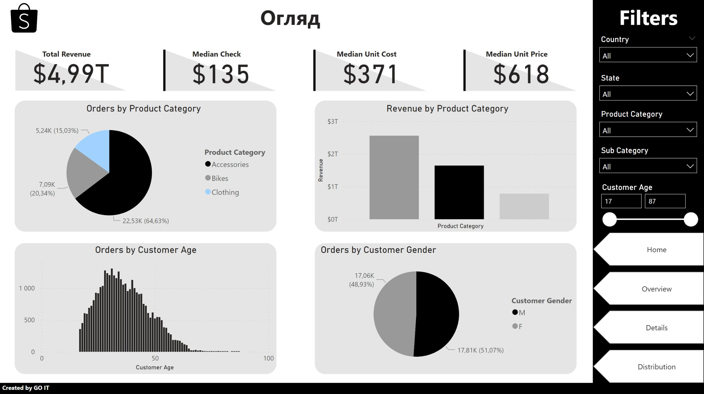

# Tier 2. Module 8 - Visual Analytics

## Lesson 06. Homework - Preparing data for analysis

### Task description

Find errors on the dashboard. You need to find and mark on it using any graphic editor convenient for you at least 5 errors in the dashboard. If you find more, you can consider yourself an expert.

Preparing and uploading homework

1. Download the [dashboard](https://drive.google.com/file/d/16J3JS0az3OeAyjZ3eU4tl-zQ9nfEwkhS/view?usp=sharing) to your computer.
2. Complete the assignment.
