# Tier 3. Module 2 - Foundations of Cloud Computing

## Homework for Topic 4 - AWS computing services

### Technical task

The goal of this task is to gain hands-on experience with EC2 in AWS. Learn how to create, configure, and connect to a virtual machine. Install a web server.

#### Task description

1. Sign up for a free AWS account (Free Tier), if you don't already have one.
2. In the AWS console, go to the EC2 service. Launch two new instances with the following parameters:

- AMI: Amazon Linux 2023.
- Instance type: t2.micro (for free use).

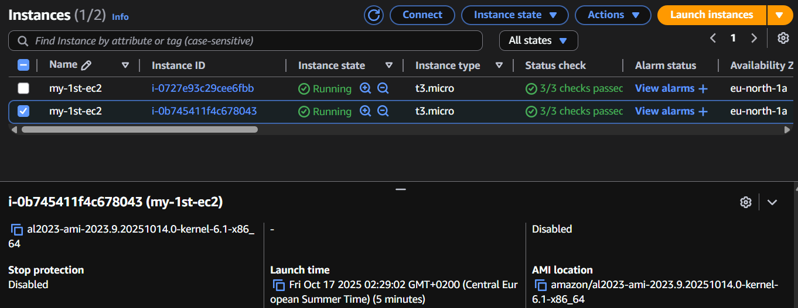

- Create a new key pair and save the private key.

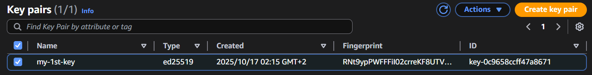

- Configure the Security Group for SSH (port 22) and HTTP (port 80) access.

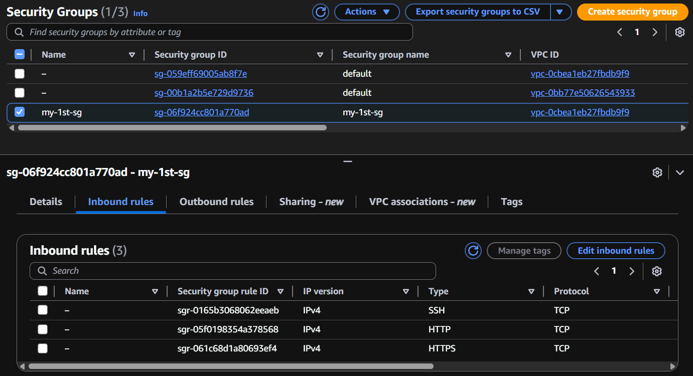

3. After launching the instance, connect to it via SSH using the AWS web console

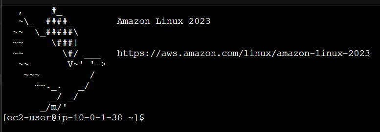

4. In the instance terminal, run the following commands to install the `nginx` web server:

```bash
sudo yum install nginx
sudo systemctl enable nginx
sudo systemctl start nginx
```

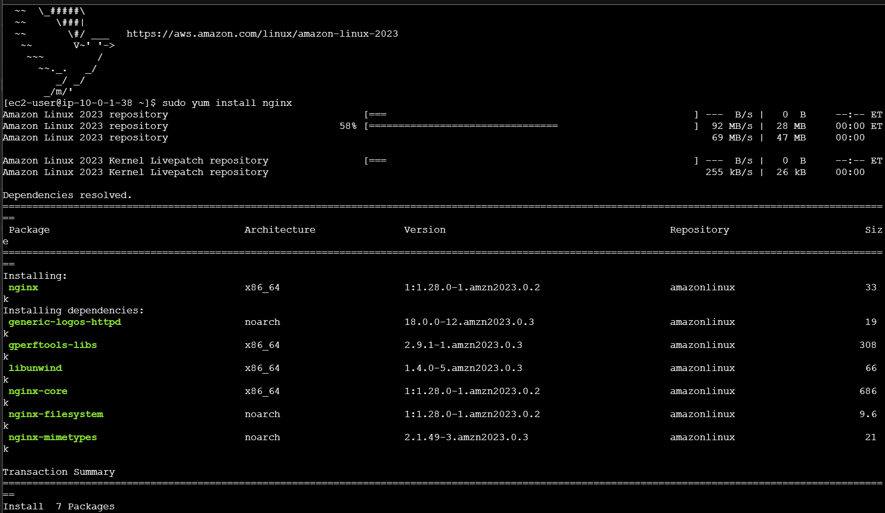

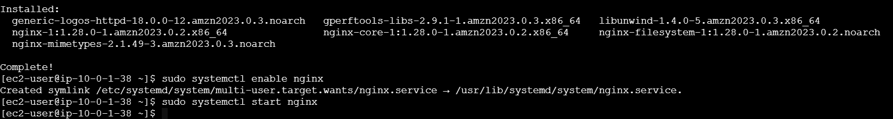

5. Open the public DNS of your instance in a browser. The default nginx page should appear.

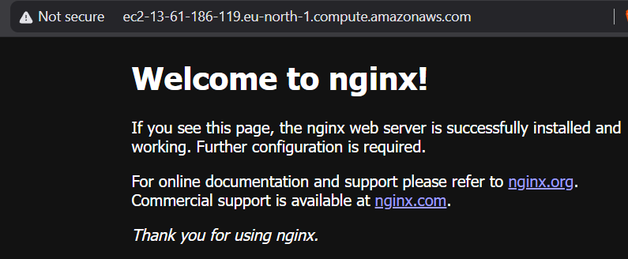

6. Create a Target Group for your EC2 data.

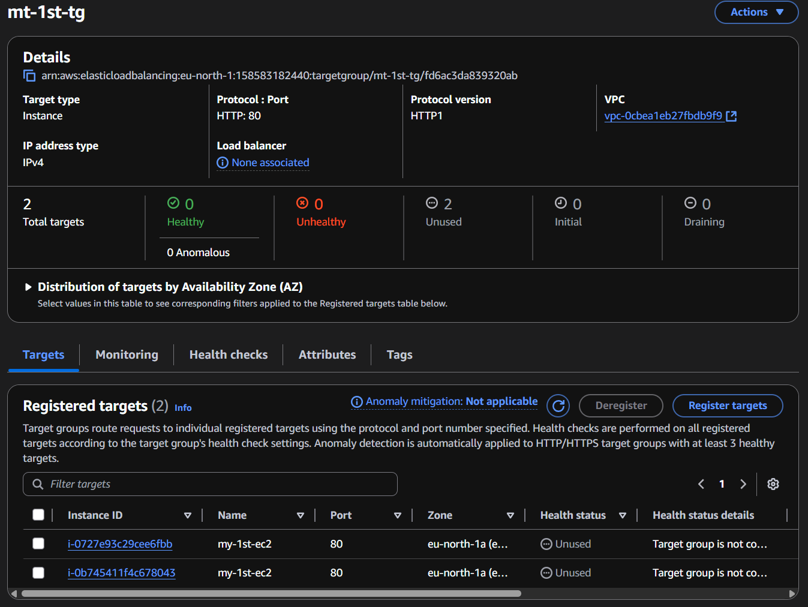

7. Create and attach an Application Load Balancer to the Target Group.

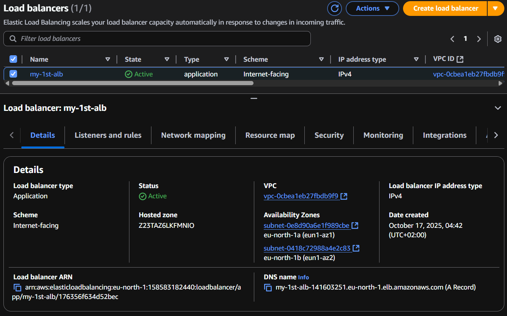

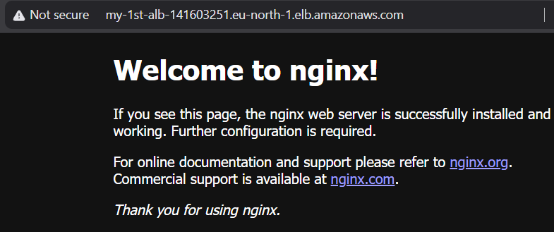

8. Stop the instance in the EC2 console to avoid wasting resources.

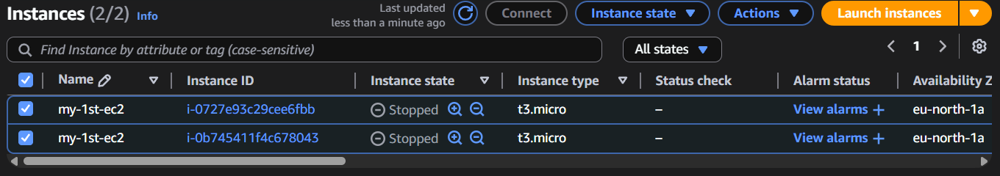

As a result, you will create working EC2-based web servers in AWS and configure load balancing between them via the Application Load Balancer.

Save a screenshot of the web server page in the browser at the Application Load Balancer address as confirmation.
