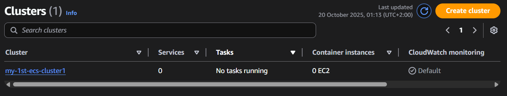
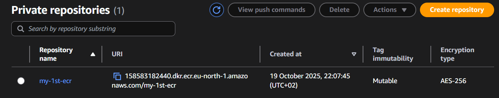
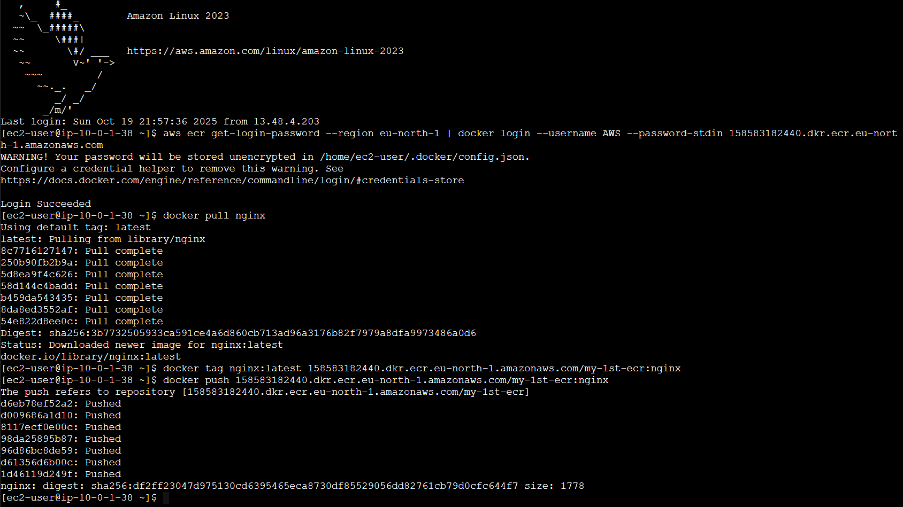
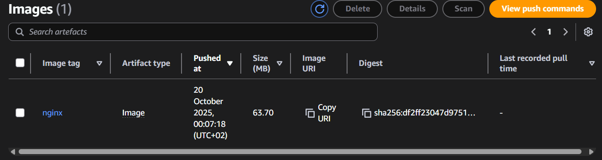
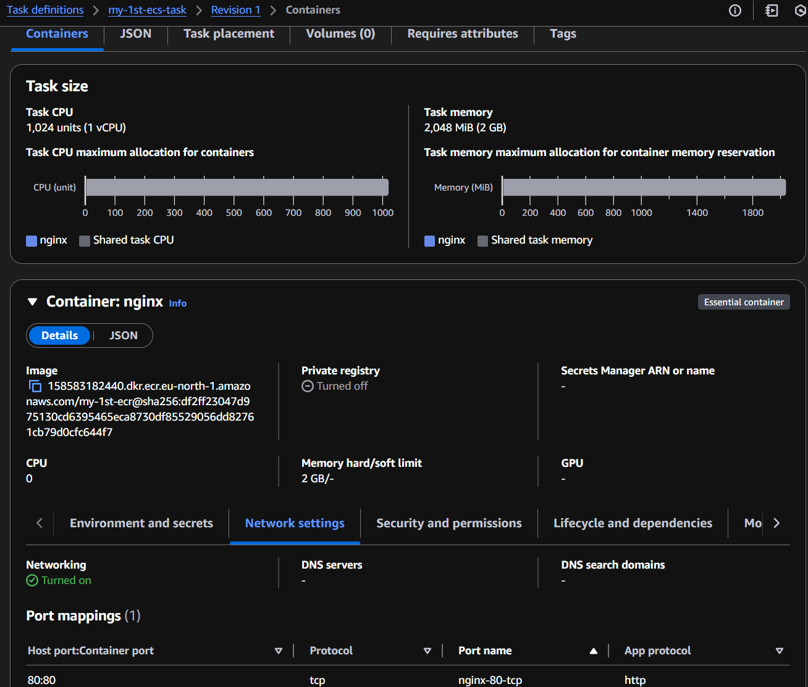
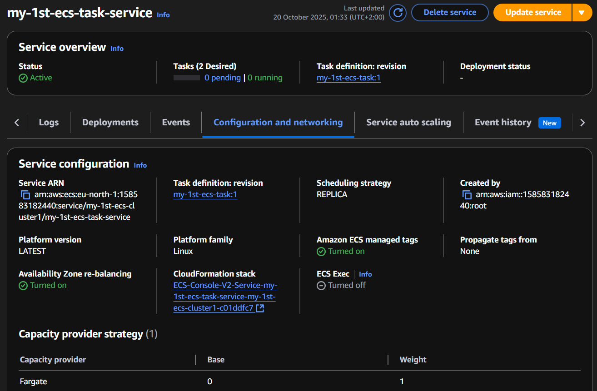
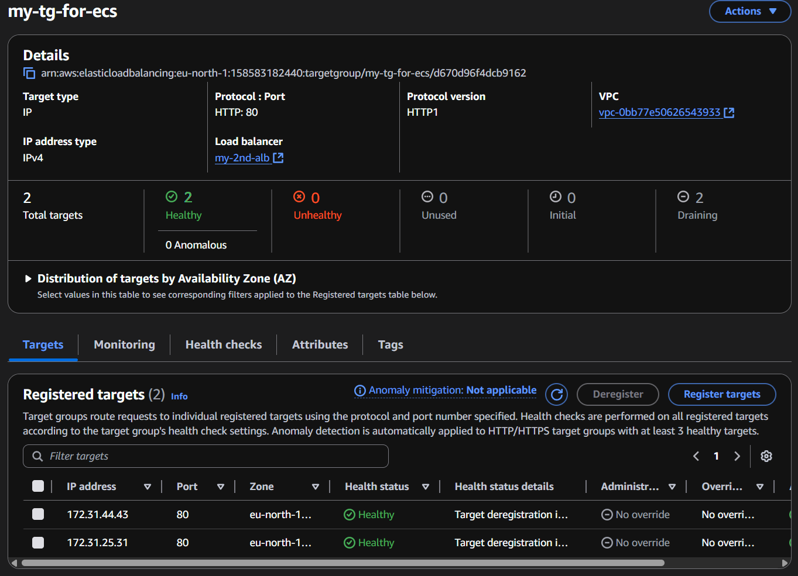
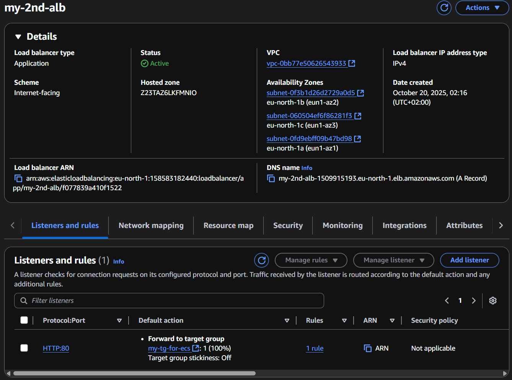
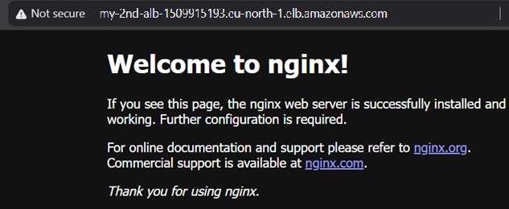

# Tier 3. Module 2 - Foundations of Cloud Computing

## Homework for Topic 5 - Containerization in AWS

### Technical task

1. Sign up for a free AWS account (Free Tier), if you don’t already have one.

2. Go to the AWS Console and search for the ECS (Elastic Container Service) service.

3. Create an ECS cluster (Fargate or EC2):

- Select `Create cluster`.
- Select EC2 or AWS Fargate.
- Enter a name for the cluster and click `Create`.



4. Create a repository in Amazon ECR to store the container image:

- Go to ECR (`Elastic Container Registry`).
- Click `Create repository`, enter a name, leave Mutable tags.



- Copy the commands to upload the container (`View push commands`).



5. Create and upload the Nginx Docker image to ECR:

Run the commands in the terminal:

```bash
docker pull nginx
docker tag nginx <aws_account_id>.dkr.ecr.<region>.amazonaws.com/nginx-repo
aws ecr get-login-password --region <region> | docker login --username AWS --password-stdin <aws_account_id>.dkr.ecr.<region>.amazonaws.com
docker push <aws_account_id>.dkr.ecr.<region>.amazonaws.com/nginx-repo
```



6. Create a Task Definition:

- Go to ECS → `Task Definitions` → `Create new task definition`.
- Select Launch type: Fargate.
- Enter a name, specify 1 vCPU, 512 MB RAM.
- Add a container:

Image URI — copy it from ECR.

Port mappings — specify port `80`.

- Click Create.



7. Create an ECS service:

- Go to ECS → `Clusters`, select your cluster.
- Click `Create service`.
- Select Launch type: Fargate.
- Select the created `Task Definition`.
- Enter the service name.
- Specify Desired tasks: 2.



8. Configure load balancing via ALB:

- Create an Application Load Balancer (EC2 → Load Balancers → Create Load Balancer).
- Add a Target Group with two ECS containers.



- Connect the ALB to the ECS service.



9. Test the service:

- Go to the Application Load Balancer URL.
- You should see the Nginx page.

Save a screenshot of the browser page with Nginx running as confirmation.


