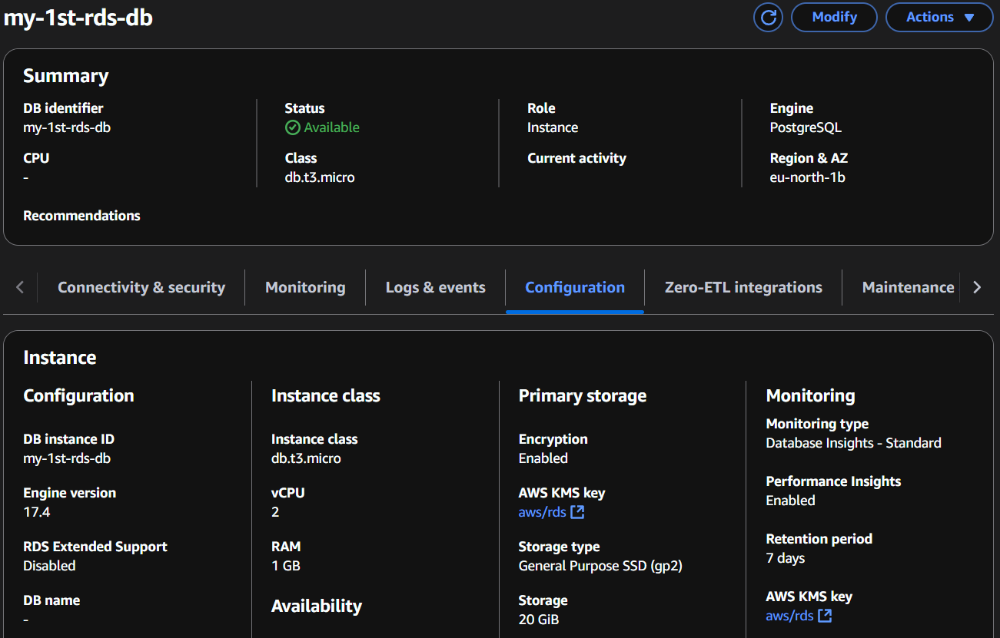
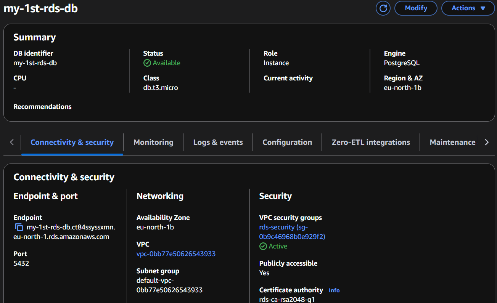
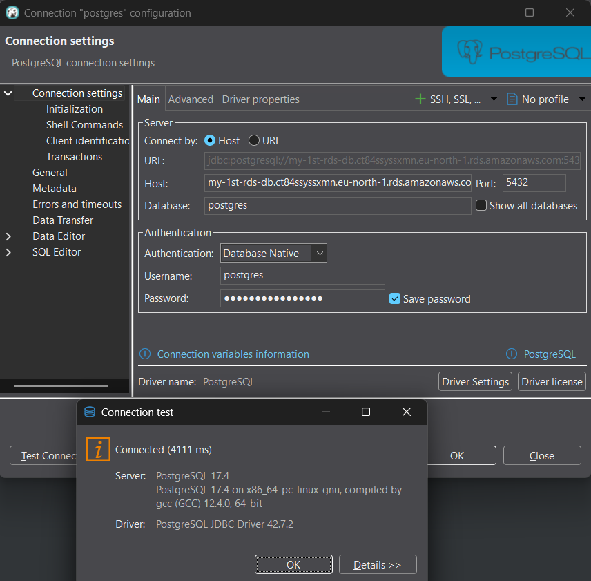
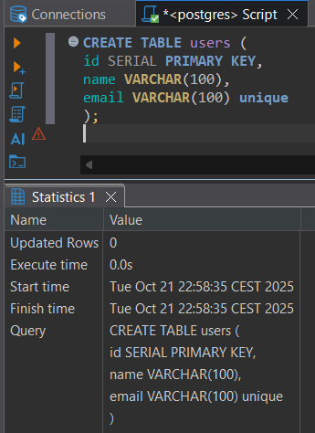
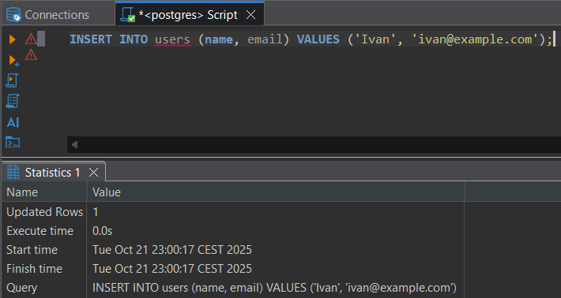
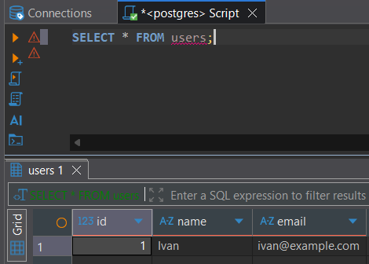
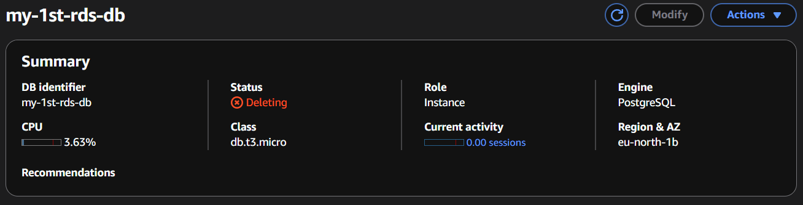

# Tier 3. Module 2 - Foundations of Cloud Computing

## Homework for Topic 6 - Data warehouses in AWS

### Technical task

This task will help you gain hands-on experience with Amazon RDS in AWS: today you will learn how to create a managed relational database in RDS.

#### Task Description

1. Sign Up and Get Started

- Sign up for a free AWS account (Free Tier) if you don’t already have one.
- Go to the AWS Console and search for the RDS service.

2. Create a Database in Amazon RDS

#### Create a Database Instance in RDS

1. Open **Amazon RDS** → **Databases** → **Create database**.
2. Select the creation method: **Standard create**.
3. Select the database type: **PostgreSQL**.
4. Select the template: **Free Tier** (for testing without extra costs).
5. Enter a unique **Database identifier** (for example, `my-rds-db`).
6. Specify the username (**Master username**) — `postgres`.
7. Set a password or allow AWS Secrets Manager to manage it.
8. Select the instance type: **db.t3.micro (1 vCPU, 1 GB RAM)**.
9. Specify the disk size: **20 GB** (General Purpose SSD).
10. In the **Connectivity** section:

- **VPC**: Use **default VPC**.
- **Public access: Yes** (allow access to the database from the outside to be able to connect from your computer).
- **VPC security group: Allow connections from your IP** (or allow access for EC2, if necessary).

11. Enable **Automatic backup** (7 days).
12. Click **Create database**.



#### Checking the connection to RDS

1. Go to the **Databases** section → Select the created instance.
2. Copy the database **Endpoint**.



Connect via **psql** or another client:

```bash
psql -h <endpoint> -U postgres -d postgres
```



3. Create a table in RDS

Connect to the database and execute the SQL command to create the table:

```SQL
CREATE TABLE users (
id SERIAL PRIMARY KEY,
name VARCHAR(100),
email VARCHAR(100) UNIQUE
);
```



Insert a test record:

```SQL
INSERT INTO users (name, email) VALUES ('Ivan', 'ivan@example.com');
```



Verify that the record is saved:

```SQL
SELECT * FROM users;
```



4. Delete resources (to avoid unnecessary costs)

**Amazon RDS** → Delete the database if it is no longer needed.


