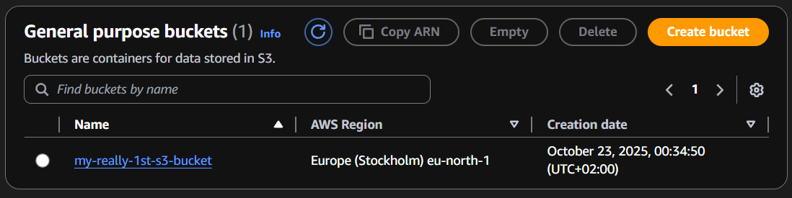
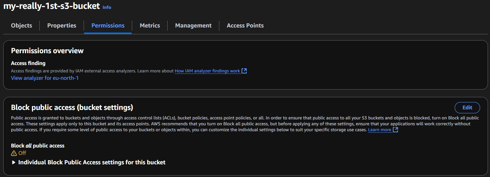
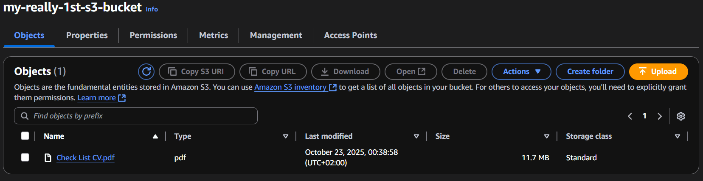
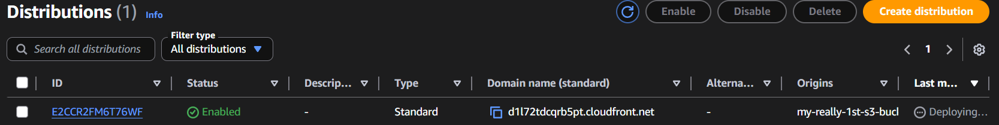
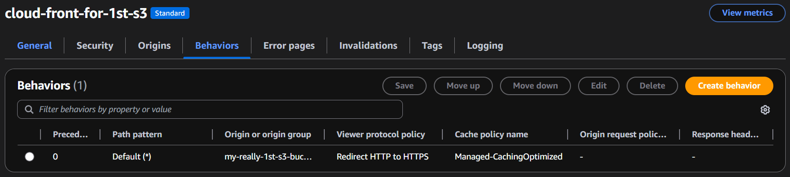
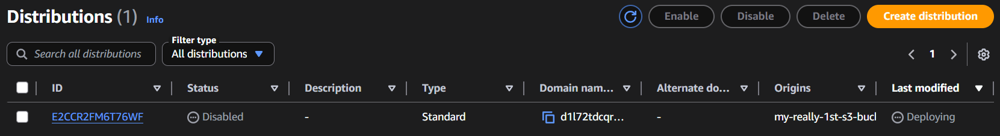
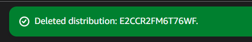
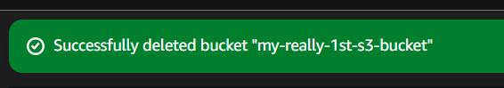

# Tier 3. Module 2 - Foundations of Cloud Computing

## Homework for Topic 7 - Data storage and caching in AWS

### Technical task

The goal of this task is to gain hands-on experience with Amazon S3 and Amazon CloudFront.

You will:

- Create an S3 bucket and upload files
- Configure access to objects in S3
- Create a CloudFront distribution for accelerated content delivery
- Configure caching and access policies in CloudFront
- Verify the availability of content through CloudFront

#### Task description

Go to the AWS Management Console and open the S3 service.

1. Create an S3 bucket

- Open Amazon S3 → Buckets → Create bucket.
- Enter a unique name for the bucket.
- Select a region (for example, `us-east-1`).

- Disable the `Block all public access option`.

- Click Create bucket.

2. Upload a file to S3

- Open the created bucket.
- Click Upload → Add files and upload any file.
- Complete the upload by clicking `Upload`.

3. Create a CloudFront Distribution

- Open CloudFront → Distributions → Create distribution.
- In the Origin domain field, select the S3 bucket you created.
- In the Viewer protocol policy field, select `Redirect HTTP to HTTPS`.
- In the Allowed HTTP methods field, select `GET, HEAD`.
- In the Cache policy field, select `CachingOptimized`.
- Click `Create distribution`.
- Verify that the file is loading.

4. Delete resources

- Delete the CloudFront distribution (Disable → Delete).

- Delete the S3 bucket (clear it first).

