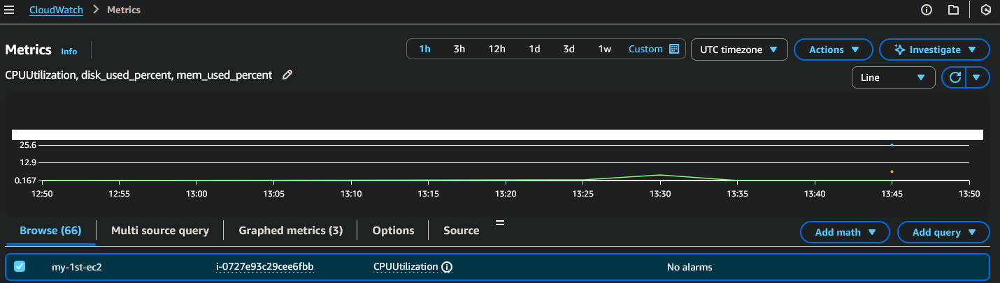
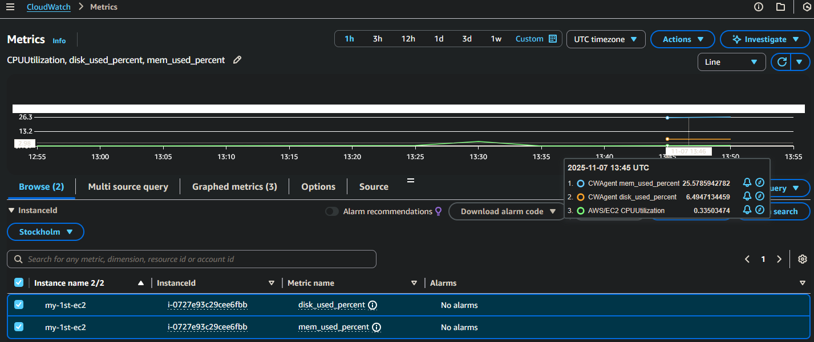
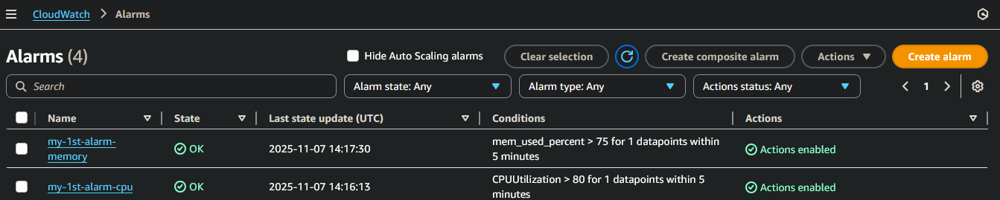
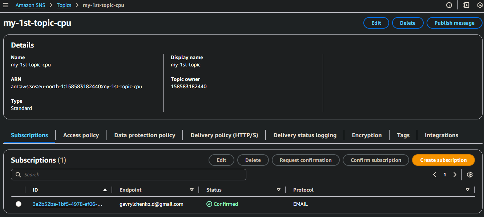
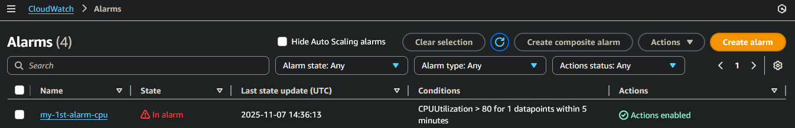
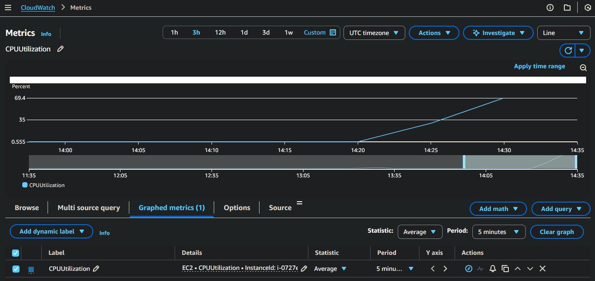
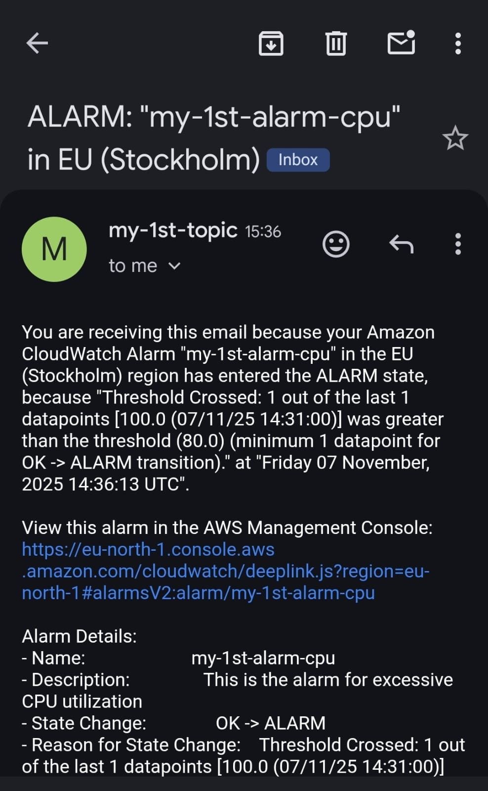
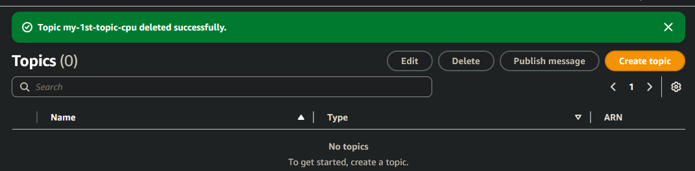
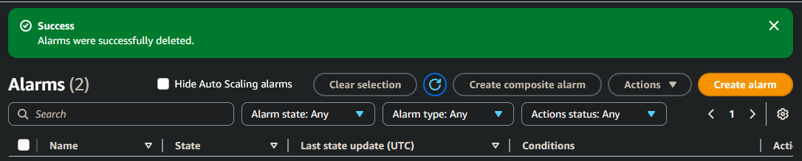

# Tier 3. Module 2 - Foundations of Cloud Computing

## Homework for Topic 8 - Monitoring and analytics in AWS

### Technical task

Today you will learn how to configure metrics for EC2 and create Alarms that will automatically notify you and your mentor about load exceedances.

#### Task Description

1. Configure Metrics for EC2

Go to AWS Console → CloudWatch

Add CPU and Memory Monitoring for your EC2 instance:

- Select `Metrics → EC2 → InstanceId`
- Add CPUUtilization

- Add Memory Metric (if you don’t see it, install and activate CloudWatch Agent on EC2, here is the [documentation](https://docs.aws.amazon.com/AmazonCloudWatch/latest/monitoring/Install-CloudWatch-Agent.html))

- Verify that metrics are updated in real time

2. Create CloudWatch Alarms for CPU and Memory

Go to CloudWatch → Alarms → Create alarm

Configure two alerts (notifications):

- CPU Usage > 80% for 5 minutes
- Memory Usage > 75% for 5 minutes

- Configure the notification:
- Select `Create new SNS topic`
- Enter your email
- Confirm subscription via email

Verify that alerts are working:

- Run a stress on EC2 (`stress --cpu 2 --timeout 300` or `yes > /dev/null &`)

- Verify that CloudWatch is sending emails

