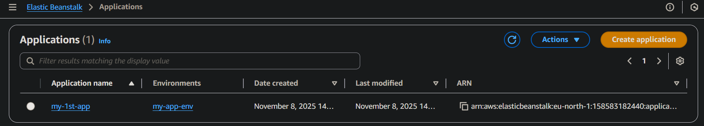
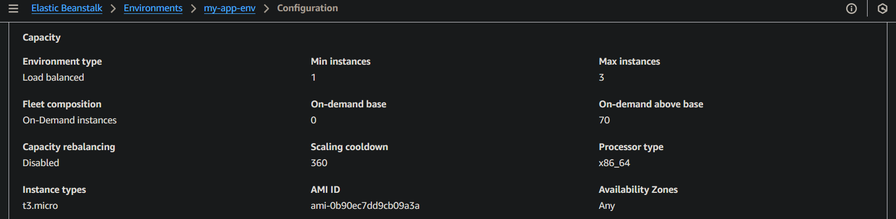
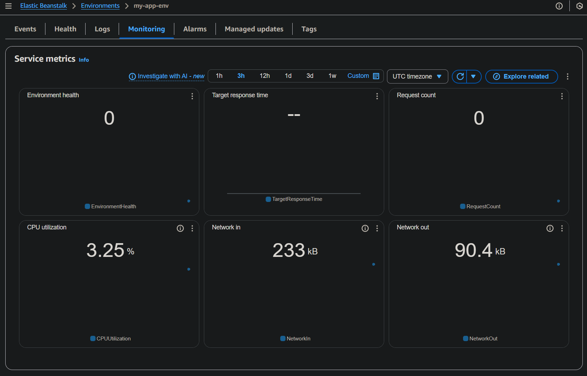
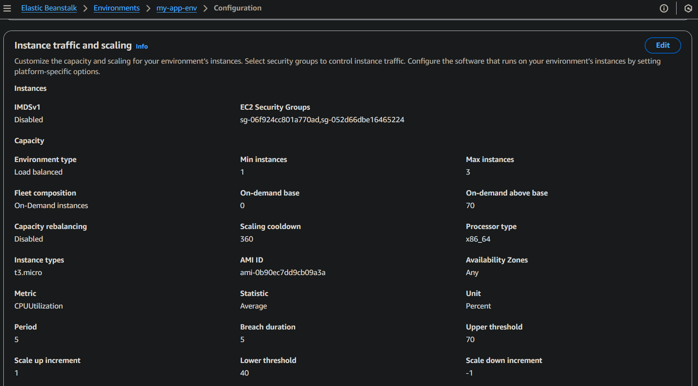
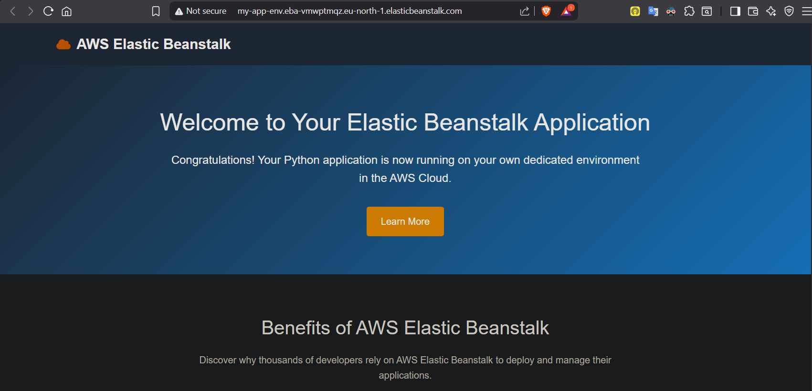

# Tier 3. Module 2 - Foundations of Cloud Computing

## Homework for Topic 9 - Deployment and DevOps

### Technical task

In this homework assignment, you will learn how to deploy a web application in AWS Elastic Beanstalk, configure the environment, and analyze its status.

#### Task Description

1. Create an environment in AWS Elastic Beanstalk

- Go to _AWS Console → Elastic Beanstalk_.
- Click “_Create application_” and configure the following parameters:
- Application name: `my-app`
- Environment type: `Web server environment`
- Environment name: `my-app-env`
- Platform: choose `Python`, `Node.js`, or `PHP`
- Platform version: leave recommended
- Application code: choose “Sample application”

2. Configure the infrastructure for Elastic Beanstalk

- Choose the instance configuration:
- Deployment type: `Single instance (free tier eligible)`
- EC2 instance size: `t3.micro`
- Verify that the environment is created without errors.

3. Monitoring and logging

- Go to _Elastic Beanstalk → Monitoring_.
- Make sure the following metrics are available:
- CPUUtilization
- RequestCount
- Target response time

4. Scaling Settings

- Enable autoscaling for your environment:
- Minimum Instances: 1
- Maximum Instances: 3
- Scaling Conditions: CPUUtilization > 70%

5. Access the application

- Follow the generated Elastic Beanstalk URL and verify that the test page works.

