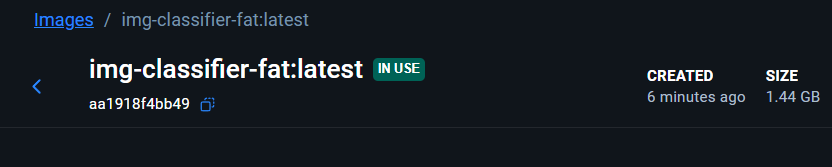
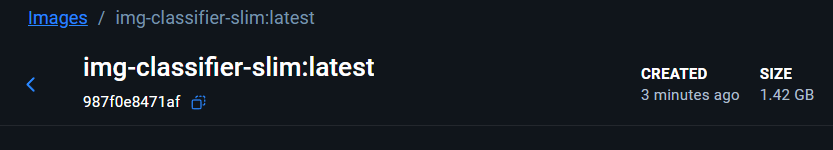
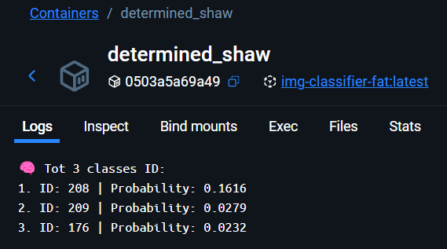
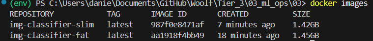

### Comparing two Docker images:

#### Fat Image

#### Slim Image

#### Result of classification

#### Conclusin

The optimized image is 30 MB lighter thanks to the multi-stage build, which allows you to clearly separate the build stage and the execution stage and not include unnecessary dependencies in the final build.
