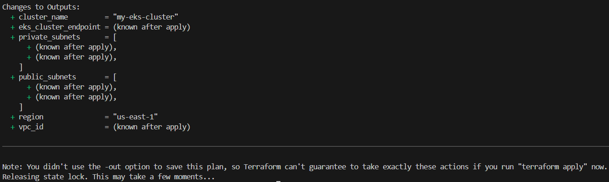
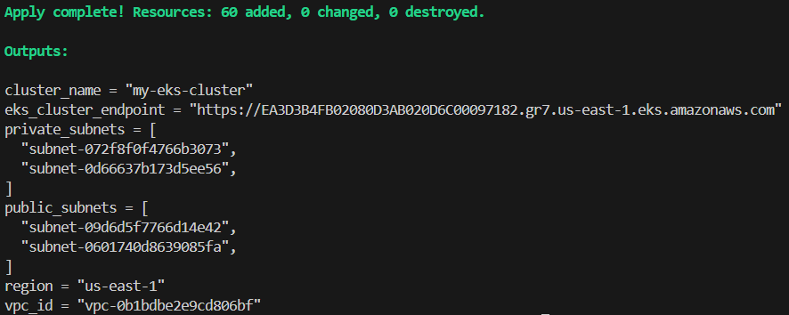
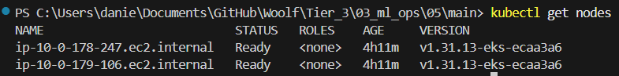
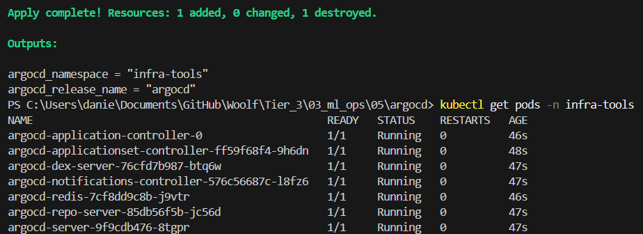

# Tier 3. Module 3 - MLOps CI/CD

## Homework for Topic 5 - Kubernetes for MLOps

### Deploy

1. Configure AWS profile

```bash
aws configure --profile <your-user-name>
```

In my case

```bash
aws configure --profile terraform-user
```

2. Create S3 backet to save Terraform state file and DynamoDB table for state locking (recommended for EKS).

```bash
cd bootstrap
terraform init
terraform apply
cd ..
```

3. Create main infrastructure.

3.1 Insert S3 backet's into backend.tf file

Terraform backends are initialized before variables and data sources, that's why they are not allowed in the backend.tf.

3.2 Configure your actual IP address in the main/variables.tf file for secure access to EKS cluster

You can find it checking `https://checkip.amazonaws.com/` in browser.

3.3 Run the commands

```bash
cd main
terraform init
terraform plan
terraform apply
cd ..
```





4. Configure cluster permissions (IAM to K8s mapping)

```bash
aws eks --region <region> update-kubeconfig --name <your-cluster-name>

aws eks create-access-entry `
  --cluster-name <your-cluster-name> `
  --principal-arn arn:aws:iam::<your-account-id>:user/<your-user-name> `
  --region <region>

aws eks associate-access-policy `
  --cluster-name <your-cluster-name> `
  --principal-arn arn:aws:iam::<your-account-id>:user/<your-user-name> `
  --policy-arn arn:aws:eks::aws:cluster-access-policy/AmazonEKSClusterAdminPolicy `
  --access-scope type=cluster `
  --region <region>
```

In my case

```bash
aws eks --region us-east-1 update-kubeconfig --name my-eks-cluster

aws eks create-access-entry `
  --cluster-name my-eks-cluster `
  --principal-arn arn:aws:iam::014885976360:user/terraform-user `
  --region us-east-1

aws eks associate-access-policy `
  --cluster-name my-eks-cluster `
  --principal-arn arn:aws:iam::014885976360:user/terraform-user `
  --policy-arn arn:aws:eks::aws:cluster-access-policy/AmazonEKSClusterAdminPolicy `
  --access-scope type=cluster `
  --region us-east-1
```

5. Check the nodes

```bash
kubectl get nodes
```



6. Deploy ArgoCD via Terraform

Make sure that the values ​​of "region" and "cluster_name" in the argocd/variables.tf file are identical to the values ​​in the main/variables.tf file.

```bash
cd argocd
terraform init
terraform plan
terraform apply
cd ..
```

7. Verify ArgoCD deployment

```bash
kubectl get pods -n <namespace name>
```

In my case

```bash
kubectl get pods -n infra-tools
```



8. Delete ArgoCD if not neaded.

```bash
cd argocd
terraform destroy
cd ..
```

9. Delete main infrastructure if not neaded.

```bash
cd main
terraform destroy
cd ..
```
