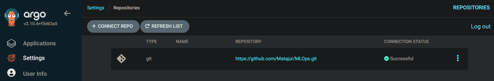
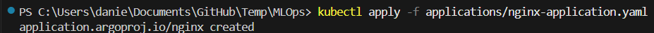
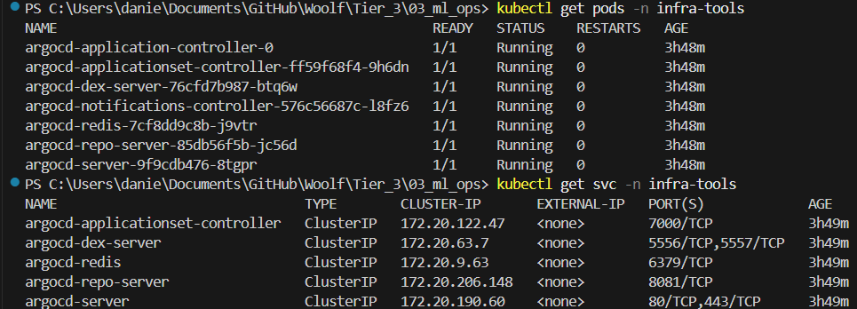
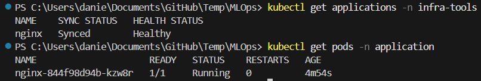
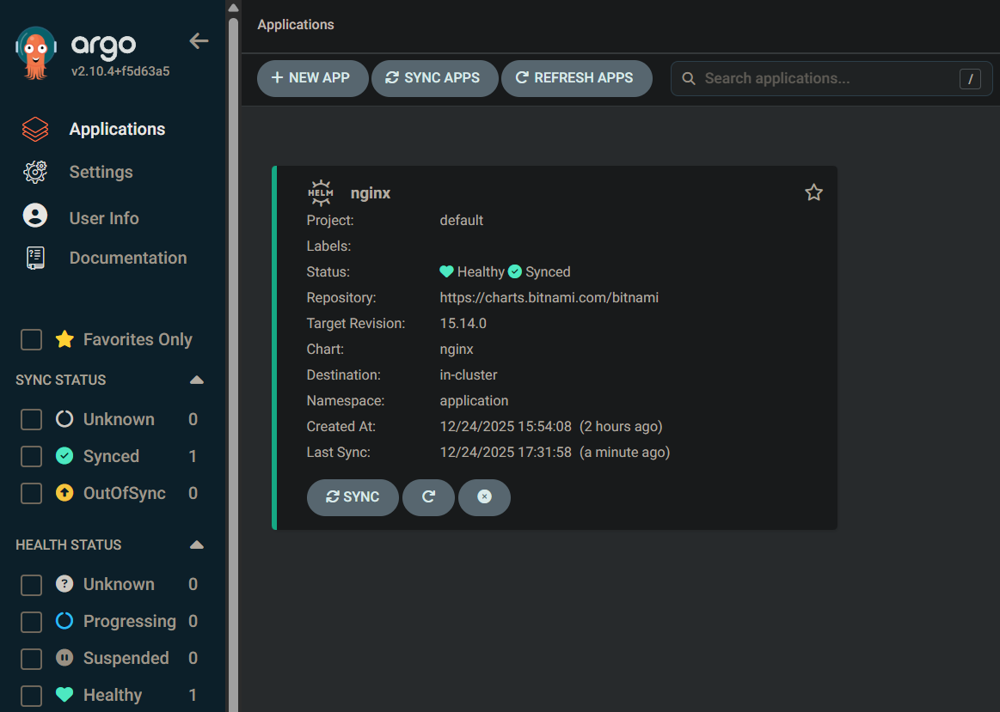
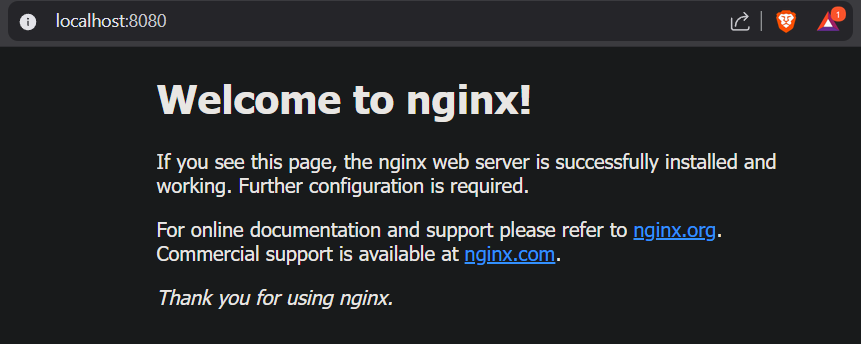

# Tier 3. Module 3 - MLOps CI/CD

## Homework for Topic 7 - ArgoCD for Helm deployment

### IMPORTANT NOTES:

- For instructions on deploying the full infrastructure with VPC, EKS, and ArgoCD pods, see the README.md file from [branch 5](https://github.com/Matajur/MLOps/tree/lesson-5-6).
- This README.md file only applies to Argo application deployment.
- A separate `values.yaml` file for the Argo application was chosen because it allows better scaling for large systems.
- [Bitnami NGINX](https://charts.bitnami.com/bitnami) Helm chart from ArtifactHub was chosen for its stability.
- Port-forwarding instead of LoadBalancer was used for the service access because of lower cost.

### Deploy

Once the code is committed to the Git repository, follow these steps.

1. Register the repository in Argo CD

1.1 Using ArgoCD CLI

```bash
argocd repo add https://github.com/<your-org>/<your-repo>.git
```

In my case

```bash
argocd repo add https://github.com/Matajur/MLOps.git
```

1.2 Using ArgoCD UI

1.2.1 Get a one-time password to access the ArgoCD UI

Whenever you run the commands listed below, enter the name of your namespace instead of "infra-tools".

On Linux

```bash
kubectl -n infra-tools get secret argocd-initial-admin-secret -o jsonpath="{.data.password}" | base64 -d
```

On Windows

```bash
kubectl -n infra-tools get secret argocd-initial-admin-secret `
  -o jsonpath="{.data.password}" |
  %{ [System.Text.Encoding]::UTF8.GetString([System.Convert]::FromBase64String($_)) }
```

1.2.2 Expose the ArgoCD server locally (port-forwarding)

```bash
kubectl -n infra-tools port-forward svc/argocd-server 9090:80
```

1.2.3 Access the ArgoCD UI via link

http://localhost:9090

- Username: admin
- Password: output of the command above

  1.2.4 Register the repository link in the Argo CD UI → Settings → Repositories

- For a public repository use the connection method: via HTTPS
- Connection Type: Git
- Repository URL: https://github.com/Matajur/MLOps.git (link to a complete ropository, not a separate branch)
- Name: mlops
- Project: default



2. Apply the application

```bash
kubectl apply -f applications/nginx-application.yaml
```



3. Check ArgoCD sanity (all pods should be Running)

```bash
kubectl get pods -n infra-tools
kubectl get svc -n infra-tools
```



4. Verify synchronization

```bash
kubectl get applications -n infra-tools
kubectl get pods -n application
```





5. Expose the Nginx server locally (port-forwarding)

```bash
kubectl -n application port-forward svc/nginx 8080:80
```

6. Access the Nginx welcome page via link

http://localhost:8080


