# Tier 3. Module 3 - MLOps CI/CD

## Homework for Topic 9 - Monitoring the quality of models and tracking experiments

### Deployment

This branch contains GitOps manifests and an experiment script that:

- Deploys MinIO, PostgreSQL, and an MLflow Tracking Server via ArgoCD;
- Deploys Prometheus Pushgateway via ArgoCD;
- Runs a small hyperparameter sweep on Iris and:
  - logs params/metrics/artifacts to MLflow;
  - pushes `mlflow_accuracy` and `mlflow_loss` to Pushgateway with `run_id` labels;
  - downloads the best model to `best_model/`.

#### Repo structure

```
MLOps/
├── argocd/
│   ├── applications/
│   │   ├── mlflow.yaml
│   │   ├── minio.yaml
│   │   ├── postgres.yaml
|   |   ├── monitoring-stack.yaml
│   │   └── pushgateway.yaml
│   └── manifests/
│       └── mlflow/
│           ├── deployment.yaml
│           └── service.yaml
├── experiments/
│   ├── train_and_push.py
│   └── requirements.txt
├── best_model/
│   └── <downloaded model artifacts appear here after running>
└── README.md
```

#### Execution steps

After uploading the project to the repository, follow these steps.

1. Register Applications in ArgoCD

The repository itself was registered in the ArgoCD UI during the previous homework, see the branch [lesson-7](https://github.com/Matajur/MLOps/tree/lesson-7).

1.1 Apply ArgoCD Applications

Whenever you run the commands listed below, enter the name of your namespace instead of "infra-tools".

```bash
kubectl apply -n infra-tools -f argocd/applications/
```

This:

- Creates Application CRs in Kubernetes;
- Argo CD immediately detects them.

  1.2 Verify Applications exist

```bash
kubectl get applications -n infra-tools
```

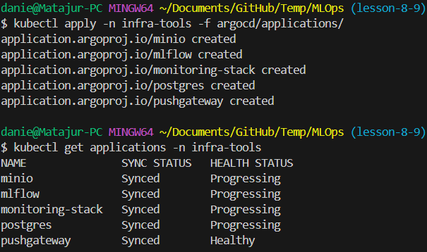

1.3 Check ArgoCD UI

```bash
kubectl -n infra-tools port-forward svc/argocd-server 9090:80
```

Login ArgoCD UI under the link: http://localhost:9090/

How to get username and password for ArgoCD UI is explained in the previous homework, see the branch [lesson-7](https://github.com/Matajur/MLOps/tree/lesson-7).

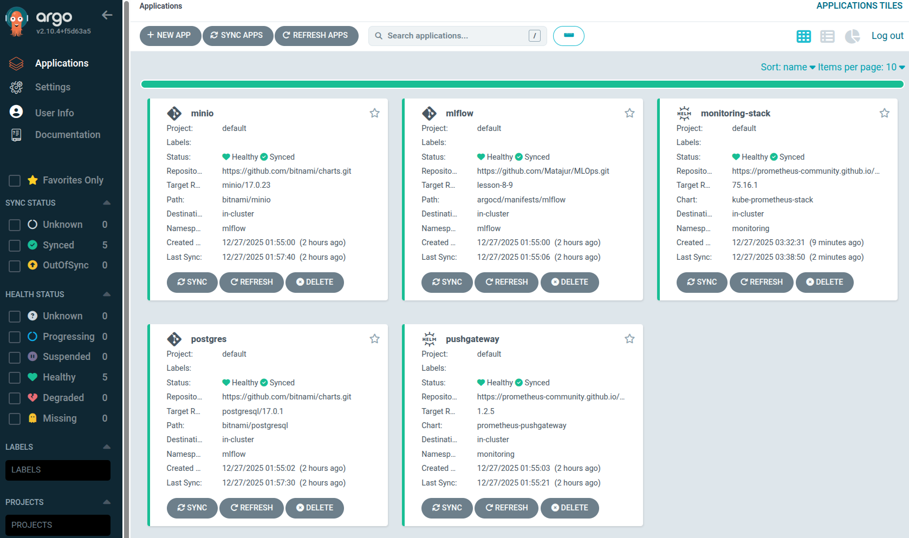

2. Verify infrastructure inside Kubernetes

2.1 Verify namespaces

```bash
kubectl config set-context --current --namespace=mlflow
kubectl get ns
```

2.2 Verify Pods

```bash
kubectl get pods -n mlflow
kubectl get pods -n monitoring
```

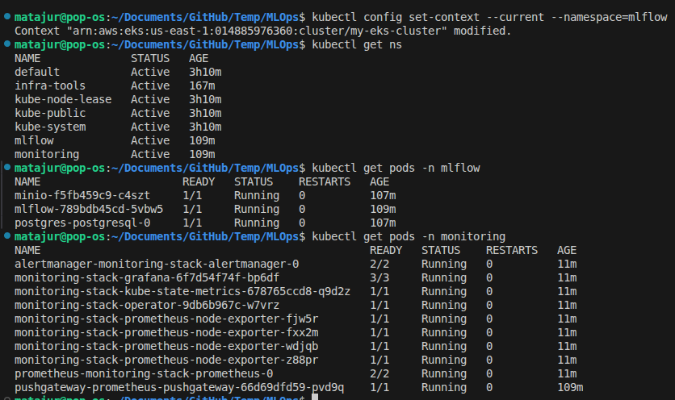

2.3 Verify Services

```bash
kubectl get svc -n mlflow
kubectl get svc -n monitoring
```

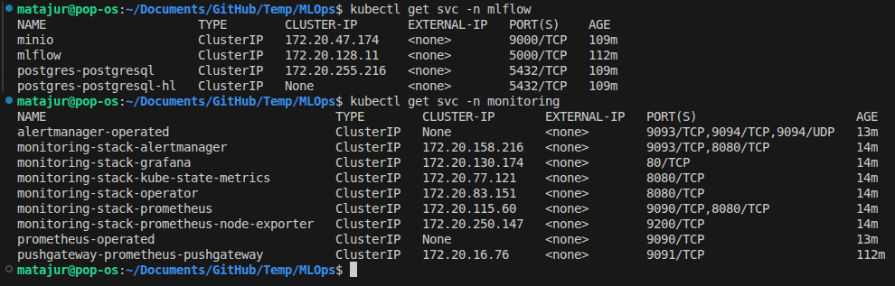

2.4 Verify Helm-generated Secrets

Instead of hard-coded logins and passwords in Helm charts, this project uses hidden secrets generated by Helm.

```bash
kubectl get secrets -n mlflow
kubectl describe secret -n mlflow minio
kubectl describe secret -n mlflow postgres-postgresql
```

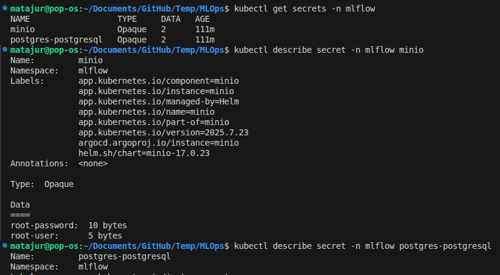

3. Verify MLflow is reachable

Port-forward MLflow

```bash
kubectl port-forward -n mlflow svc/mlflow 5000:5000
```

Open in browser: http://localhost:5000

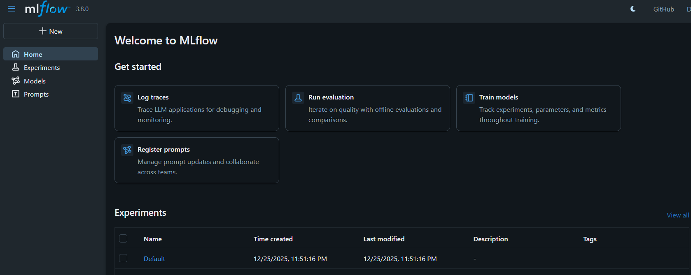

4. Run training locally

This generates metrics that are tracked by MLflow.
The trained models will be stored in the cloud in MinIO storage, and PostgreSQL will store experiment metadata, such as configurations, and model references in MinIO storage.

4.1 Prepare local Python environment

```bash
cd experiments
python3 -m venv .venv
source .venv/bin/activate
pip install -r requirements.txt
```

4.2 Get the MinIO credentials from Kubernetes

Only in bash

```bash
kubectl get secret -n mlflow minio -o jsonpath="{.data.root-user}" | base64 -d; echo
kubectl get secret -n mlflow minio -o jsonpath="{.data.root-password}" | base64 -d; echo
```

4.3 Make MinIO reachable from the local machine

```bash
kubectl port-forward -n mlflow svc/minio 9000:9000
```

4.4 Export the required environment variables locally

```bash
export AWS_ACCESS_KEY_ID="<MINIO_USER>"
export AWS_SECRET_ACCESS_KEY="<MINIO_PASS>"
export AWS_DEFAULT_REGION="us-east-1"
export MLFLOW_S3_ENDPOINT_URL="http://localhost:9000"
export MLFLOW_TRACKING_URI="http://localhost:5000"
```

4.5 Export runtime endpoints

They are needed for the script to reach cluster services.

```bash
export MLFLOW_TRACKING_URI=http://localhost:5000
export PUSHGATEWAY_URL=http://pushgateway.monitoring.svc.cluster.local:9091
```

- MLflow is accessed via port-forward
- Pushgateway is accessed via Kubernetes DNS

  4.6 Run training

```bash
python3 train_and_push.py --pushgateway http://localhost:9091
```

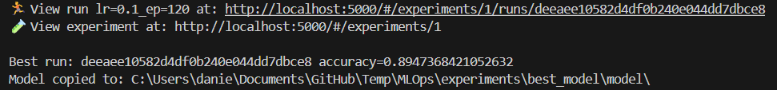

At this point:

- Multiple MLflow runs created
- Metrics logged
- Models uploaded to MinIO
- Accuracy & loss pushed to Pushgateway
- Best model downloaded to best_model/

  4.7 Verify MLflow UI

Refresh the http://localhost:5000 page.

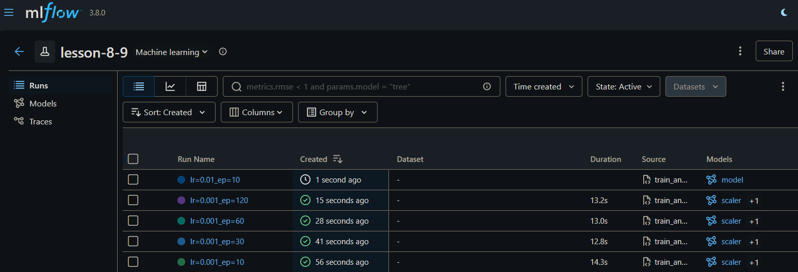

5. Verify Pushgateway metrics

Port-forward Pushgateway

```bash
kubectl port-forward -n monitoring svc/pushgateway-prometheus-pushgateway 9091:9091
```

Open in browser: http://localhost:9091/metrics

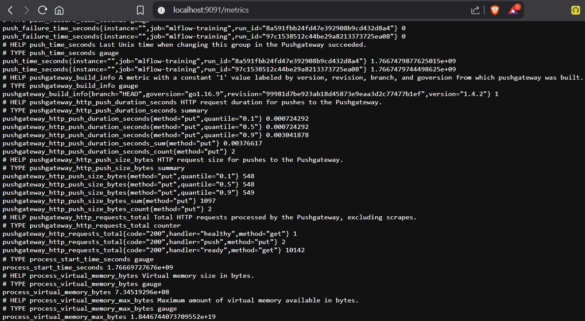

6. Verify Prometheus ingestion

6.1 Port-forward and open Prometheus UI

```bash
kubectl port-forward -n monitoring svc/monitoring-stack-prometheus 9090:9090
```

Open in browser: http://localhost:9090

6.2 Run queries

```bash
mlflow_accuracy
mlflow_loss
```

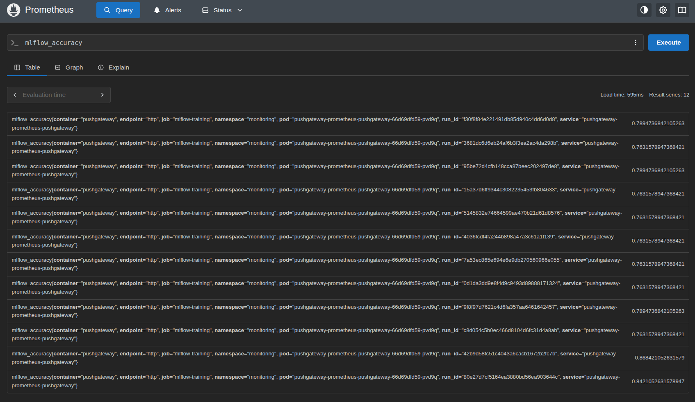

7. Visualize in Grafana

7.1 Open Grafana UI

Port-forward

```bash
kubectl port-forward -n monitoring svc/monitoring-stack-grafana 3000:80
```

Open in browser: http://localhost:3000

- login: admin
- password: can be found with this command:

```bash
kubectl -n monitoring get secret monitoring-stack-grafana \
  -o jsonpath='{.data.admin-password}' | base64 -d; echo
```

7.2 Explore metrics

In **Grafana → Explore → Prometheus**, query:

```bash
mlflow_accuracy
mlflow_loss
```

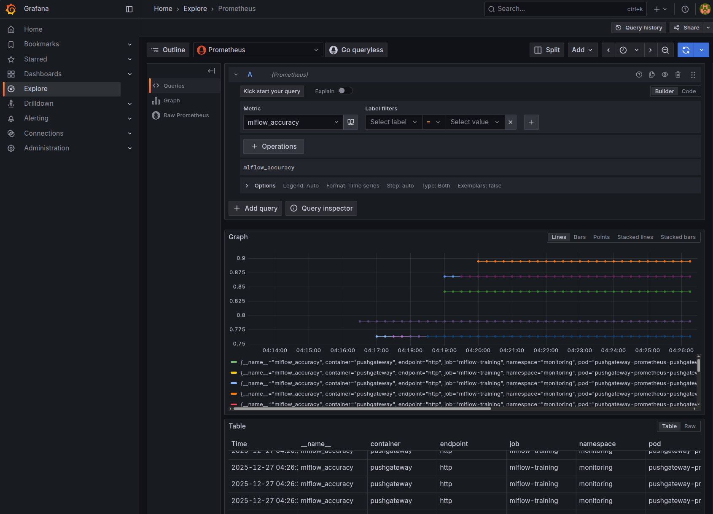
