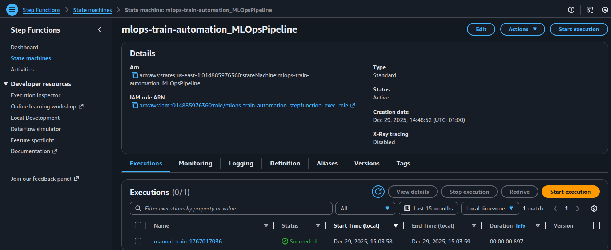
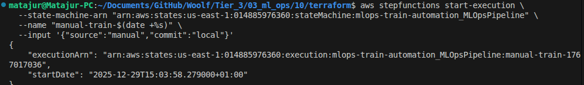
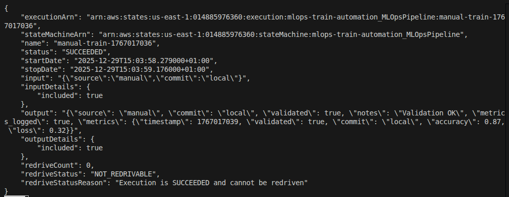
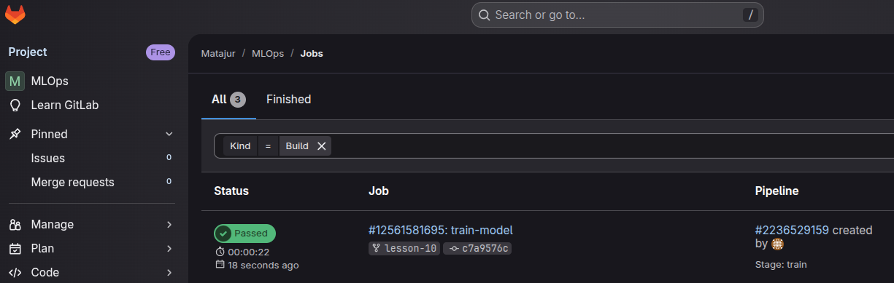

# Tier 3. Module 3 - MLOps CI/CD

## Homework for Topic 9 - Monitoring the quality of models and tracking experiments

### Deployment

This branch deploys a minimal training automation pipeline in AWS:

- Two AWS Lambda functions: `validate` and `log_metrics`;
- One AWS Step Functions state machine that runs `validate -> log_metrics` sequentially;
- GitLab CI job that triggers a Step Functions execution on every push.

#### Project structure

```bash
lesson-10/
├── terraform/
│  ├── main.tf
│  ├── variables.tf
│  └── lambda/
│    ├── validate.py
│    ├── log_metrics.py
│    ├── validate.zip
│    └── log_metrics.zip
├── .gitlab-ci.yml
├── README.md
```

1. Build Lambda archives

From the repository root:

```bash
cd terraform/lambda
zip validate.zip validate.py
zip log_metrics.zip log_metrics.py
cd ..
```

**Attention**: If Python code is changed, rebuild the zip archives before terraform apply.

2. Deploy infrastructure with Terraform

```bash
terraform init
terraform apply
```

After apply, Terraform prints the `state_machine_arn` output. Save it for CI and for manual runs. In my case

```bash
state_machine_arn = "arn:aws:states:us-east-1:014885976360:stateMachine:mlops-train-automation_MLOpsPipeline"
```



3. Manually run the Step Function for infrastructure and pipeline validation

```bash
aws stepfunctions start-execution \
  --state-machine-arn "arn:aws:states:REGION:ACCOUNT_ID:stateMachine:mlops-train-automation_MLOpsPipeline" \
  --name "manual-train-$(date +%s)" \
  --input '{"source":"manual","commit":"local"}'

aws stepfunctions describe-execution \
  --execution-arn "arn:aws:states:REGION:ACCOUNT_ID:stateMachine:mlops-train-automation_MLOpsPipeline:NAME"
```

In my case

```bash
aws stepfunctions start-execution \
  --state-machine-arn "arn:aws:states:us-east-1:014885976360:stateMachine:mlops-train-automation_MLOpsPipeline" \
  --name "manual-train-$(date +%s)" \
  --input '{"source":"manual","commit":"local"}'

aws stepfunctions describe-execution \
  --execution-arn "arn:aws:states:us-east-1:014885976360:execution:mlops-train-automation_MLOpsPipeline:manual-train-1767017036"

```





4. GitLab CI

The pipeline contains a single job `train-model` that runs on every push and triggers the Step Function execution.

4.1 GitLab variables

Set these in GitLab: Settings → CI/CD → Variables

If you want the pipeline to run outside of the main branch, uncheck "Protected Variable" when installing it, or add the branch to protected ones.

- `AWS_ACCESS_KEY_ID`
- `AWS_SECRET_ACCESS_KEY`
- `AWS_DEFAULT_REGION` (see `variables.tf`)
- `STATE_MACHINE_ARN` (from Terraform output `state_machine_arn`)

  4.2 Push the code to GitLab

CI will send to the state machine an input in form of JSON:

- `source`: `gitlab-ci`
- `commit`: the Git commit short SHA

Example input:

```bash
{
  "source": "gitlab-ci",
  "commit": "a1b2c3d4"
}
```


