# Tier 3. Module 3 - MLOps CI/CD

## Final Project

### Description

This repository contains a minimal, end-to-end “MLOps-style” deployment of an inference service into Kubernetes using GitOps (ArgoCD) and standard observability tooling.

#### Repository layout

```bash
final-project/
├── terraform/                      # AWS infrastructure with local state
│  ├── infra/
│  │  ├── main.tf
│  │  ├── outputs.tf
│  │  ├── providers.tf
│  │  ├── variables.tf
│  │  └── versions.tf
│  └── platform/
│     ├── helm.tf
│     ├── outputs.tf
│     ├── providers.tf
│     ├── variables.tf
│     ├── versions.tf
│     └── values/
│        ├── argocd-values.yaml
│        ├── kube-prometheus-stack-values.yaml
│        └── loki-stack-values.yaml
├── app/                            # FastAPI inference service
│  └── main.py
├── model/                          # Training / retraining utilities
│  └── train.py
├── helm/                           # Helm charts to deploy the service
│  ├── Chart.yaml
│  ├── values.yaml
│  └── templates/
│     ├── _helpers.tpl
│     ├── deployment.yaml
│     ├── hpa.yaml
│     ├── ingress.yaml
│     ├── service.yaml
│     ├── serviceaccount.yaml
│     └── servicemonitor.yaml
├── argocd/                         # ArgoCD Application manifest (auto-sync)
│  └── application.yaml
├── grafana/                        # Dashboard configuration
│  └── dashboards.json
├── prometheus/                     # Targets to scrape the metrics for Prometheus
│  └── additionalScrapeConfigs.yaml
├── Dockerfile
├── requirements.txt
├── ecr-policy.json                 # IAM policies fo GitLab CI to access Amazon ECR
├── .gitattributes                  # Controls how Git treats files
└── .gitlab-ci.yml
```

#### What is implemented

1. **AWS infrastructure for running Inference service**

- EKS (VPC + cluster + managed node group)
- IRSA (OIDC enabled)
- EBS CSI (so Prometheus/Grafana/Loki can use PVs)
- ArgoCD (Helm)
- Prometheus + Grafana via `kube-prometheus-stack` (Helm)
- Loki + Promtail via `loki-stack` (Helm)
- Namespaces, basic persistence, and sane defaults

2. **Inference service (FastAPI)**

- Loads a serialized sklearn model (`model/model.pkl`) at startup.
- Exposes:
  - `POST /predict` — returns model prediction, logs input/output to stdout.
  - `GET /health` — liveness/readiness probe.
  - `GET /metrics` — Prometheus metrics endpoint (via `prometheus_client`).
- Has a dedicated `predict(data)` function.
- Implements a lightweight drift check using **Alibi Detect**:
  - Keeps a sliding window of recent requests.
  - When the window is full, it runs a KS-based drift test vs reference data (`model/reference.npy`).
  - On drift it logs `Drift detected` and increments a Prometheus counter.

3. **Drift detector (Alibi Detect)**

- Uses `alibi-detect`’s `KSDrift` (tabular, univariate KS tests with multiple-testing correction).
- Trigger action:
  - Logs `Drift detected` (always).
  - Optional webhook call (if `DRIFT_WEBHOOK_URL` env var is set). This is suitable for calling GitLab pipeline triggers.

4. **CI for retrain (GitLab CI)**

The pipeline includes a **manual** and **automatic** (after new push to repo is detected) `retrain-model` job which:

- Runs `python -m model.train` to generate:
  - `model/model.pkl` (new model artifact)
  - `model/reference.npy` (reference data for drift detector)
- Builds and pushes a Docker image (Kaniko) tagged with the Git commit SHA.
- Updates Helm values (`helm/values.yaml`) with the new image tag and commits back to the repo, enabling ArgoCD auto-sync.

5. **Helm + ArgoCD**

- Helm chart deploys:
  - `Deployment`
  - `Service`
  - `ServiceAccount` (optional)
  - Optional `Ingress` template remains in the chart (off by default)
- ArgoCD `Application` is configured with **automated sync**, prune, and self-heal.

6. **Monitoring and logging**

- Prometheus scrapes `/metrics` (either via:
  - service annotations; or
  - the example `prometheus/additionalScrapeConfigs.yaml`).
- Grafana dashboard JSON includes:
  - Requests/min
  - Latency (p50/p95/p99 via histogram)
  - Drift events
- Loki/Promtail: the app logs to stdout; Promtail collects container logs by default when installed.

---

### Infrastructure deployment

1. **Configure AWS profile**

```bash
AWS configure --profile <your-user-name>
```

In my case

```bash
aws configure --profile terraform-user
```

2. **Create main infrastructure vith EKS**

```bash
cd terraform/infra
terraform init
terraform plan
terraform apply
```

3. **Configure EKS cluster with all the services**

```bash
cd ../platform
terraform init
terraform plan
terraform apply
```

4. **Configure kubeconfig**

```bash
aws eks update-kubeconfig --region <region> --name <your-cluster-name>
```

In my case

```bash
aws eks update-kubeconfig --region us-east-1 --name mlops-final-eks
kubectl get nodes
kubectl get pods -A
```

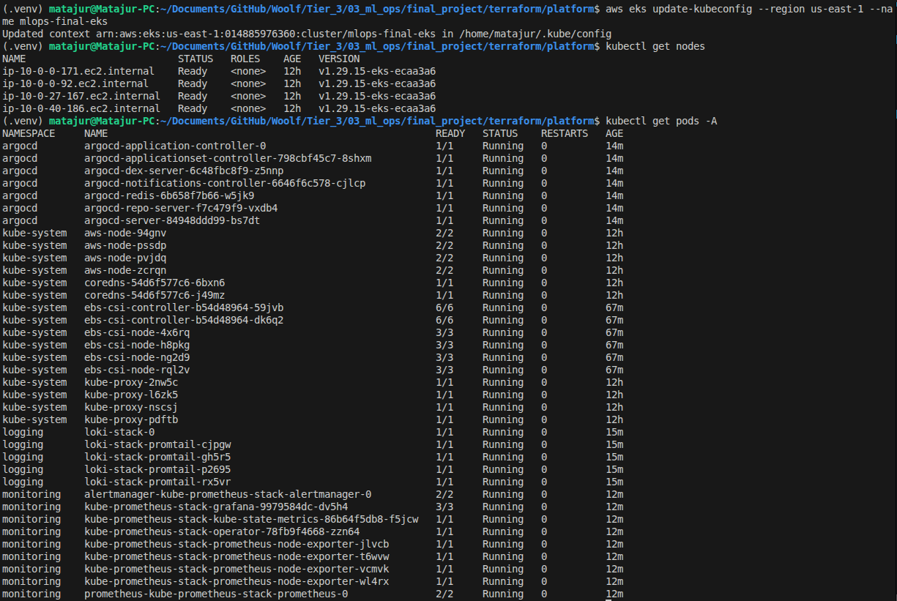

5. **Port-forward for quick checks**

```bash
# ArgoCD UI
kubectl -n argocd port-forward svc/argocd-server 8080:80

# Grafana UI (kube-prometheus-stack)
kubectl -n monitoring port-forward svc/kube-prometheus-stack-grafana 3000:80

# Prometheus UI
kubectl -n monitoring port-forward svc/kube-prometheus-stack-prometheus 9090:9090
```

Access the services:

- ArgoCD UI
  - URL: `http://localhost:8080`
  - Username: `admin`
  - Password: output of the command

```bash
kubectl get secret argocd-initial-admin-secret -n argocd -o jsonpath="{.data.password}" | base64 -d && echo
```

- Grafana UI
  - URL: `http://localhost:3000`
  - Username: `admin`
  - Password: output of the command

```bash
kubectl get secret kube-prometheus-stack-grafana -n monitoring -o jsonpath="{.data.admin-password}" | base64 -d && echo
```

- Prometheus UI
  - URL: `http://localhost:9090`
  - No credentials are needed

Additional verification of the ArgoCD and Monitoring Stack pods

```bash
kubectl get pods -n argocd
kubectl get pods -n monitoring
```

---

### Local testing run (optional)

```bash
python -m venv .venv
source .venv/bin/activate
pip install -r requirements.txt

# Train model locally
python -m model.traind

# Start API
uvicorn app.main:app --reload --port 8000
```

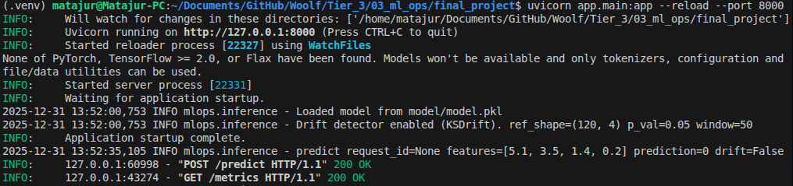

Test request by sending a feature vector with 4 numerical values:

```bash
curl -s -X POST http://localhost:8000/predict \
  -H 'Content-Type: application/json' \
  -d '{"features":[5.1,3.5,1.4,0.2]}' | jq
```

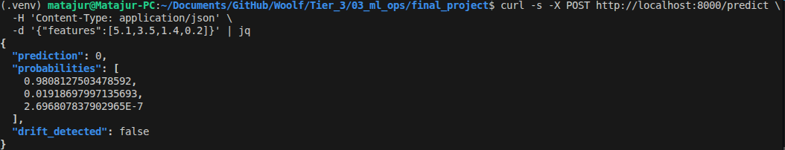

Metrics:

```bash
curl -s http://localhost:8000/metrics | grep predict
```

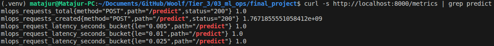

---

### Build & run container locally for pre-deployment validation (optional)

The container must run with cache disabled and JIT for Numba or Alibi Detect will crash during startup.

```bash
docker build -t mlops-inference:dev .
podman run --rm -p 8000:8000 -e NUMBA_DISABLE_JIT=1 -e NUMBA_DISABLE_CACHE=1 mlops-inference:dev

curl http://localhost:8000/health
curl -X POST http://localhost:8000/predict -H 'Content-Type: application/json' -d '{"features":[1,2,3,4]}'
curl http://localhost:8000/metrics
```

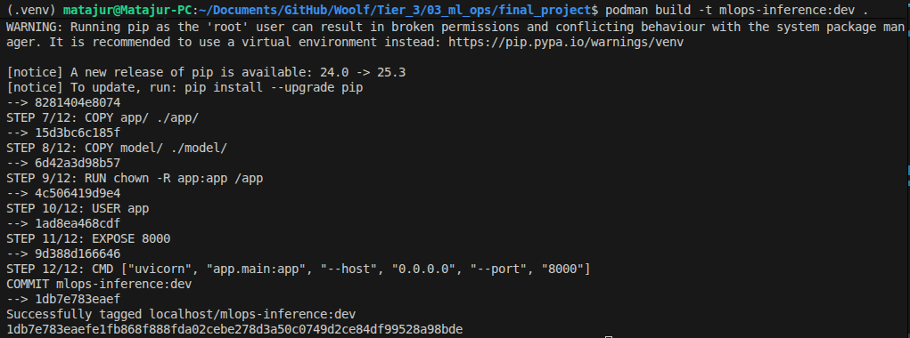

---

### Prerequisites for app deployment

- AWS infrastructure deployed.
- All the code pushed to GitLab.
- GitLab project with Container Registry enabled.
- Set up variable `GIT_PUSH_TOKEN` — a project access token with permission to push to the target branch.
- After committing the code to Gitlab, all three phases of the pipeline (retrain → build → update-chart) must be marked as passed.

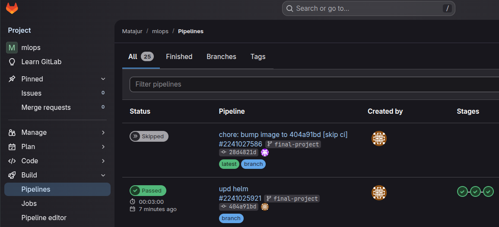

- GitLab repository registered in ArgoCD UI → Settings → Repositories:
  - For a public repository use the connection method: via `HTTPS`;
  - Connection Type: `Git`;
  - Repository URL: link to a complete ropository, not a separate branch. In my case:
    `https://gitlab.com/matajur1/mlops.git`
  - Name: any;
  - Project: `default`.

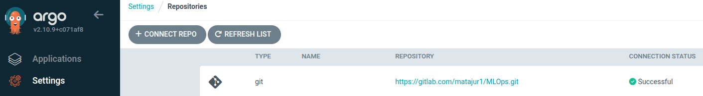

---

### Deploy with ArgoCD (GitOps)

1. Update `argocd/application.yaml`:

   - `spec.source.repoURL` to your repository URL (in my case `https://gitlab.com/matajur1/mlops.git`)
   - `spec.destination.server` (usually `https://kubernetes.default.svc`)
   - `spec.destination.namespace` to your target namespace, (in my case `argocd`)

2. Apply the ArgoCD Application:

```bash
kubectl apply -f argocd/application.yaml
```

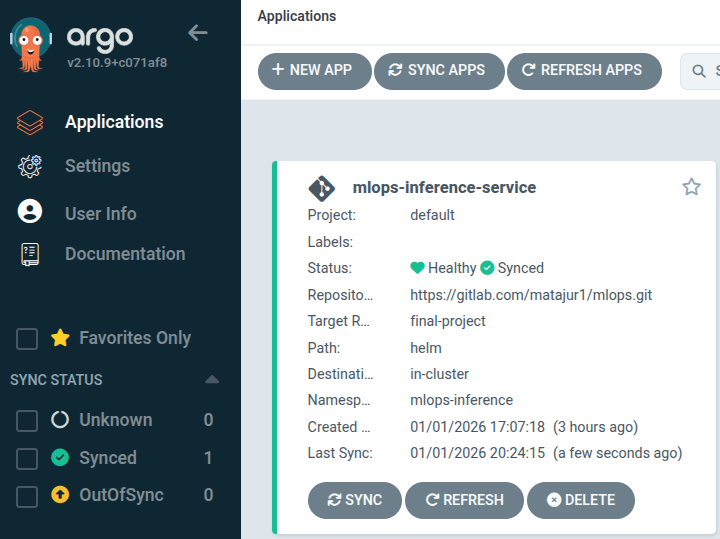

---

### Test the query in-cluster

```bash
kubectl -n mlops-inference port-forward svc/mlops-inference-service 8000:80
curl -s -X POST http://localhost:8000/predict -H 'Content-Type: application/json' -d '{"features":[5.1,3.5,1.4,0.2]}' | jq
```

Expected:

- Response includes `prediction` plus a boolean `drift_detected`.
- Logs show the request and response.

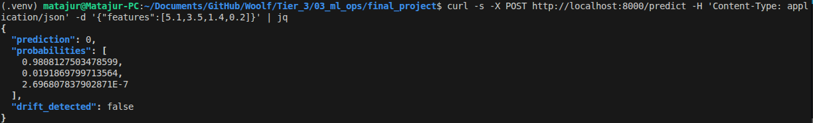

---

### Check logging (Loki and kubectl)

```bash
kubectl -n mlops-inference logs deploy/mlops-inference-service -f
```

Look for lines like:

- `request_features=... prediction=...`
- `Drift detected` (when drift triggers)

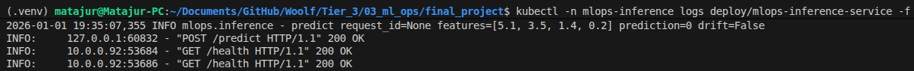

View logs in Grafana Explore by selecting the Loki data source and filtering by:

- `{namespace="mlops-inference"}`

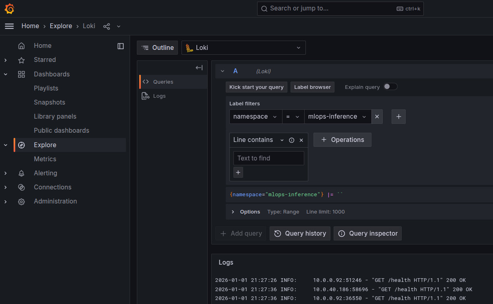

---

### Check if the drift detector is triggered

The drift detector runs when the sliding window reaches `DRIFT_WINDOW_SIZE` requests (default 50).

1. Send many requests with shifted data:

```bash
for i in $(seq 1 60); do
  curl -s -X POST http://localhost:8000/predict \
    -H 'Content-Type: application/json' \
    -d '{"features":[20,20,20,20]}' >/dev/null
done
```

2. Check logs:

```bash
kubectl -n mlops-inference logs deploy/mlops-inference-service | grep -i drift | tail
```

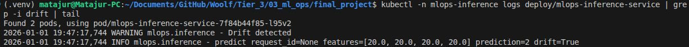

3. Check metrics:

- `mlops_drift_events_total`
- `mlops_requests_total`

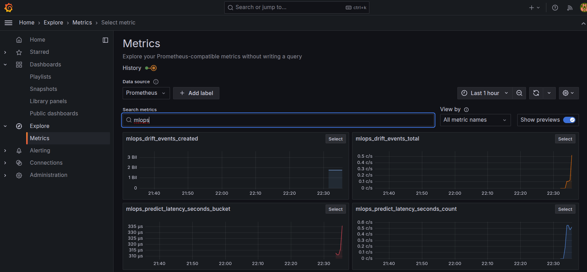

---

### Verify monitoring (Prometheus + Grafana)

1. **Prometheus**

- Confirm the target is discovered and up:
  - Targets page in Prometheus UI
  - Or query: `up{job="mlops-inference-service"}`

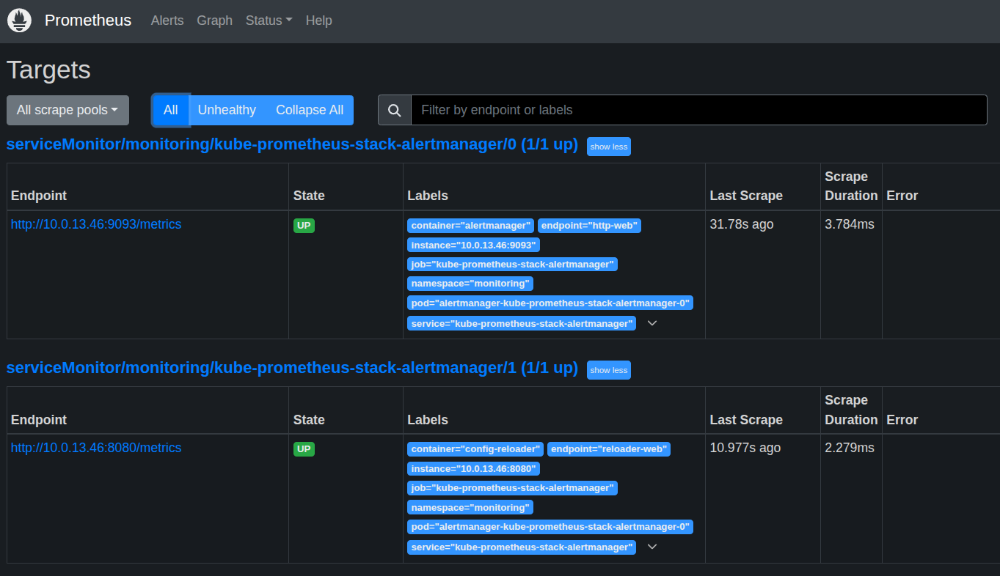

2. **Grafana**

- Import `grafana/dashboards.json`.
- Ensure Prometheus data source is selected.
- Dashboard provides:
  - Requests/min
  - Latency percentiles
  - Drift events

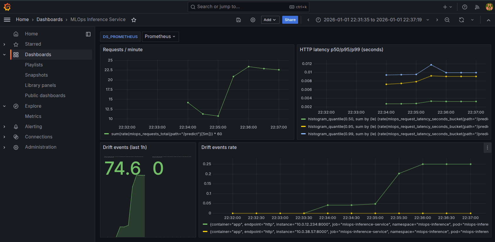

---

### How to verify retrain pipeline (GitLab CI)

1. **Required CI variables**

Configure these in GitLab → Settings → CI/CD → Variables (masked/protected as appropriate):

- `GIT_PUSH_TOKEN` — a project access token with permission to push to the target branch.
- Optional:
  - `DRIFT_WEBHOOK_URL` — URL that the service calls on drift (for GitLab pipeline trigger API).
  - `DRIFT_WEBHOOK_TOKEN` — bearer token header sent by the service if you want auth.
  - `GIT_PUSH_USER` — username for the token (often `oauth2` or the token’s user).
  - `CI_REGISTRY` / built-ins are provided by GitLab.
  - `CI_REGISTRY_IMAGE` / built-in.

2. **Running retrain**

- In GitLab → CI/CD → Pipelines → Run pipeline
- Start the `retrain-model` job manually.
- Or make a commit to `final-project` branch.

Expected:

- new container image pushed
- `helm/values.yaml` updated with the new tag
- ArgoCD auto-sync deploys the updated image

---

### Updating the model

Two supported paths:

1. **CI retrain**

- Trigger `retrain-model` job.
- ArgoCD auto-sync deploys the new image automatically.

2. **Manual model update**

- Run `python -m model.train` locally, commit changes, push.
- Then build/push a new image and update `helm/values.yaml`.

---

### P.S.

If the application is no longer needed:

```bash
cd terraform/platform
terraform destroy
cd ../infra
terraform destroy
```

---
