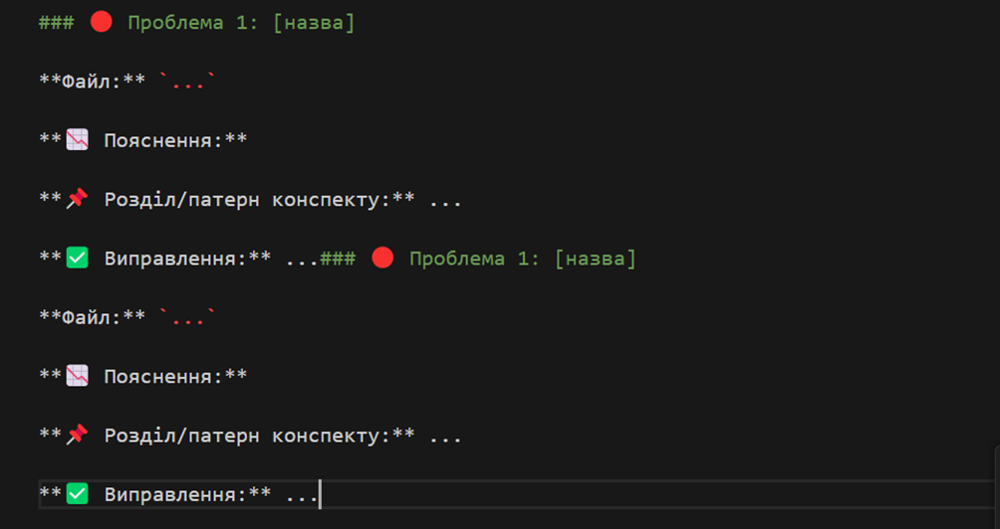

# Tier 4. Module 7 - Secure Software Development and Integration

## Topic 3. Homework - Secure architectural design in SSDLC / CI-CD

### Technical Task: Architectural review of the template for the possibility of conducting checks and the presence of check signals

Step-by-step instructions for performing the work

#### Preparing the environment

1. Create a local folder **secure-arch-lab/**.
2. Place the files obtained from the [archive](https://drive.google.com/drive/folders/1C5Inznb9G0TKGobJu3gzYscbUvCvOaSB?usp=sharing) in this folder:

main.py, deployment.yaml, main.tf, ci.yml, Dockerfile, lab.md, README.md.

#### Part 1. Initial architecture audit

1. Open the **lab.md** file, familiarize yourself with the task, report format, and checklist.
2. Analyze each of the project files:

- **main.py** — is there typing? logging? OpenAPI?
- **deployment.yaml** — how are secrets transferred? is CSI / Vault used?
- **ci.yml** — are there checks? e.g. SBOM, semgrep, gitleaks?
- **main.tf** — is the traffic source restricted?
- **Dockerfile** — is there a signature? SBOM?

#### Part 2. Report the issues you found

1. Create a new file in this folder called **report.md**.
2. For each of at least 5 issues you found:

Describe it in the format provided in **lab.md** (specify the file, the nature of the issue, the principle violated, a link to the abstract).
Suggest possible fixes: for example, an architectural pattern, a policy, a tool, or an IaC solution.

Format for each problem:

#### Part 3. Optional

- Create a separate folder **fix/** and put the file(s) with the fixed code there.
- Or add an example where you show the difference: original file ➝ fixed.

#### Part 4. Transferring the result

Check that your folder contains:

- **report.md** — your report;
- (optional) **fix/** — fixed files;
- the entire project structure from the lab files.
