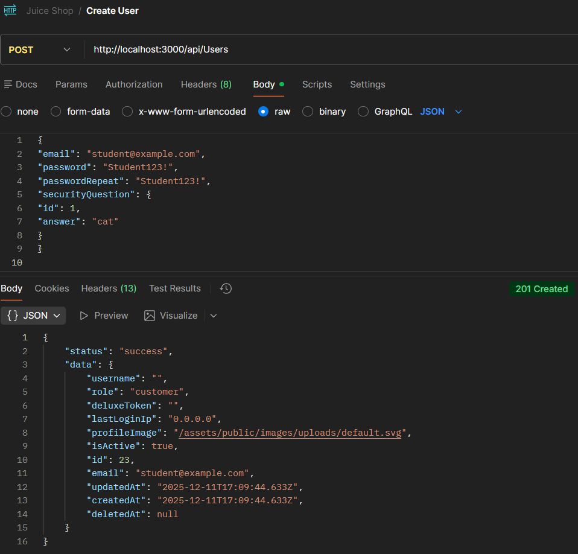
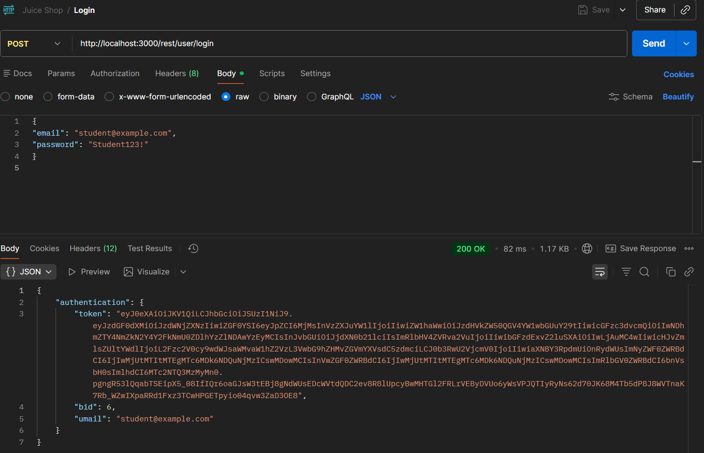
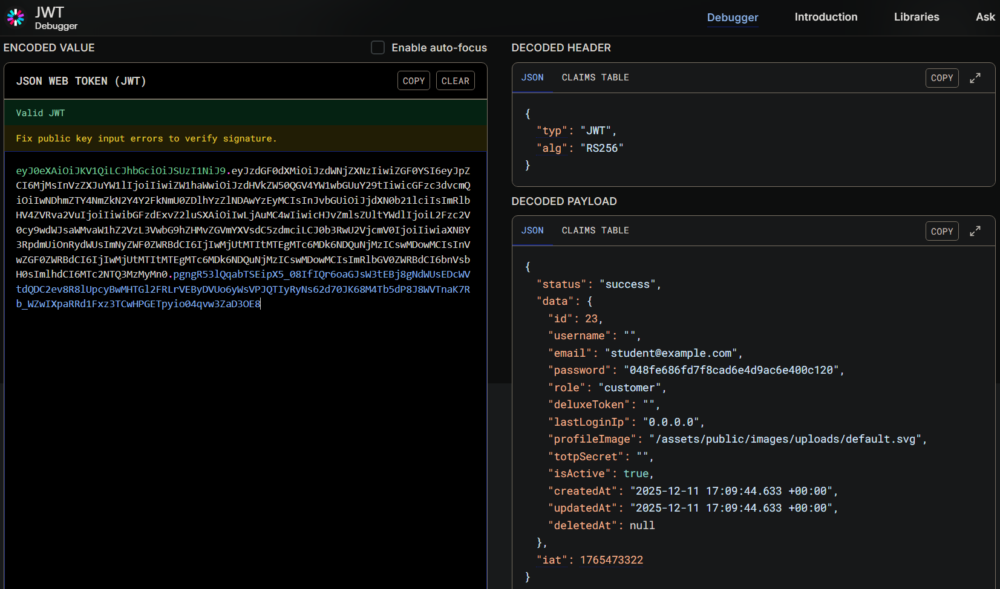
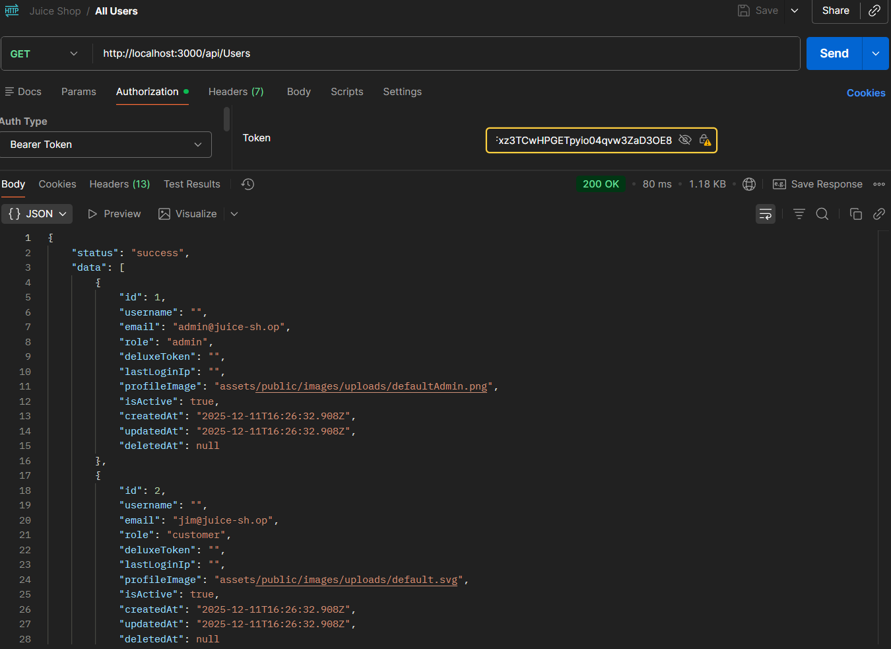
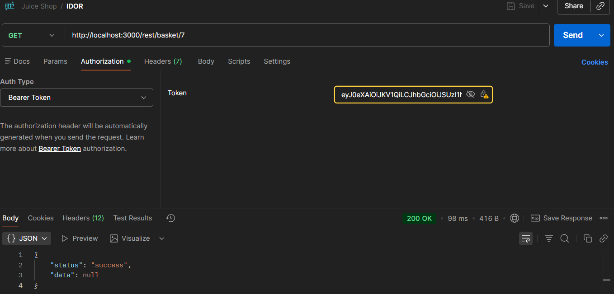
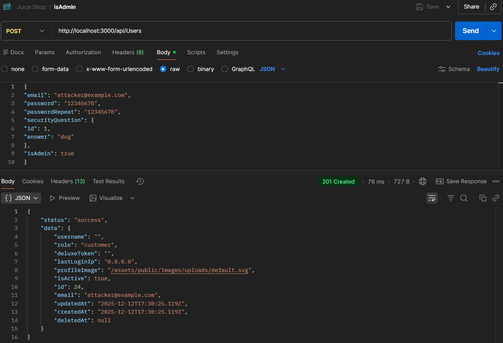
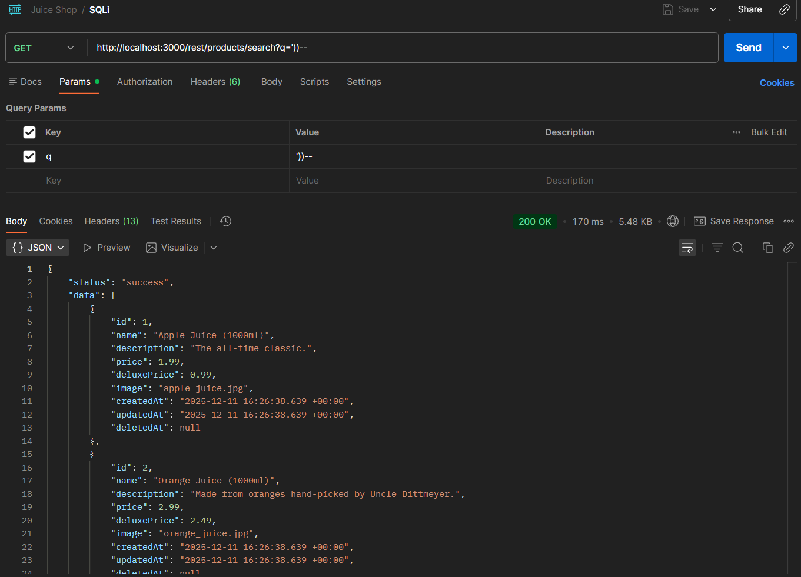

# Tier 4. Module 7 - Secure Software Development and Integration

## Topic 4. Homework - Secure programming and APIs

### Vulnerability Report

#### Summary table

| Endpoint              | Method | Token? | Vulnerability   | STRIDE                 | CWE     |
| --------------------- | ------ | ------ | --------------- | ---------------------- | ------- |
| /api/Users            | GET    | YES    | Broken AuthZ    | Elevation of Privilege | CWE-285 |
| /rest/basket/7        | GET    | YES    | IDOR            | Elevation of Privilege | CWE-639 |
| /api/Users            | POST   | NO     | Mass Assignment | Elevation of Privilege | CWE-915 |
| /rest/products/search | GET    | NO     | SQLi            | Tampering              | CWE-89  |

#### Vulnerability analysis

1. `GET /api/Users`

**Vulnerability:** Broken Function Level Authorization. The endpoint returns a list of all users, often including sensitive fields, without verifying whether the requesting user has the necessary privileges. This allows unauthorized individuals to view data they should not access.

**Danger:** Attackers can gather usernames, roles, contact information, or hashed passwords to support further attacks like credential stuffing, account takeover, or privilege escalation. Exposure of user data also violates privacy requirements and compliance regulations.

**Remediation:**

- Enforce role-based access control (RBAC) so only admins can query user lists.
- Apply response filtering to ensure only non-sensitive fields are returned and only when needed.

2. `GET /rest/basket/7`

**Vulnerability:** IDOR. The endpoint allows direct access to a basket by numeric ID without verifying that the requester owns basket 7. Anyone who can guess or iterate IDs can access items belonging to other users.

**Danger:** Attackers can read or manipulate another user's shopping cart, potentially leading to fraud, privacy breaches, or unauthorized actions that impact billing or orders. It breaks the core principle of object-level access control.

**Remediation:**

- Enforce object-level authorization checks: confirm the basket belongs to the authenticated user before returning it.
- Use opaque identifiers (UUIDs) rather than easily guessable integers.

3. `POST /api/Users`

**Vulnerability:** Mass Assignment. The server accepts user-supplied JSON containing the field "isAdmin": true and uses it to assign administrative privileges to the newly created account. This happens because the API incorrectly trusts data coming from the client instead of enforcing privilege assignment exclusively on the server.

**Danger:** An attacker can immediately create their own administrator account, giving them full access to restricted functionality, sensitive data, and system configuration. This effectively results in total compromise of the application, its users, and potentially the underlying infrastructure.

**Remediation:**

- Privileged fields (like isAdmin, role, permissions) must be ignored or overwritten by server-side logic, never accepted from client input.
- Implement strict authorization and role assignment policies, ensuring only trusted server-side workflows or existing admins can create or promote administrative accounts.

4. `GET /rest/products/search`

**Vulnerability:** SQL Injection. The search endpoint concatenates the input parameter directly into a SQL query without proper sanitization. This allows attackers to break query structure using injected SQL syntax.

**Danger:** Attackers may read sensitive data, bypass authentication, modify or delete records, or execute destructive queries. SQL injection is one of the highest-impact vulnerabilities because it undermines trust in both data confidentiality and integrity..

**Remediation:**

- Use parameterized queries / prepared statements for all database access.
- Validate and parameterize user input, ensuring it is properly handled.

#### STRIDE and CWE explanation

1. `GET /api/Users`

The endpoint reveals data about all users without proper authorization checks. STRIDE classifies this as Elevation of Privilege because it allows a user to act beyond their intended permissions, and CWE-285 documents this exact class of vulnerability.

2. `GET /rest/basket/7`

This is a case where a user can access another user’s resource by simply changing an ID. STRIDE classifies this as Elevation of Privilege because it allows a user to act beyond their intended permissions, and CWE-639 directly describes access-by-ID weaknesses.

3. `POST /api/Users`

The attacker injects a privileged attribute (“isAdmin”) into a client-side JSON request, and the server incorrectly trusts it. STRIDE labels this as Elevation of Privilege, and CWE-915 specifically document incorrect privilege assignment caused by flawed authorization logic.

4. `GET /rest/products/search`

SQL injection allows an attacker to tamper with backend queries, altering logic or extracting data. CWE-89 is the authoritative vulnerability definition for SQL injection.
