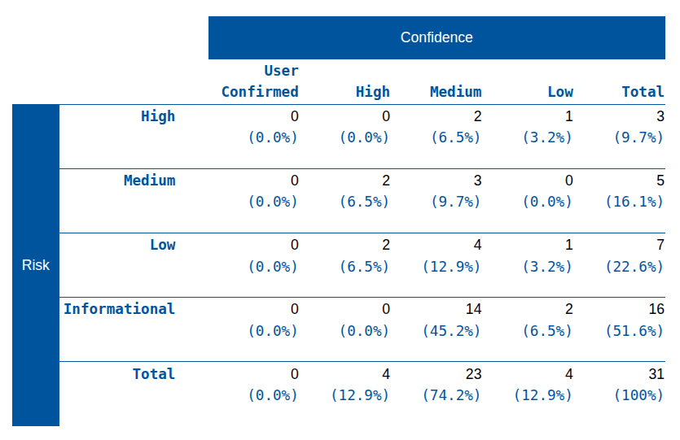
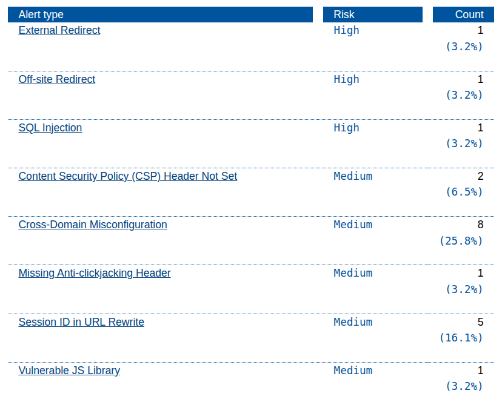
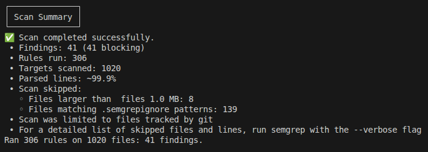
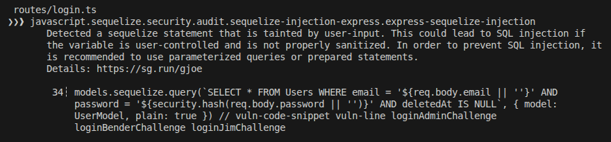
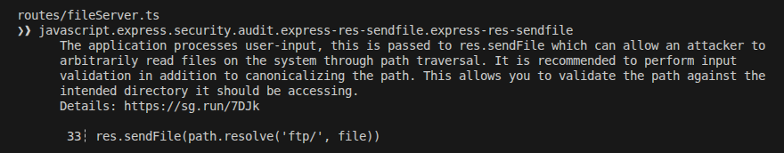
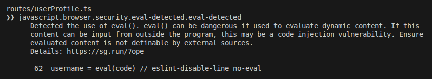

# Tier 4. Module 7 - Secure Software Development and Integration

## Topic 6. Homework - SAST / DAST / IAST / RASP

### Vulnerability Report

OWASP Juice Shop web application security analysis.

#### Part 1: DAST with ZAP

As a result of the attack on the store using ZAP, which involved a simple context with a single logged-in user, a combination of active vulnerabilities (operational flaws) and passive misconfigurations (security hardening issues) were discovered, totally **3 critical and 5 medium risks**.

Active vulnerabilities include:

- SQL injection, which allows an attacker to bypass authentication or delete the entire user database.
- External redirection, which an attacker can use for phishing by sending a link that looks like a trusted juice-shop domain.

Passive misconfigurations include:

- Content Security Policy not set, which makes the application more vulnerable to cross-site scripting due to the lack of instructions telling the browser which scripts are safe to run.
- Missing Anti-Clickjacking header, which means Juice Shop can be embedded in an invisible layer on another site.
- Cross-domain misconfiguration, which can lead to sensitive data leakage to malicious third-party websites, as it allows the application to exchange data between different domains.

Also, ZAP has noticed:

- Vulnerable JS Library (Retire.js), i.e older versions of libraries with known public exploits.
- Session ID in URL Rewrite, i.e a session token appearing in the address bar, so the attacker can steal the active login session just by having that url.

#### Part 2: SAST with Semgrep in Docker

Semgrep discovered **41 vulnerabilities** (real and "False Positive"). The 3 most critical real risks:

- SQL Injection (The "Admin Takeover")

The code uses templates, instead of a real email the attacker can enter `' OR 1=1 --` and the database will log the attacker in as the first user, i.e. administrator.

- Arbitrary File Read via Path Traversal

The application takes a filename from the user (`file`) and passes it to `res.sendFile`. An attacker can use "dot-dot-slash" sequences to "break out" of the intended `ftp/` folder. For example, if the attacker will send something like `../../../../etc/passwd`, the server will go up four levels and serve a sensitive system password file.

- Remote Code Execution via `eval()`

Finding: `username = eval(code)`. Attacker can send any string to server and `eval()` will execute it as live code.

#### Part 3: Analysis of results and comparison

| Test type | What vulnerabilities were detected     | Context value                                                                           | False positives? | Comment |
| --------- | -------------------------------------- | --------------------------------------------------------------------------------------- | ---------------- | ------- |
| SAST      | SQL Injection ("Admin Takeover")       | Ability to find hardcoded secrets, unparameterized SQL queries, dangerous functions     | No               | …       |
| SAST      | Arbitrary File Read via Path Traversal | Ability to find hardcoded secrets, unparameterized SQL queries, dangerous functions     | No               | …       |
| SAST      | Remote Code Execution via `eval()`     | Ability to find hardcoded secrets, unparameterized SQL queries, dangerous functions     | No               | …       |
| DAST      | External Redirect                      | Imitation of real user behavior, detection of runtime XSS, insecure headers, API flaws… | No               | …       |
| DAST      | Off-site Redirect                      | Imitation of real user behavior, detection of runtime XSS, insecure headers, API flaws… | No               | …       |
| DAST      | SQL Injection                          | Imitation of real user behavior, detection of runtime XSS, insecure headers, API flaws… | No               | …       |
| DAST      | Session ID in URL Rewrite              | Imitation of real user behavior, detection of runtime XSS, insecure headers, API flaws… | No               | …       |
| DAST      | Vulnerable JS Library                  | Imitation of real user behavior, detection of runtime XSS, insecure headers, API flaws… | No               | …       |

#### Conclusion:

- SAST (Static Application Security Testing) is "Inside-Out" verification of the application's source code, which detects coding errors, hardcoded secrets, unparameterized SQL queries, use of dangerous functions like eval(), and insecure configuration files.

  - Advantages:
    - It Finds bugs early in the development lifecycle (Shift Left).
    - Pinpoints the exact line of code and file name.
    - High coverage (it always scans 100% of the code).
  - Disadvantages:
    - Elevated rate of "False Positives".
    - Cannot find environment-specific issues (e.g., a misconfigured server).

- DAST (Dynamic Application Security Testing) is "Outside-In" interaction with the application while it is running, imitation of the attacker's behavior, which detects vulnerabilities in the running environment, authentication issues, session management flaws, and "live" exploits like Reflected XSS or SQLi.
  - Advantages:
    - Finds vulnerabilities that only appear at runtime (e.g., misconfigured headers or cookie security).
    - Language independent.
  - Disadvantages:
    - Happens late in the process (Shift Right).
    - Cannot see the code and can't tell how and where to fix the code.

### Homework

#### Task 1. A combination of approaches using the example of Juice Shop

| Vulnerability                          | Can be detected through | Tool    | At what stage of SSDLC it is advisable                                 |
| -------------------------------------- | ----------------------- | ------- | ---------------------------------------------------------------------- |
| SQL Injection ("Admin Takeover")       | SAST                    | Semgrep | In the IDE during development and in GitHub Actions during Commit/Pull |
| Arbitrary File Read via Path Traversal | SAST                    | Semgrep | In the IDE during development and in GitHub Actions during Commit/Pull |
| Remote Code Execution via `eval()`     | SAST                    | Semgrep | In the IDE during development and in GitHub Actions during Commit/Pull |
| External Redirect                      | DAST                    | ZAP     | Staging & QA testing and during production monitoring                  |
| Off-site Redirect                      | DAST                    | ZAP     | Staging & QA testing and during production monitoring                  |
| SQL Injection                          | DAST                    | ZAP     | Staging & QA testing and during production monitoring                  |
| Session ID in URL Rewrite              | DAST                    | ZAP     | Staging & QA testing and during production monitoring                  |
| Vulnerable JS Library                  | DAST                    | ZAP     | Staging & QA testing and during production monitoring                  |

#### Task 2: Practical simulation (analytical work) for IAST or RASP

IAST (Interactive Application Security Testing) is used to detect, primarily, vulnerabilities such as SQL injections or XSS with deep context at the code level.

Test conditions:

- It is better to use IAST during integration and unit testing because IAST is a passive method; it only finds vulnerabilities in the code that is actually executed, and during integration and unit testing, code coverage is maximized.
- To further increase code coverage, ZAP can be configured to scan the application and run various sections of code that may have been overlooked during integration and unit testing.

Expected Results:

- SQL Injections. Detection of unsanitized input reaching the sequelize or sqlite query engine.
- Broken Auth. Flags for hardcoded credentials or weak hashing.
- XSS. Alerts on untrusted input being rendered in the Angular frontend without proper encoding.
- SCA. Automatic flagging of vulnerable packages listed in SBOM.

Adwantages:

- Minimum "False Positives". Since the agent sees the code executing, it can understand if the the vulnerability is "real" and reachable.
- Code audit. Since the agent sees the code, it indicates exact line and function leading to the flaw.

#### Task 3. Selecting a tool by application type

Because SPA is frontend and REST API is backend, which are always are decoupled in modern applications, there have two distinct attack surfaces to protect against and different vulnerabilities to focus on.

- SPA (Single Page Application), in frontend the security focus is on the Client-Side Runtime.

  - SAST with Semgrep for for catching "Logic Flaws" (sensitive data in code) during commit (pre-receive hooks).
  - DAST with ZAP for detecting Client-Side Logic Flaws during security testing.
  - SAST & DAST for detecting XSS (Cross-Site Scripting) with Semgrep durig code development and with ZAP during security testing.
  - IAST with Contrast Security for Insecure Storage revealing during QA / integration Testing.
  - SCA with Snyk or npm for SBOM for surching vulnerabilities in third-party libraries.

- REST API, in backend the security focus is on System's Data.

  - SAST & IAST for detecting SQLi with Semgrep during code development and Contrast Security during integration and unit testing.
  - IAST with Contrast Security for revealing of Mass Assignment during integration testing.
  - DAST with Postman for catching Excessive Data Exposure during security review.
  - IAST & DAST for detection of BOLA (Insecure IDs) with Contrast Security during QA and ZAP during staging.
  - SCA with Snyk or npm for SBOM for surching vulnerabilities in third-party libraries.
  - RASP for detection of Active Exploit Attacks with DataTherapy during production and monitoring.
