# Tier 4. Module 7 - Secure Software Development and Integration

## Topic 7. Homework - SCA and dependency management

### Laboratory report

**Topic:** Analyzing npm package dependencies using SCA tools

**Analysis date:** 11.01.2026

---

### **Package:** `express`

**Vesrion:** 4.19.2

**Repository:** `https://github.com/expressjs/express`

1. **Preliminary analysis ([Socket.dev](https://socket.dev))**

- Detected obfuscated code in `safer-buffer@2.1.2` package.
- Detected 4 High CVE vulnerabilities in 3 packages:
  - `body-parser@1.20.2` is vulnerable to denial of service when url encoding is enabled;
  - `path-to-regexp@0.1.7` generates bad regular expression any time there are two parameters within a single segment;
  - `path-to-regexp@0.1.7` generates regular expressions that are vulnerable to backtracking;
  - `qs@6.11.0` its arrayLimit bypass in its bracket notation allows DoS via memory exhaustion.
- Also, the package itself is vulnerable to XSS via `response.redirect()` that may execute untrusted code.
- Screenshot:

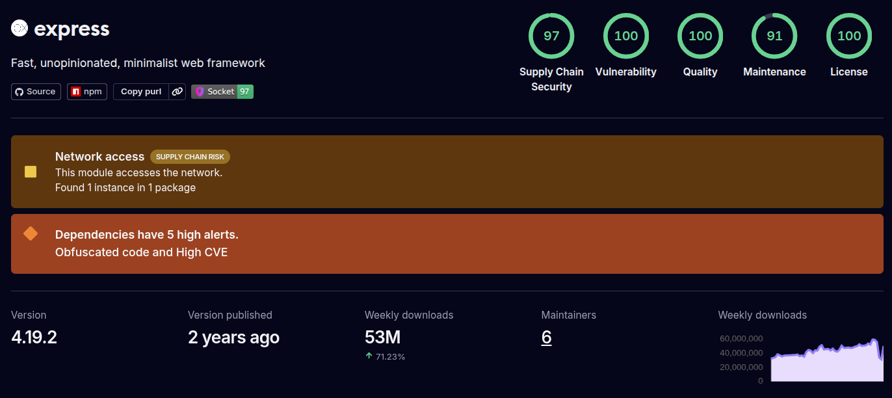

- Conclusion: The package contains subpackages with obfuscated code and several high-level vulnerabilities that could cause an application to crash or allow a denial of service. It is recommended to update the package to a newer version and control any untrusted inputs by validating them against an explicit allowlist. The obfuscated code is only present in the `tests.js` file and is theoretically not needed in production.

2. **Dependency Graph ([deps.dev](https://deps.dev))**

- Direct Dependencies: 31
- Transitive Dependencies: 39
- Critical Transitives: body-parser, qs, path-to-regexp
- Graph Screenshot:

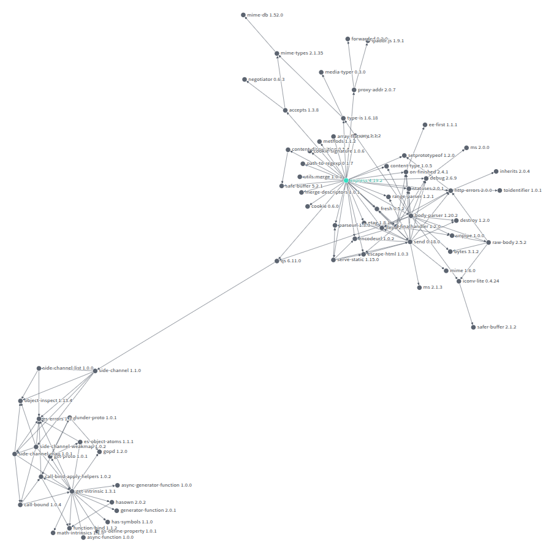

- Conclusion: The graph depth is average, but there are dependencies with high CVE.

3. **Security Hygiene Scorecard ([OpenSSF](https://securityscorecards.dev/viewer) Scorecard)**

- Overall Score: 8.7 / 10
- Key Observations:

  - Project is not fuzzed;
  - Not all dependencies are pinned;
  - Not all changeseta were approved.

- Results Screenshot:

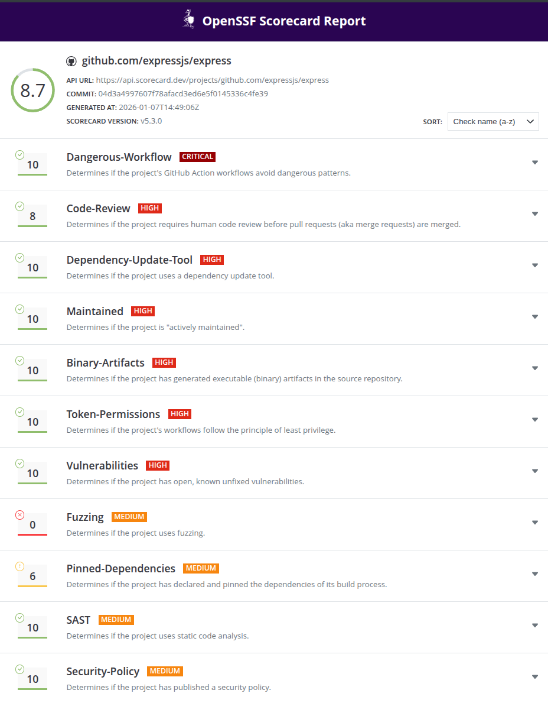

- Conclusion: The project has good hygiene, but needs to use fuzzing, better dependency control, and a better change approval process.

4. **Automatic Vulnerability Scan ([OSV-Scanner](https://osv.dev/))**

- CVE Found:

| CVE ID         | CVSS | Publication Date | Package        | Version | Recommendation           |
| -------------- | ---- | ---------------- | -------------- | ------- | ------------------------ |
| CVE-2024-45590 | 8.7  | 2024-09-10       | body-parser    | 1.20.2  | Update to version 1.20.3 |
| CVE-2024-47764 | 6.9  | 2024-10-04       | cookie         | 0.6.0   | Update to version 0.7.0  |
| CVE-2024-43796 | 5.6  | 2024-09-10       | express        | 4.19.2  | Update to version 4.20.0 |
| CVE-2024-45296 | 7.7  | 2024-09-09       | path-to-regexp | 0.1.7   | Update to version 0.1.10 |
| CVE-2024-52798 | 7.7  | 2024-12-05       | path-to-regexp | 0.1.7   | Update to version 0.1.12 |
| CVE-2025-15284 | 8.7  | 2025-12-30       | qs             | 6.11.0  | Update to version 6.14.1 |
| CVE-2024-43799 | 5.0  | 2024-09-10       | send           | 0.18.0  | Update to version 0.19.0 |
| CVE-2024-43800 | 5.0  | 2024-09-10       | serve-static   | 1.15.0  | Update to version 1.16.0 |

- Conclusion: Found total 7 packages (`express` itself and its dependencies) affected by 8 known vulnerabilities (0 Critical, 4 High, 3 Medium, 0 Low, 1 Unknown) from 1 ecosystem. Most danderous is the vulnerability in `qs` allowing attackers to cause denial-of-service via memory exhaustion, and `body-parser` becomes vulnerable to denial of service when url encoding is enabled. 8 vulnerabilities can be fixed by updating the packages.

5. **Manual CVE Search and EPSS Assessment**

- Source: [cvedetails.com](https://www.cvedetails.com/)
- EPSS Analysis:

| CVE ID         | CVSS | EPSS  | Package        | Description                   |
| -------------- | ---- | ----- | -------------- | ----------------------------- |
| CVE-2024-45590 | 8.7  | 2.07% | body-parser    | High probability of exploit   |
| CVE-2024-47764 | 6.9  | 0.09% | cookie         | Low probability of exploit    |
| CVE-2024-43796 | 5.6  | 0.09% | express        | Low probability of exploit    |
| CVE-2024-45296 | 7.7  | 0.07% | path-to-regexp | Low probability of exploit    |
| CVE-2024-52798 | 7.7  | 0.16% | path-to-regexp | Medium probability of exploit |
| CVE-2025-15284 | 8.7  | 0.15% | qs             | Medium probability of exploit |
| CVE-2024-43799 | 5.0  | 0.12% | send           | Medium probability of exploit |
| CVE-2024-43800 | 5.0  | 0.68% | serve-static   | Low probability of exploit    |

- Conclusion: CVE-2024-45590 has a high EPSS — requires immediate response.

6. **SBOM ([Syft](https://github.com/anchore/syft))**

- Format: CycloneDX JSON
- Number of components: 68
- SBOM file: `express_sbom.json`
- Conclusion: SBOM generated successfully, structure complies with CycloneDX standard.

7. **SBOM Scan ([Grype](https://github.com/anchore/grype))**

- CVE Found:

| CVE ID         | CVSS | Severity | Risk | Package        | Recommendation  |
| -------------- | ---- | -------- | ---- | -------------- | --------------- |
| CVE-2024-45590 | 8.7  | High     | 1.6  | body-parser    | Fixed in 1.20.3 |
| CVE-2024-47764 | 6.9  | Low      | <0.1 | cookie         | Fixed in 0.7.0  |
| CVE-2024-43796 | 5.6  | Low      | <0.1 | express        | Fixed in 4.20.0 |
| CVE-2024-45296 | 7.7  | High     | <0.1 | path-to-regexp | Fixed in 0.1.10 |
| CVE-2024-52798 | 7.7  | High     | 0.1  | path-to-regexp | Fixed in 0.1.12 |
| CVE-2025-15284 | 8.7  | High     | 0.1  | qs             | Fixed in 6.14.1 |
| CVE-2024-43799 | 5.0  | Low      | <0.1 | send           | Fixed in 0.19.0 |
| CVE-2024-43800 | 5.0  | Low      | 0.3  | serve-static   | Fixed in 1.16.0 |

- Conclusion: Vulnerabilities confirmed, SBOM allowed to detect direct and transitive risks.

8. **Conclusions and Recommendations**

- Critical Issues:

  - Transitive dependency with CVE-2024-45590 has high CVSS and EPSS.
  - Another dependencies with CVE-2025-15284, CVE-2024-45296, CVE-2024-52798 have high CVSS, but low probability of exploit.

- Recommendations:

  - Upgrade `express` package to version ≥4.20.0 and, first of all, its dependency `body-parser` to version ≥1.20.3.
  - Implement branch protection and automated security tests.
  - Consider using Snyk or GitHub Dependabot for monitoring.

---

### **Package:** `axios`

**Vesrion:** 1.7.2

**Repository:** `https://github.com/axios/axios`

1. **Preliminary analysis ([Socket.dev](https://socket.dev))**

- Obfuscated code is not detected.
- Detected vulnerability to Server-Side Request Forgery via unexpected behavior where requests for path relative URLs get processed as protocol relative URLs.
- Screenshot:

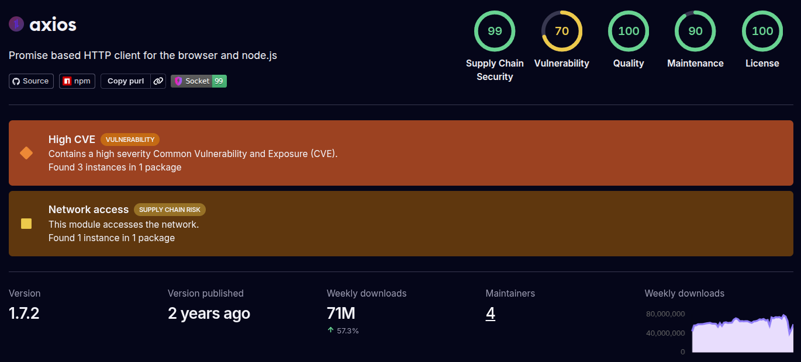

- Conclusion: The package is vulnerable to SSRF. It is recommended to update the package to a newer version, using alternatives, or at least inspect the length of the Base64 payload before decoding and then decode it in chanks.

2. **Dependency Graph ([deps.dev](https://deps.dev))**

- Direct Dependencies: 3
- Transitive Dependencies: 22
- Critical Transitives: form-data, get-intrinsic
- Graph Screenshot:

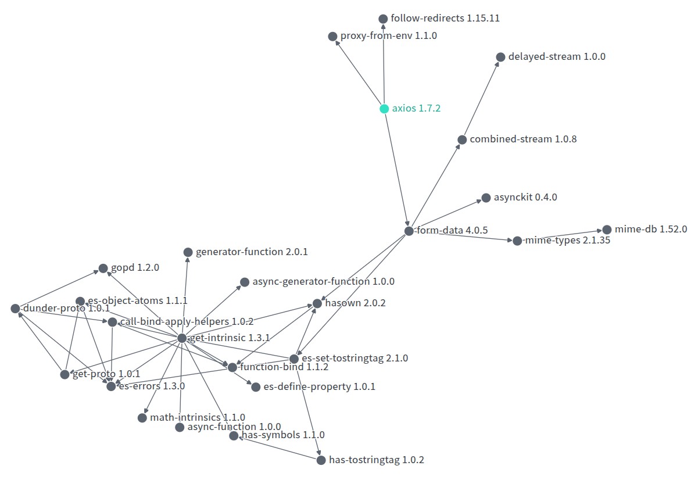

- Conclusion: The depth of the graph is relatively small, and there are no dependencies on CVE history.

3. **Security Hygiene Scorecard ([OpenSSF](https://securityscorecards.dev/viewer) Scorecard)**

- Overall Score: 5.8 / 10
- Key Observations:

  - GitHub workflow tokens have excessive permissions;
  - The package has long history of vulnerabilities;
  - Project is not fuzzed and has many other security flaws.

- Results Screenshot:

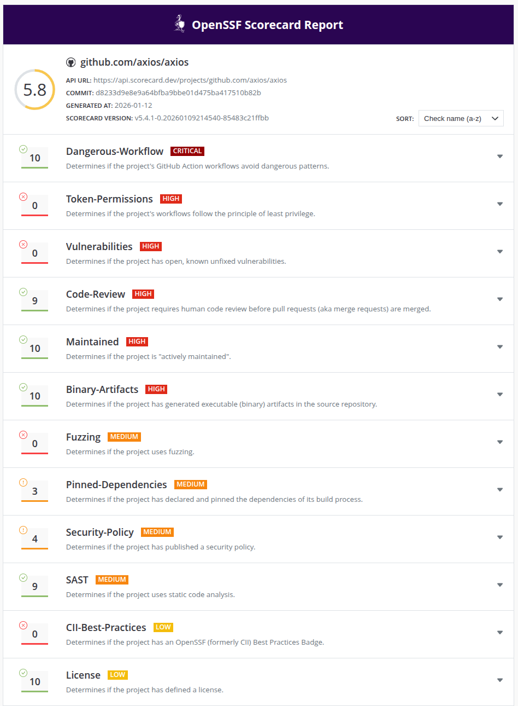

- Conclusion: The project has only basic hygiene, contains many security flaws, and does not follow best practices in many key areas, such as fixing vulnerabilities and adhering to the principle of least privilege.

4. **Automatic Vulnerability Scan ([OSV-Scanner](https://osv.dev/))**

- CVE Found:

| CVE ID         | CVSS | Publication Date | Package | Version | Recommendation           |
| -------------- | ---- | ---------------- | ------- | ------- | ------------------------ |
| CVE-2025-58754 | 7.5  | 2025-09-11       | axios   | 1.7.2   | Update to version 1.12.0 |
| CVE-2024-39338 | 7.5  | 2024-08-12       | axios   | 1.7.2   | Update to version 1.7.4  |
| CVE-2025-27152 | 7.7  | 2025-03-07       | axios   | 1.7.2   | Update to version 1.8.2  |

- Conclusion: Found total 1 package affected (`axios` itself) by 3 known vulnerabilities (0 Critical, 2 High, 0 Medium, 0 Low, 1 Unknown) from 1 ecosystem. `axios` requests is vulnerable To SSRF and Credential Leakage via absolute URL. 3 vulnerabilities can be fixed by udating the package.

5. **Manual CVE Search and EPSS Assessment**

- Source: [cvedetails.com](https://www.cvedetails.com/)
- EPSS Analysis:

| CVE ID         | CVSS | EPSS  | Package | Description                 |
| -------------- | ---- | ----- | ------- | --------------------------- |
| CVE-2025-58754 | 7.5  | 0.06% | axios   | Low probability of exploit  |
| CVE-2024-39338 | 7.5  | 2.14% | axios   | High probability of exploit |
| CVE-2025-27152 | 7.7  | 0.07% | axios   | Low probability of exploit  |

- Conclusion: CVE-2024-39338 has a high EPSS — requires immediate response.

6. **SBOM ([Syft](https://github.com/anchore/syft))**

- Format: CycloneDX JSON
- Number of components: 23
- SBOM file: `axios_sbom.json`
- Conclusion: SBOM generated successfully, structure complies with CycloneDX standard.

7. **SBOM Scan ([Grype](https://github.com/anchore/grype))**

- CVE Found:

| CVE ID         | CVSS | Severity | Risk | Package | Recommendation  |
| -------------- | ---- | -------- | ---- | ------- | --------------- |
| CVE-2025-58754 | 7.5  | High     | <0.1 | axios   | Fixed in 1.12.0 |
| CVE-2024-39338 | 7.5  | High     | 1.6  | axios   | Fixed in 1.7.4  |
| CVE-2025-27152 | 7.7  | High     | <0.1 | axios   | Fixed in 1.8.2  |

- Conclusion: Vulnerabilities confirmed, no transitive risks are detected.

8. **Conclusions and Recommendations**

- Critical Issues:

  - CVE-2024-39338 has high CVSS and EPSS.
  - CVE-2025-27152 and CVE-2025-58754 have high CVSS, but low probability of exploit.

- Recommendations:

  - Upgrade package to version ≥1.12.0.
  - Implement branch protection and automated security tests.
  - Consider using Snyk or GitHub Dependabot for monitoring.

---

### **Package:** `jsonwebtoken`

**Vesrion:** 8.5.1

**Repository:** `https://github.com/auth0/node-jsonwebtoken`

1. **Preliminary analysis ([Socket.dev](https://socket.dev))**

- Obfuscated code is not detected.
- Detected one dependency `jws@3.2.2` with high CVE as an improper signature verification.
- The package itself uses legacy, insecure key types for signature verification and vulnerable to signature validation bypass due to insecure default algorithm.
- Screenshot:

- Conclusion: The package has several dependencies of its own with high CVE and one vulnerable dependency. The only way to fix this is to upgrade to a newer version.

2. **Dependency Graph ([deps.dev](https://deps.dev))**

- Direct Dependencies: 10
- Transitive Dependencies: 4
- Critical Transitives: jws, jwa
- Graph Screenshot:

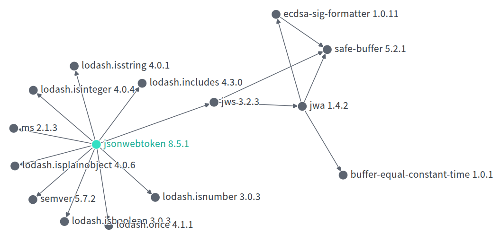

- Conclusion: The depth of the graph is small, but there is one dependency with CVE history.

3. **Security Hygiene Scorecard ([OpenSSF](https://securityscorecards.dev/viewer) Scorecard)**

- Overall Score: 5.6 / 10
- Key Observations:

  - GitHub workflow tokens have excessive permissions;
  - The package is not "actively maintained";
  - Project is not fuzzed and does not use SAST.

- Results Screenshot:

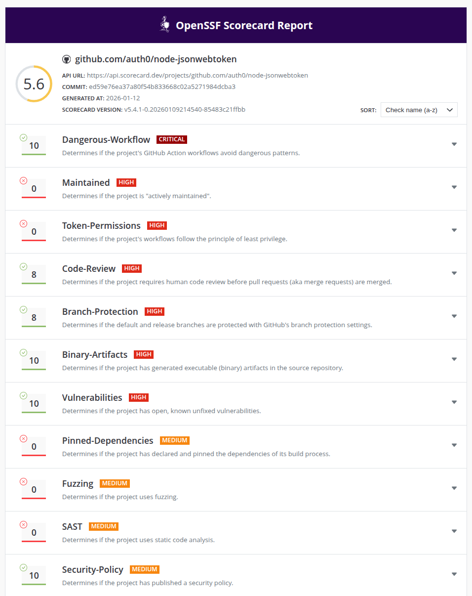

- Conclusion: The project has only basic hygiene, is not actively maintained, and does not follow best practices in many key areas, such as using SAST, fuzzing and adhering to the principle of least privilege.

4. **Automatic Vulnerability Scan ([OSV-Scanner](https://osv.dev/))**

- CVE Found:

| CVE ID         | CVSS | Publication Date | Package      | Version | Recommendation          |
| -------------- | ---- | ---------------- | ------------ | ------- | ----------------------- |
| CVE-2022-23539 | 8.1  | 2022-12-22       | jsonwebtoken | 8.5.1   | Update to version 9.0.0 |
| CVE-2022-23541 | 5.0  | 2022-12-22       | jsonwebtoken | 8.5.1   | Update to version 9.0.0 |
| CVE-2022-23540 | 6.4  | 2022-12-22       | jsonwebtoken | 8.5.1   | Update to version 9.0.0 |

- Conclusion: Found total 1 package affected (`jsonwebtoken` itself) by 3 known vulnerabilities (0 Critical, 1 High, 2 Medium, 0 Low, 0 Unknown) from 1 ecosystem. `jsonwebtoken` unrestricted key type could lead to legacy keys usage. 3 vulnerabilities can be fixed by updating the package.

5. **Manual CVE Search and EPSS Assessment**

- Source: [cvedetails.com](https://www.cvedetails.com/)
- EPSS Analysis:

| CVE ID         | CVSS | EPSS  | Package      | Description                |
| -------------- | ---- | ----- | ------------ | -------------------------- |
| CVE-2022-23539 | 8.1  | 0.07% | jsonwebtoken | Low probability of exploit |
| CVE-2022-23541 | 5.0  | 0.06% | jsonwebtoken | Low probability of exploit |
| CVE-2022-23540 | 6.4  | 0.02% | jsonwebtoken | Low probability of exploit |

- Conclusion: The package has only the vulnerabilities with low probability of exploit, but given that CVE-2022-23539 has high CVSS, its resolution should be planned and implemented.

6. **SBOM ([Syft](https://github.com/anchore/syft))**

- Format: CycloneDX JSON
- Number of components: 15
- SBOM file: `jsonwebtoken_sbom.json`
- Conclusion: SBOM generated successfully, structure complies with CycloneDX standard.

7. **SBOM Scan ([Grype](https://github.com/anchore/grype))**

- CVE Found:

| CVE ID         | CVSS | Severity | Risk | Package      | Recommendation |
| -------------- | ---- | -------- | ---- | ------------ | -------------- |
| CVE-2022-23539 | 8.1  | High     | <0.1 | jsonwebtoken | Fixed in 9.0.0 |
| CVE-2022-23541 | 5.0  | Medium   | <0.1 | jsonwebtoken | Fixed in 9.0.0 |
| CVE-2022-23540 | 6.4  | Medium   | <0.1 | jsonwebtoken | Fixed in 9.0.0 |

- Conclusion: VVulnerabilities confirmed, but all of them have low probability.

8. **Conclusions and Recommendations**

- Critical Issues:

  - CVE-2022-23539 has high CVSS, but low probability of exploit.

- Recommendations:

  - Upgrade package to version ≥9.0.0.
  - Implement branch protection and automated security tests.
  - Consider using Snyk or GitHub Dependabot for monitoring.

---

### Homework: Comparative analysis of dependencies and vulnerabilities in two npm packages

#### `axios` vs `node-fetch`

`axios` has already been analyzed for vulnerabilities during lab work, and `node-fetch` is next in line for analysis.

---

### **Package:** `node-fetch`

**Vesrion:** 3.1.0

**Repository:** `https://github.com/node-fetch/node-fetch`

1. **Preliminary analysis ([Socket.dev](https://socket.dev))**

- Obfuscated code is not detected.
- Detected 1 High CVE - node-fetch forwards secure headers to untrusted sites, and one Medium CVE - it's vulnerable to Regular Expression Denial of Service when processing a URL.
- Screenshot:

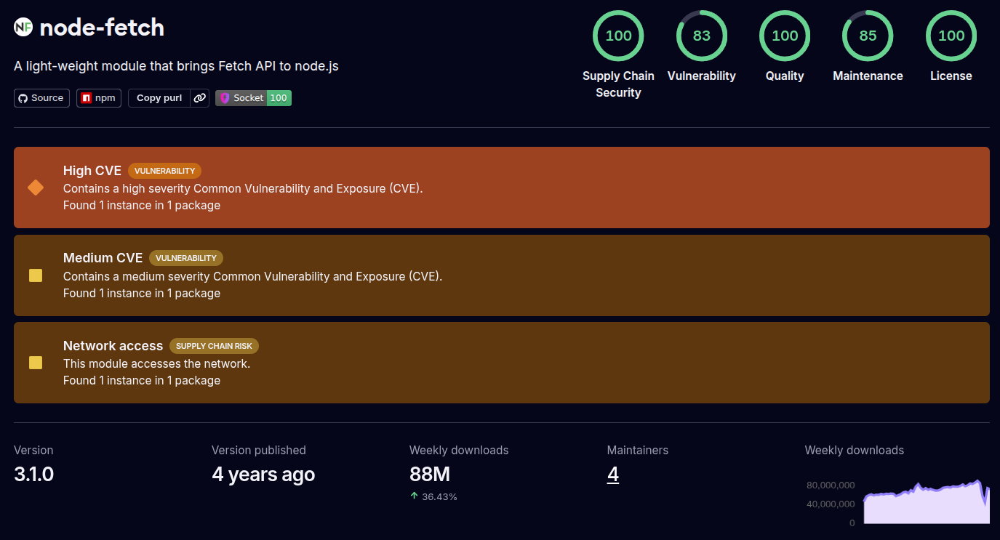

- Conclusion: The package is subject to insecure header processing and is vulnerable to ReDoS. It is recommended to update the package to a newer version, or at least implement custom verification of URLs passed to `node-fetch`.

2. **Dependency Graph ([deps.dev](https://deps.dev))**

- Direct Dependencies: 3
- Transitive Dependencies: 2
- Critical Transitives: n/a
- Graph Screenshot:

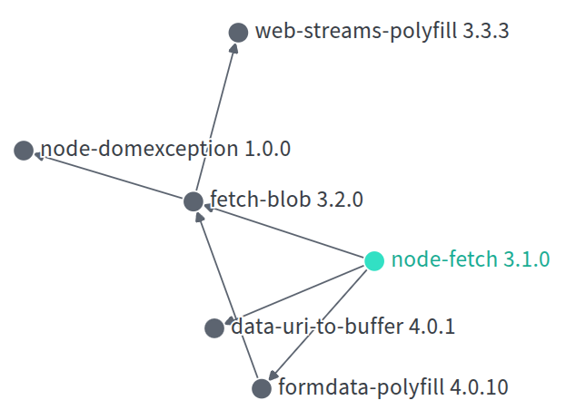

- Conclusion: The depth of the graph is small, and there are no dependencies on CVE history.

3. **Security Hygiene Scorecard ([OpenSSF](https://securityscorecards.dev/viewer) Scorecard)**

- Overall Score: 5.4 / 10
- Key Observations:

  - GitHub workflow tokens have excessive permissions;
  - The package is not maintained;
  - Project is not fuzzed, does not implement SAST and has no pinned dependencies.

- Results Screenshot:

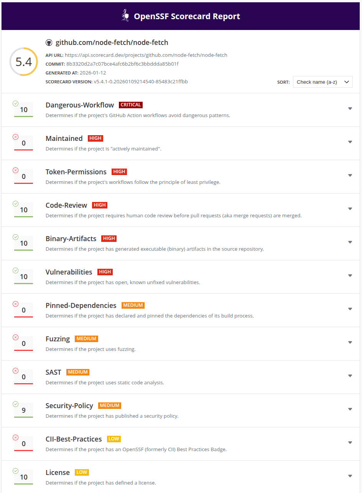

- Conclusion: The project has only basic hygiene, it's not maintained, and does not follow best practices in many key areas, such as implementing SAST and adhering to the principle of least privilege.

4. **Automatic Vulnerability Scan ([OSV-Scanner](https://osv.dev/))**

- CVE Found:

| CVE ID        | CVSS | Publication Date | Package    | Version | Recommendation           |
| ------------- | ---- | ---------------- | ---------- | ------- | ------------------------ |
| CVE-2022-0235 | 8.8  | 2022-01-21       | node-fetch | 3.1.0   | Update to version 3.1.1  |
| CVE-2022-2596 | 5.9  | 2022-08-02       | node-fetch | 3.1.0   | Update to version 3.2.10 |

- Conclusion: Found total 1 package affected (`node-fetch` itself) by 2 known vulnerabilities (0 Critical, 1 High, 1 Medium, 0 Low, 0 Unknown) from 1 ecosystem. `node-fetch` URL handling is vulnerable to ReDoS, also the package forwards secure headers such as `authorization` when redirecting to untrusted sites. 2 vulnerabilities can be fixed by udating the package.

5. **Manual CVE Search and EPSS Assessment**

- Source: [cvedetails.com](https://www.cvedetails.com/)
- EPSS Analysis:

| CVE ID        | CVSS | EPSS  | Package    | Description                   |
| ------------- | ---- | ----- | ---------- | ----------------------------- |
| CVE-2022-0235 | 8.8  | 0.65% | node-fetch | Medium probability of exploit |
| CVE-2022-2596 | 5.9  | 0.21% | node-fetch | Medium probability of exploit |

- Conclusion: CVE-2022-0235 and CVE-2022-2596 have medium EPSS and require planned response.

6. **SBOM ([Syft](https://github.com/anchore/syft))**

- Format: CycloneDX JSON
- Number of components: 6
- SBOM file: `node-fetch_sbom.json`
- Conclusion: SBOM generated successfully, structure complies with CycloneDX standard.

7. **SBOM Scan ([Grype](https://github.com/anchore/grype))**

- CVE Found:

| CVE ID        | CVSS | Severity | Risk | Package    | Recommendation  |
| ------------- | ---- | -------- | ---- | ---------- | --------------- |
| CVE-2022-0235 | 8.8  | High     | 0.5  | node-fetch | Fixed in 3.1.1  |
| CVE-2022-2596 | 5.9  | Medium   | 0.1  | node-fetch | Fixed in 3.2.10 |

- Conclusion: Vulnerabilities confirmed, no transitive risks are detected.

8. **Conclusions and Recommendations**

- Critical Issues:

  - CVE-2022-0235 have high CVSS, but medium probability of exploit.

- Recommendations:

  - Upgrade package to version ≥3.2.10.
  - Implement branch protection and automated security tests.
  - Consider using Snyk or GitHub Dependabot for monitoring.

---

#### Comparison table

| Criteria                          | axios@1.7.2 | node-fetch@3.1.0 |
| --------------------------------- | ----------- | ---------------- |
| Number of transitive dependencies | 22          | 2                |
| Number of CVEs                    | 3           | 2                |
| Average CVSS                      | 7.6         | 7.4              |
| Highest EPSS                      | 2.14%       | 0.65%            |
| Hygiene level                     | 5.8         | 5.4              |
| Risk indicators                   | 1.6         | 0.5              |
| License                           | MIT         | MIT              |

#### Conclusion

From a security perspective, `node-fetch@3.1.0` is clearly a safer option than `axios@1.7.2`. It has fewer CVEs, is harder to exploit, and has far fewer transitive dependencies that could contain hidden risks. But from a practical perspective, `axios` may be a better option because it is actively maintained and can be patched quickly if new vulnerabilities are discovered or feature updates are important, while `node-fetch` has not had any updates for 2 years, and its newer version has been in beta for 4 years.
