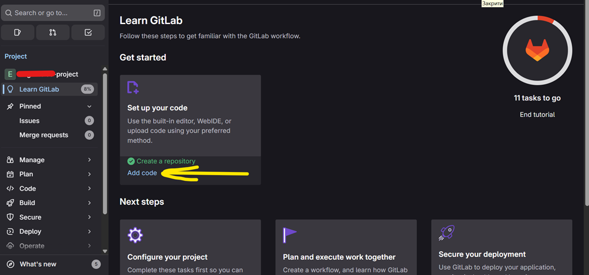
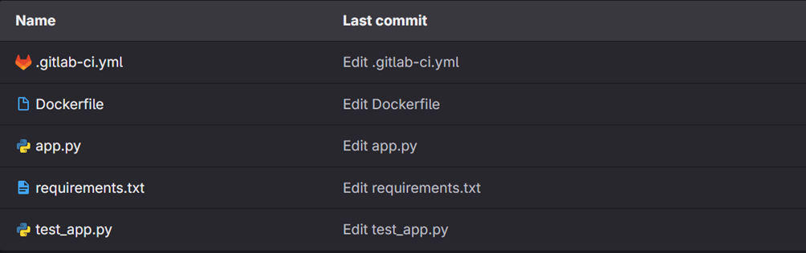
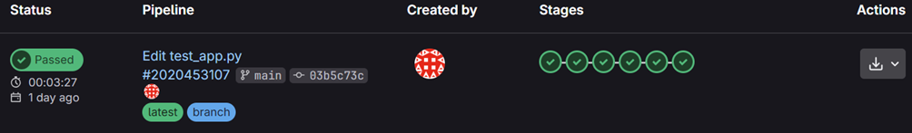

# Tier 4. Module 7 - Secure Software Development and Integration

## Topic 8. Homework - CI/CD and DevSecOps

### Laboratory work

This stage is a mini-practice where you will see how the "Fail Fast" mechanism works and learn how to read the results of the security scanners. This is the first, purely hands-on phase where you gather facts and observe the pipeline's response to vulnerabilities.

**Goal:** Learn how to build a CI/CD pipeline with integrated security steps (secret scanning, SAST, SCA) and understand how the pipeline reacts to vulnerabilities. Learn about the real-world "fail fast" approach in DevSecOps.

The lab uses a demo application that simulates a typical web-based order management system. The application is written in the Python programming language using the Flask framework. It consists of a REST API and a simple web form for data entry.

#### Environment preparation

Sign up for GitLab (if you don't already have an account). If you have an account, log in.

1. Create a project.
2. Add the [files](https://drive.google.com/drive/folders/17vD64_Y4AeK0KCzVZQM17ytdvSgf-Fij?usp=sharing) from the **"CICD_DevSecOps"** archive:

- .gitlab-ci.yml
- Dockerfile
- app.py
- requirements.txt
- test_app.py

4. **!** Take the `test_app.py` file from the **"Good"** folder.
5. Your repository should look like this:

### Workflow

**Step 1. Familiarization with the structure of the repository**

1. Open the repository in GitLab.
2. Review the contents of the `app.py`, `test_app.py`, `.gitlab-ci.yml` files.
3. Understand which CI/CD stages are already configured:

- secret-scan — checking the presence of secrets;
- sast — static code analysis;
- test — start tests;
- build — building the application;
- sca — dependency checking;
- deploy — deployment;
- dast is a dynamic security analysis.

**Step 2. Start the initial pipeline**

1. Make a commit (eg a small change to `README.md`) to get the pipeline running.
2. Wait for the pipeline to complete.
3. Open the `Build → Pipelines` tab in GitLab.
4. View the results:

- which stages were completed successfully;
- whether vulnerabilities were detected (SAST, SCA, Secret Scanning);
- note that the pipeline completed successfully despite the presence of low-level vulnerabilities.

5. Analyze the logs of each stage:

- secret-scan;
- sast;
- test;
- build;
- sca;
- deploy;
- dast.

6. Find low-level vulnerabilities. Get to know them. Understand how they affect the application.

**Step 3. Simulation of a critical vulnerability**

1. Replace the `test_app.py` file with an instance from the "Bed" folder. You can copy the code and replace it in the GitLab repository.
2. Commit the change and run the pipeline.
3. Wait for the checks to complete.

**Step 4. Analysis of the results of the second run**

1. Open the Pipeline tab and compare with the previous successful run.
2. Pay attention to:

- at what stage the pipeline stopped;
- what error message was issued by SAST / SCA;
- that the pipeline fails if a serious vulnerability is detected (Fail Fast).

**Step 5. Report (to be used when performing the HW)**

1. Run the pipeline with initial, conditionally safe code and take a screenshot of the results.
2. Modify `test_app.py` to expose the critical vulnerability and rerun the pipeline. Take a screenshot of the results.
3. Compare the two run results.
4. Give a written answer to the question:

- Why did the pipeline complete successfully in the first case?
- Why did he stop in the second case?
- What is the difference between the first and second case?
- Is the first case really safe and without vulnerabilities?
- How does this illustrate the principle of fail fast in DevSecOps?

### Homework

#### Practice Report (Technical part)

**Task 1: Success vs. Failure**

Analyze two pipeline runs (successful and unsuccessful). Explain why the pipeline completed successfully in the first case and stopped in the second. What is the key difference between the two cases? Use screenshots to support your conclusions.

**Task 2: Security of the first case**

Can the first case (with "Good' code) be considered completely secure and free of vulnerabilities? Justify your answer by giving examples of types of vulnerabilities that may not be detected by automated scanners.

**Task 3: The Fail Fast Principle**

Explain how this double pipeline run illustrates the "fail fast" principle in DevSecOps. Describe the benefits of early detection of issues in terms of time, cost, and code quality.

#### Pipeline Overview (Practical Analysis)

**Task 4: CI/CD Stages**

Describe in a structured way which CI/CD stages are implemented in the pipeline (build, test, scan, deploy). For each stage, indicate its purpose and execution sequence.

**Task 5: Security Scanners**

Identify which security scanners are used in the pipeline (SAST, DAST, secret scan, dependency scan / SCA). For each type of scanner, briefly explain which vulnerabilities it detects and at which stage it works.

**Task 6: Vulnerability Response**

Describe how the pipeline reacts to detected vulnerabilities. Explain the logic of the blocking mechanism: under what conditions a fail job occurs, when a report is generated (generate report), and when notifications are sent (notify).

#### Strategic Planning and Improvement

**Task 7: CVE Response (Analysis Block)**

Imagine that an SBOM or SCA scanner has detected a dependency on a high-severity CVE. Describe a clear sequence of actions you would take as a DevSecOps engineer. Your response protocol should include:

- Vulnerability Impact Assessment
- Finding and Selecting a Solution (Update, Replace, Workaround)
- Testing and Validating Changes
- Deployment Process
- Documenting the Incident
- Post-incident Analysis

**Task 8: Automating SBOM Analysis**

Explain how you can automate the continuous checking of SBOM for new CVEs. What tools exist for this? Describe an ideal workflow for automated security dependency checking. Mention specific tools (e.g. Trivy, Grype, OSV-Scanner) and their features.

**Task 9: Pipeline Improvements**

Propose 2-3 specific ideas to improve the existing pipeline to make it more transparent and user-friendly for the development team. These could include:

- Improving the feedback system for developers
- Adding metrics and visualizations
- Improving logging and reporting
- Flexible security policies
- Other ideas at your discretion

For each suggestion, explain what problem it solves and how it improves the team's workflow.
