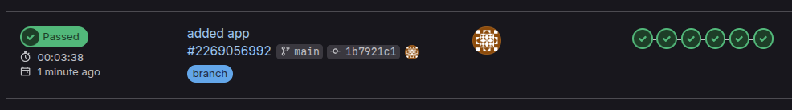
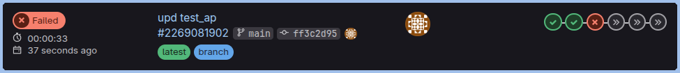
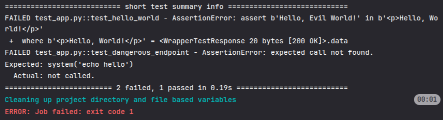
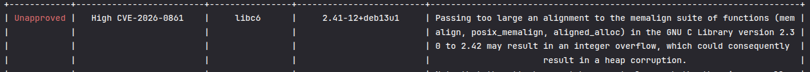
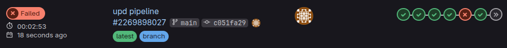
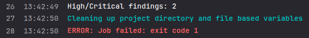
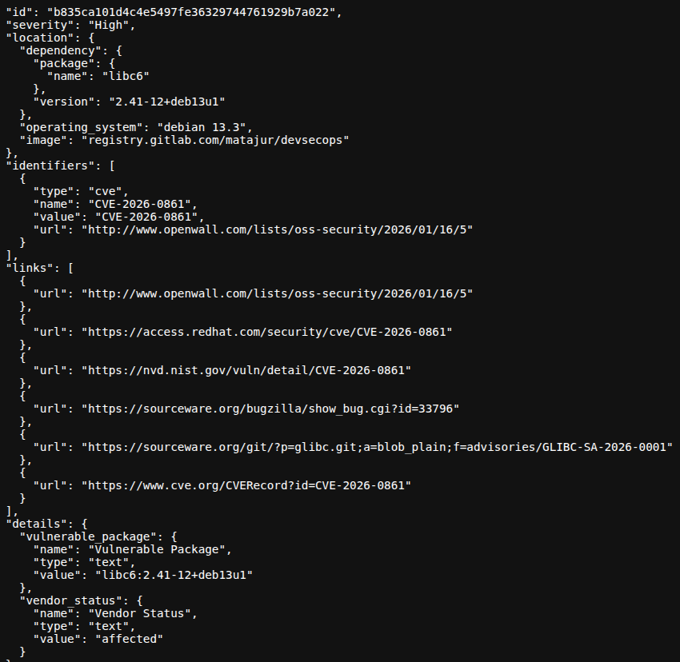

# Tier 4. Module 7 - Secure Software Development and Integration

## Topic 8. Homework - CI/CD and DevSecOps

### [GitLab repository](https://gitlab.com/Matajur/devsecops)

`https://gitlab.com/Matajur/devsecops`

### Laboratory report

**Task 1: Success vs. Failure**

1. Pipeline with "good" `test_app.py`



2. Pipeline with "bed" `test_app.py`



3. Comparison of results

In the case of a "good" unit test file, the pipeline passed all stages. In the case of a "bad" test file, the pipeline passed the secrets and SAST scans, but failed the unit tests.



4. In the first case, the pipeline passed because the scanners don't find anything to fail on and has no thresholds for failing:

- **secret-scan**: the program does not have hard-coded secrets;
- **SAST**: instead of `eval()` the program uses `ast.literal_eval`, which is a safer choice for untrusted input;
- **unit tests**: all the tests match what the app actually does;
- **SCA**: the pipeline has no threshold for vulnerability levels, so despite the presence of one high and several medium vulnerabilities, this stage has passed;



- **DAST**: unit tests provide testing of the mocked dangerous endpoint, but it's not implemented in the `app.py`.

5. In the second case, the pipeline failed not because of the application's security flaws, but purely test expectations that don't match the app:

- `test_hello_world` expects "Hello, Evil World!", but `hello_world` returns "Hello, World!". That's why the first failure occurs;
- `test_dangerous_endpoint` expects `/dangerous` endpoint to call `os.system("echo hello")`, but the app has no `/dangerous` route, so `os.system` is never called and the mock assertion fails.

6. Unit tests imlemented in both `test_app.py` files verify the functionality of the application, but not its security, so fixing failed tests in `test_app.py` will not fix the vulnerability of the application itsel. However, the "bad" `test_app.py` file provides some clues about possible future vulnerabilities that will be of great importance from a security perspective between the first and second cases:

- `test_dangerous_endpoint` explicitly expects `os.system` to be called with user‑controlled input (`/dangerous?cmd=`). If , this encodes a command‑injection/RCE requirement and would "pass" insecure behavior if this endpoint will be implemented in the `app.py`.
- There is no validation or escaping expectation around cmd. The test asserts raw execution.

**Task 2: First-case security**

In addition to possible future vulnerabilities, the application and its pipeline has some current flaws that apply to both cases:

- `app.py` uses `ast.literal_eval` on user input, which is safer than `eval()`, but still allows resource‑exhaustion (DoS) via huge inputs or deeply nested structures in case of missing input size limits or timeout, like in this case.
- There is no no authentication/authorization on any route;call /execute;
- The `SECURITY_FAILURE_LEVEL` parameter is not configured for the SCA stage in the pipeline. High or critical vulnerabilities in dependencies will not cause application deployment to fail.
- There are also no thresholds for SAST, DAST and the secret scanner, if they find something it will be reported in the logs, but the pipeline execution will not be stopped.
- DAST targets `http://` with no TLS, so findings don't reflect encrypted production traffic.

**Task 3: Fail Fast principle**

The current pipeline is designed with fail fast principle in mind, by concluding quality and security checks early in the pipeline so problems surface before build/deploy:

- Secrets scanning, SAST, and unit test are performed before build or deployment, if they fail the deployment will not be performed.
- SCA is performed between build or deployment, but can also be performed before build, only image scanning should be left after build. - DAST can only be performed on a running application. It is better to do it after a staging deployment before production.

**Task 4: CI/CD Stages**

The pipeline has the fallowing stages:

`secret_detection` → `sast` → `unit_test_job` → `docker_build_job` → `dependency_scanning` + `container_scanning` → `deploy_job` → `dast`

1. **Secret-scan**: run secret_detection to find hardcoded secrets before anything else.
2. **SAST**: run static code analysis to detect code‑level vulnerabilities early.
3. **Test**: run `unit_test_job` with pytest to validate app behavior.
4. **Build**: build and push the Docker image (`docker_build_job`).
5. **SCA**: run dependency scanning and container scanning for library and image vulnerabilities.
6. **Deploy**: pull and run the container locally for later DAST.
7. **DAST**: run dynamic scanning against the running app.

**Task 5: Security Scanners**

- **Secret scan**: detects hardcoded secrets like API keys/tokens in repo history. Runs in `secret-scan` stage first.
- **SAST**: detects code-level issues like injection risks, insecure functions, unsafe config patterns. Runs in second stage before tests.
- **Dependency scan / SCA**: detects known CVEs in direct/transitive packages from manifests/lockfiles/sbom. In this case runs in sca stage after build, but it's better to run it even before the build to fall even faster.
- **DAST**: probes the running app for runtime issues (e.g., injection, auth misconfig, exposed endpoints). Runs in the last stage after deploy.

**Task 6: Responding to vulnerabilities**

- In this pipeline, scan jobs only fail if the scanner exits non‑zero. There are no configured severity thresholds, so findings alone won't block; they'll pass unless the tool itself errors: `secret_detection`, `sast`, `dependency_scanning`, `container_scanning` all have `allow_failure: false`, but no fail‑on‑severity variables are set.
- GitLab's security templates always produce a security report artifact when they run, regardless of whether they fail.
- GitLab doesn't send explicit notifications from these jobs by default. Notifications come from GitLab's own events (pipeline failed, security report updates, MR widgets). It's required to add custom notification jobs or integrations for explicit alerts, such as creating tickets in Jira.

**Task 7: Responding to CVEs**

As mentioned earlier, the SCA scanner did indeed detect several high and medium vulnerabilities, but did not stop the deployment due to the lack of a threshold. To resolve this issue, first of all, `.gitlab-ci.yml` should by updated with a the threshold of severity of the vulnerability detected. If, for example, there are high vulnerabilities detected, the pipeline should fail at this stage.

```yaml
SECURITY_FAILURE_LEVEL: High
```

Then the following steps should be performed:

1. Vulnerability Impact Assessment

- Confirm the exact package/version and CVE details (attack vector, preconditions, affected components).
- Determine exposure: is the vulnerable code path reachable in your app, and in which environments (dev/stage/prod)?
- Classify risk (severity × exploitability × business impact) and decide whether to block release.
- Identify affected services, owners, and SLAs for remediation.

2. Finding and Selecting a Solution (Update, Replace, Workaround)

- Prefer upgrading to a patched version (direct or transitive override); check changelogs/breaking changes.
- If no safe version exists, evaluate alternative libraries with active maintenance and compatible licensing.
- If no alternative can be implemented, apply config mitigations or feature flags to disable the vulnerable component until a fix is available.
- Decide and document the option with rationale (time to fix vs. risk).

3. Testing and Validating Changes

- Update dependency manifest/lockfile; run unit, integration, and security regression tests.
- Re‑run SCA to confirm the CVE is resolved; ensure no new critical issues are introduced.
- Validate runtime behavior and any performance impacts, especially if replacing a library.

4. Deployment Process

- Follow standard release workflow (PR/MR, peer review, approvals).
- Deploy to staging first; monitor error rates, logs, and security scans.
- Roll out to production with rollback plan; confirm post‑deploy SCA/monitoring status.

5. Documenting the Incident

- Record CVE details, affected versions, impacted services, and timeline.
- Capture the chosen mitigation, tests executed, and deployment evidence.
- Link artifacts (SCA report, PR/MR, release notes, post‑deploy scan).

6. Post‑incident Analysis

- Identify why the vulnerable version was introduced and why it wasn't caught earlier.
- Add preventive controls: pin versions, automate dependabot/renovate, enforce severity thresholds in CI.
- Update playbooks and train relevant teams on the specific failure mode.

**Task 8: Automating SBOM Analysis**

To automate continuous SBOM CVE checking, SBOM should be generated on every build and then run scheduled re‑scans against updated vulnerability databases. Also, alerts and PR automation should be set up for remediation.

1. Tools and features

- **Trivy**: generates SBOMs (CycloneDX/SPDX), scans images/filesystems/lockfiles, integrates with CI, supports SBOM re‑scan and policy thresholds.
- **Grype**: scans SBOMs, images, and filesystems; fast CVE matching; good for "scan SBOM" workflows and CI gating.
- **OSV‑Scanner**: checks dependencies against OSV (package‑level vulnerabilities), it's great for source‑based scans and lockfile accuracy.
- **Syft**: generates SBOMs for images/filesystems; strong format support.
- **Dependency‑Track**: stores SBOMs and continuously re‑evaluates them as new CVEs are published; provides alerting and dashboards.
- **Renovate/Dependabot**: automates upgrade PRs once CVEs are detected.

2. Recommended automated workflow

- Generate SBOMs for source and container (Syft or Trivy) and store as artifacts.
- Scan SBOMs with Trivy/Grype and fail on severity threshold; publish a security report.
- Push SBOMs to Dependency‑Track, it continuously re‑checks as CVE feeds update.
- Send notifications to Slack/Email/Jira when new CVEs affect tracked SBOMs.
- Trigger Renovate/Dependabot to open PRs; include CVE metadata in PR descriptions.
- Enforce policies (block releases on Critical/High, allow exceptions with expiry).

**Task 9: Pipeline Improvements**

1. Add severity thresholds + explicit "security summary" job

In the current pipeline the cans run, but do not fail because of bad findings. It's required to set `SECURITY_FAILURE_LEVEL` (e.g., `High`) and add a summary job that parses GitLab security reports into a short table (counts by severity + top CVEs). This makes failures actionable and reduces time spent digging through logs.

```yaml
# Definition of stages (stages) of the pipeline
stages:
  - secret-scan
  - sast
  - test
  - build
  - sca
  - report # security summary
  - deploy
  - dast

# Fail the pipeline on High+ security findings across GitLab security scanners.
variables:
  SECURITY_FAILURE_LEVEL: "High"
```

2. Publish artifacts with direct links to reports

Now developers should hunt through job logs to find SAST/SCA/DAST output. It's required to export reports (JSON/HTML) as artifacts and add a simple `index.html` with links. It centralizes security evidence and makes results shareable across the team.

```yaml
      # Create a simple index with links to available reports.
      report_links = []
      for path in report_files:
          if os.path.exists(path):
              target = os.path.join("security-report", path)
              os.replace(path, target)
              report_links.append(f'<li><a href="{path}">{path}</a></li>')
      report_links_html = "\n".join(report_links) or "<li>No report files found.</li>"
      with open("security-report/index.html", "w", encoding="utf-8") as f:
          f.write(
              "<!doctype html><html><body>"
              "<h1>Security Reports</h1>"
              "<ul>"
              + report_links_html +
              "</ul>"
              "</body></html>"
          )
```

3. Add pipeline badges + MR widgets for "what is changed"

Now project team lacks visibility on security drift between branches/PRs. It's needed to enable MR security widgets and add pipeline badges in `README.md` for SAST/SCA/DAST. This surfaces status at a glance and encourages earlier fixes.

`.gitlab-ci.yml` was updated accordingly and "good" `test_app.py` was used for improved pipeline. Now, as expected, the pipeline failed during SCA scanning due to a dependency vulnerability.



Failure in the container scan gate.



The security report can be downloaded from the section "Job artifacts" of the `security_summary` job.


