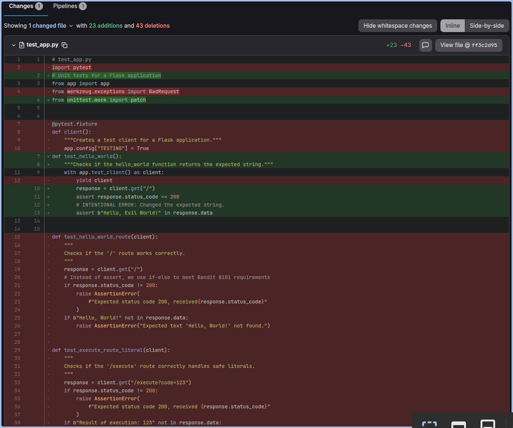
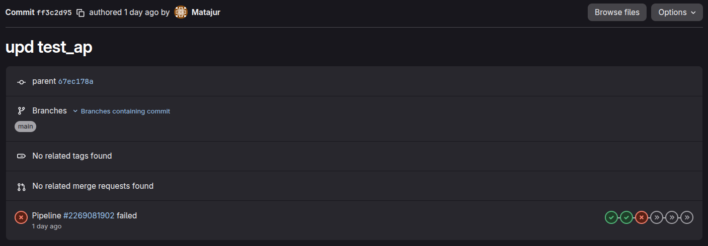

# Tier 4. Module 7 - Secure Software Development and Integration

## Topic 9. Homework - SCM and change audit

### [GitLab repository](https://gitlab.com/Matajur/devsecops)

`https://gitlab.com/Matajur/devsecops`

### Laboratory report

1. **Introduction**

The [repository](https://gitlab.com/Matajur/devsecops) contains a change in `test_app.py` that resulted in a CI/CD failure. The change was pushed directly to the master branch without review and without a verified signature, which violates standard SCM and SSDLC policies. This report documents the technical facts, identifies policy violations, models a realistic incident scenario, and proposes preventive measures and cultural practices to reduce recurrence.

2. **Technical analysis of the change**

Based on the GitLab history collected during the lab:

- **File impacted**: `test_app.py`.
- **Change scope**: A single commit modified test logic and expectations, which caused the pipeline to fail. The failure indicates that, first, the tests themselves became invalid and, second, the change uncovered a mismatch with application behavior.

- **Branch behavior**: The change was committed directly to `master` rather than via a merge request, bypassing the normal review flow.
- **Commit metadata**: Author, timestamp, and message are available in the GitLab commit details captured during the lab audit.

- **Specific consequences**: Even though the file is a test module, changes to tests can still mask defects or hide security regressions if they weaken assertions or remove coverage. A test change that fails CI also disrupts delivery and can, in case of hustle or missed deadlines, cause teams to ignore red pipelines, which is a dangerous behavior.

3. **Authentication**

Signature and identity checks performed against the commit:

- **Signature status**: The commit was not signed (no GPG/SSH signature), so there is no cryptographic proof of authorship.
- **Author verification**: The commit shows no verified badge, meaning the identity cannot be trusted solely based on Git metadata.
- **Implication**: Without a signed commit, accountability and non-repudiation are weakened. In an incident, it becomes harder to prove who made the change and whether the change was authorized.

4. **Assessment of compliance with SCM policies**

Security policy violations related to the change in `test_app.py`:

- **Direct push to master (no protected branch / no merge request)**
  - **Risk**: High. Bypasses peer review and formal change control, so insecure or unstable code can enter the mainline unnoticed.
  - **Consequences**: Defects or vulnerabilities reach production quickly; audit trails are weaker; accountability is blurred.
  - **SSDLC violation**: Breaks change control and governance, which require controlled promotion of changes through review and approval.

- **No code review / no approval workflow**
  - **Risk**: High. Single-person changes are more likely to include mistakes or malicious logic.
  - **Consequences**: Undetected security flaws; loss of defense-in-depth; higher incident probability.
  - **SSDLC violation**: Violates the "security by review" principle and quality gates in secure development.

- **Unsigned commit (no GPG/SSH signature)**
  - **Risk**: Medium. Cannot prove the commit was authored by the claimed identity.
  - **Consequences**: Supply-chain impersonation becomes easier; incident response and forensics are weakened.
  - **SSDLC violation**: Breaks integrity and non-repudiation requirements for change traceability.

- **Unverified author / missing identity verification**
  - **Risk**: Medium. Without verified identities, access misuse or credential compromise is harder to detect.
  - **Consequences**: Hidden insider threats; reduced confidence in audit results; delayed containment.
  - **SSDLC violation**: Violates accountability and traceability in secure change management.

- **CI/CD failure not blocking merge or deployment**
  - **Risk**: High. Failing tests mean known defects or security checks are ignored.
  - **Consequences**: Broken builds, production outages, or security regressions released to users.
  - **SSDLC violation**: Breaks automated verification gates and "fail closed" control in the delivery pipeline.

- **No enforced status checks before merge**
  - **Risk**: High. Allows changes to bypass required tests or security scans.
  - **Consequences**: Vulnerabilities or policy violations pass into the main branch without detection.
  - **SSDLC violation**: Violates automated validation and continuous assurance requirements.

5. **Incident modeling**

**Scenario**: A developer pushes a change to `test_app.py` directly to `master`. The change weakens authentication test coverage (e.g., reduces required checks) and inadvertently causes a CI failure. Because the original CI is not configured to block merges or deployments, the pipeline remains red but the deployment still proceeds, or the change remains on `master` and is later included in a release.

**How the change reached production**:

- Direct push bypassed the merge request workflow and review.
- The unsigned commit could not be verified, so the origin was not trustworthy.
- CI failed, but branch protection did not block merge or deployment.

**Why it was not detected**:

- No code review to catch weakened tests.
- No enforced quality gates in the pipeline configuration to prevent a red pipeline from being promoted.
- No automated security scans tied to a blocking status check.

**Consequences**:

- **Users**: Potential exposure to security regressions (e.g., weaker auth checks not covered by tests).
- **Business**: Increased likelihood of production incidents, customer trust impact, and operational downtime.
- **Team**: Erosion of confidence in CI/CD signals and auditability, making future incidents harder to investigate.

6. **Preventive strategy**

**Technical controls**:

- Protect `master` with branch rules: no direct pushes, merge requests only.
- Require **two approvals** for security-sensitive areas (tests, auth, secrets handling).
- Enforce **signed commits** (GPG or SSH) and verified emails for contributors.
- Make CI status checks **mandatory** (block merge on red pipeline).
- Add automated checks: SAST, dependency scanning, secret detection, and test coverage thresholds.
- Use pre-receive hooks to reject unsigned or non-reviewed commits.

**Process and organizational controls**:

- Define a lightweight change management policy with clear responsibilities.
- Train developers on signing commits and interpreting CI results.
- Introduce a "stop the line" rule: red pipeline means no release.
- Regularly audit branch protection settings and review exceptions.

7. **Building a culture**

Dear Team, this incident is a reminder that change auditing is not bureaucracy but an important part of our work culture. It is how we protect our users, our uptime, and each other. When a change bypasses review or enters `master` without a signature, we lose traceability and trust in the codebase. When a failing pipeline is ignored, we normalize risk and make future incidents more likely.

Our goal is not to slow anyone down. It is to build a workflow where changes are safe, verified, and easy to understand. Reviews are an important safeguard against irreparable harm, not a checkpoint to fear. Signatures and CI gates are there to protect the team from mistakes and to make investigations clear and fair.

Let us treat the pipeline as as if they were our close friends: if it is red, we pause and fix. If we need exceptions, we document them transparently. By doing this together, we create a culture where quality and security are shared responsibilities, not afterthoughts.

8. **Conclusions**

This change demonstrates how small deviations from SCM policy can cascade into security and reliability risks. Direct pushes, missing signatures, and non-blocking CI undermined the SSDLC guarantees of traceability, verification, and controlled promotion. Strengthening branch protection, enforcing signatures, and making CI a mandatory gate are the most immediate fixes. Over time, consistent reviews and a culture of responsibility will reduce both the frequency and impact of similar incidents.
