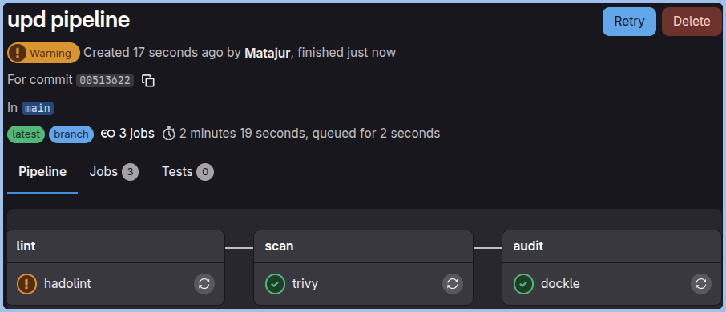
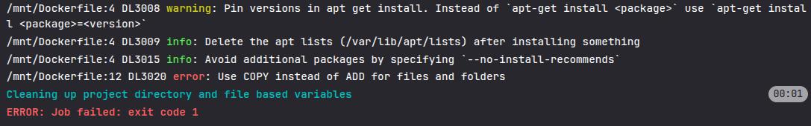
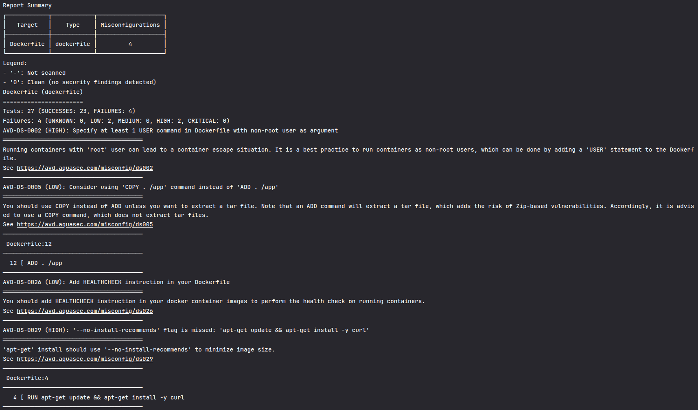
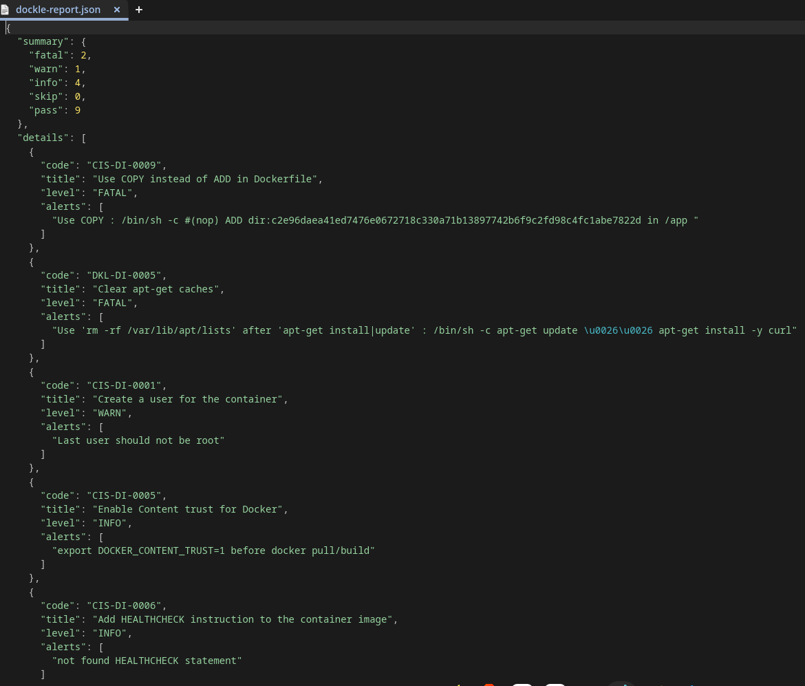
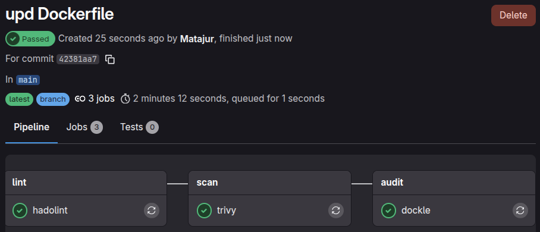
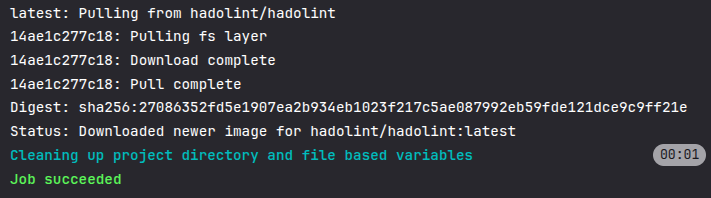
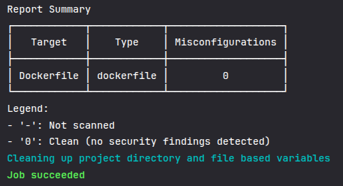
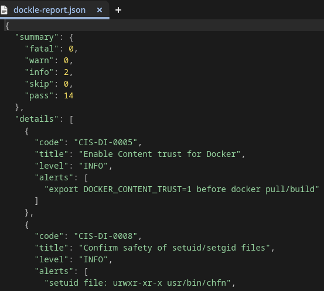

# Tier 4. Module 7 - Secure Software Development and Integration

## Topic 11. Homework - Security in container and cloud environments

### Laboratory report

1. **Pipeline execution for Docker-bad**

**1.1 Hadolint**

Hadolint is linter that focuses on Dockerfile syntax and "best practices".

Even though one critical issue was found related to using `ADD` instead of `COPY` and the scanner exited with status code 1, the task only showed a warning because `allow_failure: true` is set and the pipeline will continue to run even if issues are found.

**1.2 Trivy**

Trivy is vulnerability scanner that focuses on known CVEs (Common Vulnerabilities and Exposures) in packages and configuration missteps.

Despite detecting two high vulnerabilities, the system did not display any warnings even when `allow_failure: false` was set because no severity threshold was set in the pipeline.

**1.3 Dockle**

Dockle is a linter for images that focuses on security "Best Practices" for the final image (CIS Benchmarks).

In our case it has the same pipeline configuration problems as Trivy.

2. **Pipeline execution for Docker-bad**

**2.1 Hadolint**

No more critical issues or warnings, exit code 0.

**2.2 Trivy**

No security findings detected, exit code 0.

**2.3 Dockle**

Only two warnings of `Info` level, exit code 0.

#### Results comparison table

| Instrument | Types of risks (Docker-bad)           | How fixed (Docker-good)                                                                   | Violated SSDLC principles/best practices      | Criticality |
| ---------- | ------------------------------------- | ----------------------------------------------------------------------------------------- | --------------------------------------------- | ----------- |
| Hadolint   | Use of ADD                            | `ADD` replaced by nothing, which can be still risky with no automatic context copy        | Least Privilege / Attack Surface Minimization | High        |
| Hadolint   | No versions Pinned in apt get install | `apt-get install -y --no-install-recommends`, but still no versions pinned                | Supply Chain Vulnerability / Immutability     | Medium      |
| Hadolint   | Too big image size / attack surface   | `apt-get install -y --no-install-recommends apt-get clean && rm -rf /var/lib/apt/lists/*` | Attack Surface Minimization                   | Low         |
| Trivy      | Running containers with 'root' user   | `RUN useradd -m -s /bin/bash safeuser` `USER safeuser`                                    | Least Privilege                               | High        |
| Trivy      | Too big image size / attack surface   | `apt-get install -y --no-install-recommends apt-get clean && rm -rf /var/lib/apt/lists/*` | Attack Surface Minimization                   | High        |
| Trivy      | Use of ADD                            | `ADD` replaced by nothing, which can be still risky with no automatic context copy        | Least Privilege / Attack Surface Minimization | Low         |
| Dockle     | Use of ADD                            | `ADD` replaced by nothing, which can be still risky with no automatic context copy        | Least Privilege / Attack Surface Minimization | High        |
| Dockle     | Too big image size / attack surface   | `apt-get install -y --no-install-recommends apt-get clean && rm -rf /var/lib/apt/lists/*` | Attack Surface Minimization                   | High        |
| Dockle     | Running containers with 'root' user   | `RUN useradd -m -s /bin/bash safeuser` `USER safeuser`                                    | Least Privilege                               | Medium      |

**Notes:**

- Different tools give different ctiticality for the same issues.
- Good Dockerfiles uses `debian:12.5-slim` image instead of `ubuntu:22.04`, which is much lighter, therefore smaller attack surface.

#### Conclusion

Hadolint, Trivy and Dockle were used to cover the Build, Software, and Configuration layers, because each one has its own area of responsability:

- Hadolint checks the Dockerfile code itself.
- Trivy is a scanner for the actual software and libraries inside.
- Dockle auditors the final image structure.

In general, all three tools showed the same problems, but gave them different criticality:

- Using `ADD` instead of `COPY`;
- Running the container as root;
- Not clearing the cache and saving large image.

CI/CD automation moves security checks earlier in the delivery flow and makes them consistent ("fall fast" approach). Every change is built the same way, scanned the same way, and blocked the same way if it violates security gates. This reduces human error and shortens the time between introducing a vulnerability and detecting it.

For a production environment, it's required to fix at least all high and critical vulnerabilities, but that's only half the battle. The actual pipeline configuration, regardless of whether the Dockerfile configuration is good or bad, only issues warnings in the logs. In a production environment, it should display these warnings and stop the deployment if issues are found at a threshold level (usually: High).
